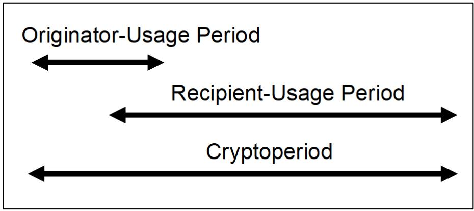
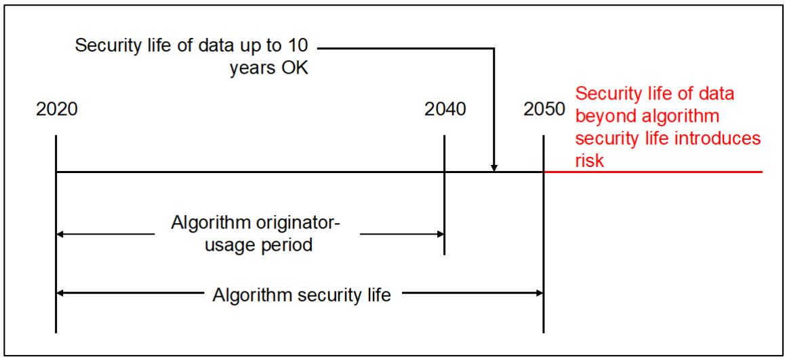
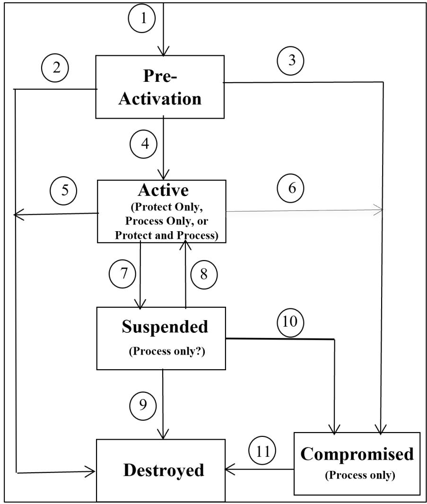
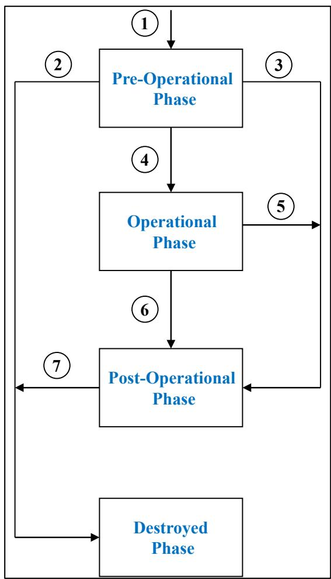
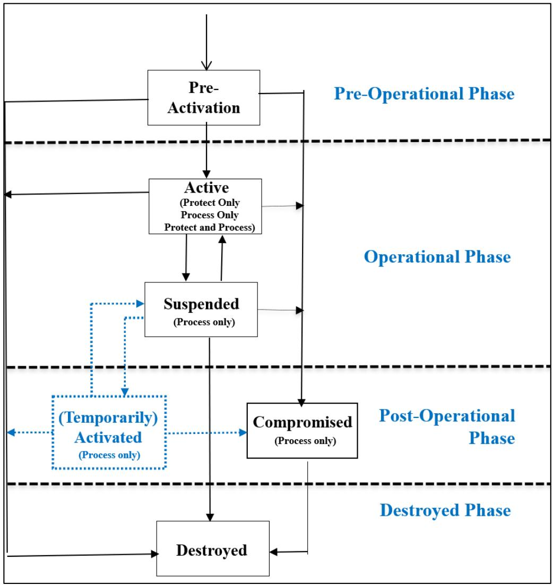
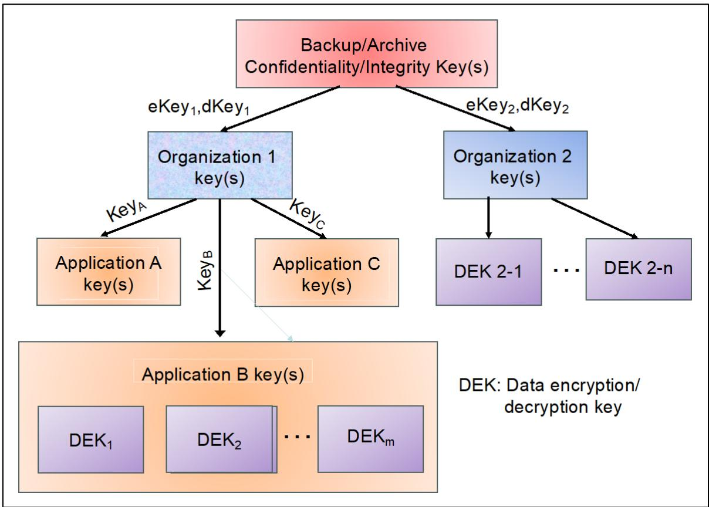

**NIST Special Publication 800 NIST SP 800-57pt1r6 ipd**

**Recommendation for Key Management**

Part 1 — General

Initial Public Draft

Elaine Barker

William Barker

This publication is available free of charge from: https://doi.org/10.6028/NIST.SP.800-57pt1r6.ipd

**NIST Special Publication 800**

**NIST SP 800-57pt1r6 ipd**

**Recommendation for Key Management**

Part 1 — General

Initial Public Draft

Elaine Barker

Computer Security Division

Information Technology Laboratory

William Barker

Information Technology Laboratory;

Strativia LLC*

*Former Strativia employee; some work for

this publication was done while at Strativia

This publication is available free of charge from:

https://doi.org/10.6028/NIST.SP.800-57pt1r6.ipd

December 2025

U.S. Department of Commerce

Howard Lutnick, Secretary

National Institute of Standards and Technology

Craig Burkhardt, Acting Under Secretary of Commerce for Standards and Technology and Acting NIST Director

Certain equipment, instruments, software, or materials, commercial or non-commercial, are identified in this paper in order to specify the experimental procedure adequately. Such identification does not imply recommendation or endorsement of any product or service by NIST, nor does it imply that the materials or equipment identified are necessarily the best available for the purpose.

There may be references in this publication to other publications currently under development by NIST in accordance with its assigned statutory responsibilities. The information in this publication, including concepts and methodologies, may be used by federal agencies even before the completion of such companion publications. Thus, until each publication is completed, current requirements, guidelines, and procedures, where they exist, remain operative. For planning and transition purposes, federal agencies may wish to closely follow the development of these new publications by NIST.

Organizations are encouraged to review all draft publications during public comment periods and provide feedback to NIST. Many NIST cybersecurity publications, other than the ones noted above, are available at https://csrc.nist.gov/publications.

**Authority**

This publication has been developed by NIST in accordance with its statutory responsibilities under the Federal Information Security Modernization Act (FISMA) of 2014, 44 U.S.C. § 3551 et seq., Public Law (P.L.) 113-283. NIST is responsible for developing information security standards and guidelines, including minimum requirements for federal information systems, but such standards and guidelines shall not apply to national security systems without the express approval of appropriate federal officials exercising policy authority over such systems. This guideline is consistent with the requirements of the Office of Management and Budget (OMB) Circular A-130.

Nothing in this publication should be taken to contradict the standards and guidelines made mandatory and binding on federal agencies by the Secretary of Commerce under statutory authority. Nor should these guidelines be interpreted as altering or superseding the existing authorities of the Secretary of Commerce, Director of the OMB, or any other federal official. This publication may be used by nongovernmental organizations on a voluntary basis and is not subject to copyright in the United States. Attribution would, however, be appreciated by NIST.

**NIST Technical Series Policies**

Copyright, Use, and Licensing Statements

NIST Technical Series Publication Identifier Syntax

**Publication History**

Approved by the NIST Editorial Review Board on YYYY-MM-DD [Will be added to final publication.] Supersedes NIST Series XXX (Month Year) DOI [Will be added to final publication, if applicable.]

**How to Cite this NIST Technical Series Publication**

Barker E, Barker W (2025) Recommendation for Key Management: Part 1 — General. (National Institute of Standards and Technology, Gaithersburg, MD), NIST Special Publication (SP) NIST SP 800-57pt1r6 ipd. https://doi.org/10.6028/NIST.SP.800-57pt1r6.ipd

**Author ORCID iDs**

Elaine Barker: 0000-0003-0454-0461

William Barker: 0000-0002-4113-8861

**Public Comment Period**

December 5, 2025 – February 5, 2026

**Submit Comments**

keymanagement@nist.gov

National Institute of Standards and Technology

Attn: Computer Security Division, Information Technology Laboratory

100 Bureau Drive (Mail Stop 8930) Gaithersburg, MD 20899-8930

**Additional Information**

Additional information about this publication is available at https://csrc.nist.gov/pubs/sp/800/57/pt1/r6/ipd, including related content, potential updates, and document history.

All comments are subject to release under the Freedom of Information Act (FOIA).

**Abstract**

This recommendation provides cryptographic key-management guidelines in three parts. Part 1 provides general guidelines and best practices for the management of cryptographic keying material, including definitions for the security services that may be provided when using cryptography and the algorithms and key types that may be employed, specifications for the protection that each type of key and other cryptographic information requires and methods for providing this protection, discussions about the functions involved in key management, and discussions about a variety of key-management issues to be addressed when using cryptography. Part 2 provides guidance on policy and security planning requirements for U.S. Government agencies. Part 3 provides guidelines for using the cryptographic features of current systems.

**Keywords**

archive; authentication; authorization; availability; backup; compromise; confidentiality; cryptographic key; cryptographic module; digital signature; eXtendable-Output Function; hash function; hashing method; key agreement; key management; key recovery; keying material; key transport; private key; public key; quantum-resistant; secret key; security category; security strength; trust anchor.

**Reports on Computer Systems Technology**

The Information Technology Laboratory (ITL) at the National Institute of Standards and Technology (NIST) promotes the U.S. economy and public welfare by providing technical leadership for the Nation’s measurement and standards infrastructure. ITL develops tests, test methods, reference data, proof of concept implementations, and technical analyses to advance the development and productive use of information technology. ITL’s responsibilities include the development of management, administrative, technical, and physical standards and guidelines for the cost-effective security and privacy of other than national security-related information in federal information systems. The Special Publication 800-series reports on ITL’s research, guidelines, and outreach efforts in information system security, and its collaborative activities with industry, government, and academic organizations.

**Note to Reviewers**

1. Ascon, as specified in SP 800-232, and the new quantum-resistant algorithms specified in FIPS 203, 204, and 205 have been included.   
2. The keys used for both key establishment and key storage are now discussed separately.   
3. The security categories used in the PQC competition have been included, along with the quantum-resistant algorithms.   
4. The time frames for algorithm approval status have been removed and replaced with references to SP 800-131A.   
5. A section has been added to discuss keying material storage and mechanisms.   
6. See Appendix F for a more complete list of changes.

**Call for Patent Claims**

This public review includes a call for information on essential patent claims (claims whose use would be required for compliance with the guidance or requirements in this Information Technology Laboratory (ITL) draft publication). Such guidance and/or requirements may be directly stated in this ITL Publication or by reference to another publication. This call also includes disclosure, where known, of the existence of pending U.S. or foreign patent applications relating to this ITL draft publication and of any relevant unexpired U.S. or foreign patents.

ITL may require from the patent holder, or a party authorized to make assurances on its behalf, in written or electronic form, either:

a) assurance in the form of a general disclaimer to the effect that such party does not hold and does not currently intend holding any essential patent claim(s); or   
b) assurance that a license to such essential patent claim(s) will be made available to applicants desiring to utilize the license for the purpose of complying with the guidance or requirements in this ITL draft publication either:

i. under reasonable terms and conditions that are demonstrably free of any unfair discrimination; or   
ii. without compensation and under reasonable terms and conditions that are demonstrably free of any unfair discrimination.

Such assurance shall indicate that the patent holder (or third party authorized to make assurances on its behalf) will include in any documents transferring ownership of patents subject to the assurance, provisions sufficient to ensure that the commitments in the assurance are binding on the transferee, and that the transferee will similarly include appropriate provisions in the event of future transfers with the goal of binding each successor-in-interest.

The assurance shall also indicate that it is intended to be binding on successors-in-interest regardless of whether such provisions are included in the relevant transfer documents.

Such statements should be addressed to: keymanagement@nist.gov.

# Table of Contents

- [Executive Summary](#executive-summary)
- [1. Introduction](#1.-introduction)
  - [1.1. Purpose](#1.1.-purpose)
  - [1.2. Audience](#1.2.-audience)
  - [1.3. Scope](#1.3.-scope)
  - [1.4. Preliminary Discussion of Terms](#1.4.-preliminary-discussion-of-terms)
  - [1.5. Content and Organization](#1.5.-content-and-organization)
- [2. Security Services](#2.-security-services)
  - [2.1. Confidentiality](#2.1.-confidentiality)
  - [2.2. Data Integrity](#2.2.-data-integrity)
  - [2.3. Authentication](#2.3.-authentication)
  - [2.4. Authorization](#2.4.-authorization)
  - [2.5. Non-Repudiation](#2.5.-non-repudiation)
  - [2.6. Support Services](#2.6.-support-services)
  - [2.7. Combining Services](#2.7.-combining-services)
- [3. Cryptographic Algorithms](#3.-cryptographic-algorithms)
  - [3.1. Cryptographic Hashing Methods](#3.1.-cryptographic-hashing-methods)
  - [3.2. Symmetric-Key Algorithms](#3.2.-symmetric-key-algorithms)
  - [3.3. Asymmetric-Key Algorithms](#3.3.-asymmetric-key-algorithms)
  - [3.4. Random Bit Generation](#3.4.-random-bit-generation)
- [4. General Key-Management Guidelines](#4.-general-key-management-guidelines)
  - [4.1. Key Types and Other Information](#4.1.-key-types-and-other-information)
  - [4.2. Key Usage](#4.2.-key-usage)
  - [4.3. Cryptoperiods](#4.3.-cryptoperiods)
  - [Key establishment (automated)](#key-establishment-automated)
  - [4.4. Assurances](#4.4.-assurances)
  - [4.5. Compromise of Keys and Other Keying Material](#4.5.-compromise-of-keys-and-other-keying-material)
  - [4.6. Guidelines for Cryptographic Algorithm and Key-Size Selection](#4.6.-guidelines-for-cryptographic-algorithm-and-key-size-selection)
- [5. Protection Requirements for Key Information](#5.-protection-requirements-for-key-information)
  - [5.1. Protection and Assurance Requirements](#5.1.-protection-and-assurance-requirements)
  - [5.2. Protection Mechanisms](#5.2.-protection-mechanisms)
- [6. Key States and Transitions](#6.-key-states-and-transitions)
  - [6.1. Pre-Activation State](#6.1.-pre-activation-state)
  - [6.2. Active State](#6.2.-active-state)
  - [6.3. Suspended State](#6.3.-suspended-state)
  - [6.4. Compromised State](#6.4.-compromised-state)
  - [6.5. Destroyed State](#6.5.-destroyed-state)
- [7. Key-Management Phases and Functions](#7.-key-management-phases-and-functions)
  - [7.1. Pre-Operational Phase](#7.1.-pre-operational-phase)
  - [7.2. Operational Phase](#7.2.-operational-phase)
  - [7.3. Post-Operational Phase](#7.3.-post-operational-phase)
  - [7.4. Destroyed Phase](#7.4.-destroyed-phase)
- [8. Additional Considerations](#8.-additional-considerations)
  - [8.1. Access Control and Identity Authentication](#8.1.-access-control-and-identity-authentication)
  - [8.2. Inventory Management](#8.2.-inventory-management)
  - [8.3. Accountability](#8.3.-accountability)
  - [8.4. Audit](#8.4.-audit)
  - [8.5. Key-Management System Survivability](#8.5.-key-management-system-survivability)
- [References](#references)
- [Appendix A. Cryptographic and Non-Cryptographic Integrity and Source Authentication Mechanisms](#appendix-a.-cryptographic-and-non-cryptographic-integrity-and-source-authentication-mechanisms)
- [Appendix B. Key Recovery](#appendix-b.-key-recovery)
  - [B.1. General Discussion](#b.1.-general-discussion)
  - [B.2. Digital Signature Key Pair](#b.2.-digital-signature-key-pair)
  - [B.3. Authentication Keys](#b.3.-authentication-keys)
  - [B.4. Random Number Generation Key](#b.4.-random-number-generation-key)
  - [B.5. Key-Derivation/Master Key](#b.5.-key-derivationmaster-key)
  - [B.6. Key Establishment (Automated)](#b.6.-key-establishment-automated)
  - [B.7. Symmetric Data Encryption/Decryption Keys](#b.7.-symmetric-data-encryptiondecryption-keys)
  - [B.8. Keying Material Storage](#b.8.-keying-material-storage)
  - [B.9. Authorization](#b.9.-authorization)
  - [B.10. Other Related Information](#b.10.-other-related-information)
- [Appendix C. Security Strength Categories for Post-Quantum Algorithms](#appendix-c.-security-strength-categories-for-post-quantum-algorithms)
- [Appendix D. List of Abbreviations and Acronyms](#appendix-d.-list-of-abbreviations-and-acronyms)
- [Appendix E. Glossary](#appendix-e.-glossary)
- [Appendix F. Change Log](#appendix-f.-change-log)

# Executive Summary

Cryptography is used to secure communications over networks, to protect information stored in databases, and for many other critical applications. Cryptographic keys play an important part in the operation of cryptography. These keys are analogous to the combination of a safe. If a safe combination is known to an adversary, the strongest safe provides no security against penetration.

The proper management of cryptographic keys is essential to the effective use of cryptography for security. Poor key management may easily compromise strong algorithms. This recommendation provides guidelines for the management of a cryptographic key throughout its life cycle, including its secure generation, storage, distribution, use, and destruction.

Ultimately, the security of information protected by cryptography directly depends on the strength of the keys, the effectiveness of cryptographic mechanisms and protocols associated with the keys, and the protection provided to the keys. Secret and private keys need to be protected against unauthorized disclosure, and all keys need to be protected against modification.

Cryptographic keys are used across a broad range of systems and applications in enterprises, many of which are managed by individuals who may not have expertise in key management. Consequently, organizations must ensure that clear guidance and oversight is provided for the proper management of keys, as well as controls to ensure that the guidance is being followed and implemented.

Organizations and developers are presented with many choices in their use of cryptographic mechanisms. Inappropriate choices may result in an illusion of security but with little or no real security for the protocol or application. This recommendation provides background information and establishes a framework to support appropriate decisions when selecting and using cryptographic mechanisms.

Cryptographic modules are used to perform cryptographic operations using these keys. This recommendation does not address the implementation details for cryptographic modules that may be used to achieve the security requirements identified herein. These details are addressed in Federal Information Processing Standards (FIPS) Publication 140 [FIPS 140-3] and its associated implementation guidance and derived test requirements, which are available at https://csrc.nist.gov/projects/cmvp.

This recommendation is divided into three parts:

• Part 1 — General contains basic key-management guidelines   
Part 2 — Best Practices for Key Management Organizations provides a framework and general guidance to support establishing cryptographic key management.

Part 3 — Application-Specific Key Management Guidance addresses the keymanagement issues associated with currently available implementations that use cryptography.

# 1. Introduction

The use of cryptographic mechanisms is one of the strongest ways to provide security services for communications, data storage, and other applications. The National Institute of Standards and Technology (NIST) publishes FIPS and NIST Special Publications (SPs) that specify cryptographic techniques for protecting controlled unclassified information (CUI). 1

Since NIST published the Data Encryption Standard (DES) in 1977, the suite of approved standardized algorithms has grown. New classes of algorithms have been added, such as secure hash functions, key-derivation functions, and asymmetric quantum-resistant algorithms. The suite of algorithms provides different levels of cryptographic strength through a variety of key lengths. The algorithms may be combined in many ways to support increasingly complex protocols and applications. This NIST recommendation applies to federal agencies that use cryptography to protect CUI. On a voluntary basis, this recommendation may also be followed by other organizations that want to implement sound security principles in their computer systems.

The proper management of cryptographic keys and other key information is essential to the effective use of cryptography for security. Cryptographic keys are analogous to the combination of a safe. If an adversary knows the combination, the strongest safe provides no security against penetration. Similarly, poor key management may easily compromise strong algorithms. Ultimately, the security of the information protected by cryptography directly depends on the strength of the keys, the effectiveness of the mechanisms and protocols associated with the keys, and the protection afforded to the keys. Cryptography can be rendered ineffective by weak implementations, inappropriate algorithm pairing, poor physical security, and weak (i.e., vulnerable) protocols.

Key management is the process of managing a key throughout its life cycle, including its secure generation, storage, distribution, use, and destruction. Keys may be managed manually, but an automated system is often required to oversee, automate, and secure the key-management process. An automated system that performs key management is commonly known as a (cryptographic) key-management system (see [SP 800-130] and [SP 800-152].)

NIST-approved cryptographic techniques are periodically reassessed for their continued effectiveness. The algorithms specified in NIST standards (e.g., AES, SHA-2, and ECDSA) and the cryptographic modules in which they reside have required conformance tests. Accredited laboratories perform these tests on vendor implementations that claim conformance to the standards. Vendors are required to modify nonconforming implementations so that they meet all applicable requirements. Users of validated implementations can have a high degree of confidence that validated implementations conform to the standards. If any technique is found to be inadequate for the continued protection of government information, the NIST standard is revised or discontinued. Since 1977, NIST has developed a cryptographic “toolkit” of NIST standards2 that form a basis for the implementation of approved cryptography. Part

1 references many of those standards and provides guidelines for how they may be properly used to protect CUI. The process for developing NIST standards is documented in [NIST IR 7977].

## 1.1. Purpose

Organizations and developers are presented with many new choices in their use of cryptographic mechanisms. Inappropriate choices may result in little or no real security for the protocol or application. This recommendation provides background information and establishes frameworks to support appropriate decisions when selecting and using cryptographic mechanisms.

## 1.2. Audience

The audiences for this recommendation include system and application owners and managers, cryptographic module developers, protocol developers, and system administrators. The recommendation is provided in three parts, which have been tailored to specific audiences:

1. Part 1 (i.e., this document) provides general key-management guidelines that are intended to be useful to both system developers and system administrators.3 Cryptographic module developers may benefit by acquiring a greater understanding of the key-management features that are required to support specific applications. Protocol developers may identify key-management characteristics associated with specific suites of algorithms and acquire a greater understanding of the security services provided by those algorithms. System administrators may use Part 1 and Part 3 to assist in determining configuration settings that would be most appropriate for their systems.   
2. Part 2 [SP 800-57p2] helps system and application owners (e.g., the information security group within the organization) identify appropriate organizational keymanagement infrastructures, establish organizational key-management policies, and specify organizational key-management practices and plans.   
3. Part 3 [SP 800-57p3] addresses the key-management issues associated with currently available cryptographic mechanisms. It is intended to provide guidelines for system installers, system administrators, and end users of existing key-management infrastructures, protocols, and other applications as well as the people making purchasing decisions for new systems using currently available technology.

Although some background information and rationale are provided for context and to support the recommendations, this document assumes that the reader has a basic understanding of cryptography. For background material, readers may refer to a variety of

NIST and commercial publications, including [SP 800-175B], which provides recommendations for using cryptography and NIST’s cryptographic standards.

## 1.3. Scope

Part 1 of this recommendation discusses cryptographic algorithms, infrastructures, protocols, implementations, applications, and the management thereof. All cryptographic algorithms currently approved by NIST for the protection of controlled unclassified information are within the scope of Part 1.

Part 1 focuses on issues involving the management of cryptographic keys: their generation, use, and eventual destruction. Related topics (such as, algorithm selection and appropriate key length, cryptographic policy, and cryptographic module selection) are also included.

This recommendation does not address the implementation details for cryptographic modules that may be used to achieve the identified security requirements, which are provided in [FIPS 140-3], CMVP implementation guidance [IGD_B], and derived test requirements [SP 800-140]. Moreover, this recommendation does not address the requirements or procedures for operating a key archive or backup capability other than discussing the types of keying material that are appropriate to back up or include in an archive and the protection to be provided to the keying material.

This recommendation often uses “requirement” terms, which have the following meaning in this document:

1. Shall: This term is used to indicate a requirement of a FIPS or a requirement that must be fulfilled to claim conformance to this recommendation. Shall may be combined with not to become shall not.   
2. Should: This term is used to indicate an important recommendation. Ignoring the recommendation could result in undesirable results. Should may be combined with not to become should not.

## 1.4. Preliminary Discussion of Terms

Part 1 of this recommendation uses several terms related to the management of cryptographic key information. While each of these terms is defined in Appendix E, it may be useful to compare these terms and show their relationships, since they will be used throughout the document:

A cryptographic key is a parameter used in conjunction with a cryptographic algorithm that determines its operation in such a way that an entity with knowledge of the key can reproduce, reverse, or verify the operation, while an entity without knowledge of the key cannot. Examples include a symmetric key used with AES to encrypt plaintext data and decrypt ciphertext data, a private signature key used with a digital signature algorithm to generate a digital signature, or a public signature-verification key used with a digital signature algorithm to verify a digital signature.

Keys are owned and used by entities (e.g., individuals, organizations, devices, or processes) that interact with other entities to conduct business. In the case of nonhuman owners (i.e., an organization, device, or process), the owner is represented or sponsored by one or more humans. For example, if the owner is an organization, then several humans may be authorized to use the key, and the humans may be said to represent the organization when conducting its business. A device or process may own and use the key, but a human sponsor is responsible for managing the key (e.g., generating or replacing the key when required).

Keying material includes a cryptographic key and other material (e.g., an Initialization Vector or algorithm parameters) to be used during the execution of a cryptographic algorithm.   
Metadata is the information associated with a key that describes its specific characteristics, constraints, acceptable uses, ownership, and other details. Portions of the metadata may be secret (e.g., the identity of the key’s owner, in some cases).   
Key information is information about a particular key that includes all of the keying material associated with that key and associated metadata related to that key.

Symmetric keys and the private keys of asymmetric-key (public-key) algorithms require confidentiality protection, and some metadata elements may also require this protection. All key information requires integrity protection.

## 1.5. Content and Organization

This document is organized as follows:

• Section 1, Introduction, establishes the purpose, scope, and intended audience.   
Section 2, Security Services, defines the security services that may be provided using cryptographic mechanisms.   
Section 3, Cryptographic Algorithms, provides background information regarding the approved cryptographic algorithms that generate and use cryptographic keying material.   
Section 4, General Key-Management Guidelines, classifies the different types of keys and other key information according to their uses, discusses cryptoperiods and recommends appropriate cryptoperiods for each key type, provides recommendations and requirements for other keying material, introduces the concept of assurance of algorithm-parameter and public-key validity, discusses the implications of a key compromise, and provides guidelines for cryptographic algorithm and key-size selection, implementation, and replacement.   
Section 5, Protection Requirements for Key Information, specifies the protection that each type of key information requires and identifies methods for providing this protection. These protection requirements should be of particular interest to cryptographic module vendors and application implementers.

Section 6,  Key State and Transitions, identifies the states in which a cryptographic key may exist during its lifetime.   
• Section 7, Key-Management Phases and Functions, identifies four phases and a multitude of functions involved in key management. This section should be of particular interest to cryptographic module vendors and developers of cryptographic infrastructure services.   
Section 8, Additional Considerations, discusses access control, identity authentication, inventory management, accountability, audit, and survivability.   
• The References list the sources cited in this document.   
Appendix A, Cryptographic and Non-Cryptographic Integrity and Source-Authentication Mechanisms, provides supplemental information about integrity and source-authentication services.   
Appendix B, Key Recovery, provides additional information about recovering keys from key backups and archives.   
Appendix C, Security Strength Categories for Post-Quantum Algorithms, provides a collection of broad categories that have been developed to address uncertainties in estimating the security strengths of post-quantum cryptosystems.   
Appendix D, List of Abbreviations and Acronyms, includes all of the abbreviations and acronyms used in this document.   
• Appendix E, Glossary, provides definitions for the terms used in this document.4   
Appendix F, Change Log, contains a history of the changes made since the previously published version of this document (i.e., Revision 5).

# 2. Security Services

Cryptography may be used to provide or support several basic security services: confidentiality, identity authentication, integrity authentication, source authentication, authorization, and non-repudiation. These services may also be required to protect a key and information related to that key. In addition, there are other cryptographic and noncryptographic mechanisms that are used to support these security services. In general, a single cryptographic mechanism may provide more than one service (e.g., the use of digital signatures can provide integrity authentication and source authentication) but not all services.

## 2.1. Confidentiality

Confidentiality is the property whereby information is not disclosed to unauthorized parties; secrecy and privacy are terms that are often used synonymously with confidentiality. Confidentiality can be obtained using encryption to render the information unintelligible except by an authorized party that uses an appropriate key to decrypt the encrypted information. For encryption to provide confidentiality, the cryptographic algorithm used for encryption and its mode of operation must be designed and implemented so that an unauthorized party cannot determine the decryption key associated with the encryption or derive the plaintext directly without using the key.

## 2.2. Data Integrity

Data integrity is a property whereby data has not been modified in an unauthorized manner since it was created, transmitted, or stored. Modification includes the insertion, deletion, and substitution of data. Cryptographic mechanisms, such as message authentication codes (MACs) or digital signatures, can be used to detect (with a high probability) both accidental modifications (e.g., modifications that sometimes occur during noisy transmissions or by hardware memory failures) and deliberate modifications by an adversary. Non-cryptographic mechanisms are also often used to detect accidental modifications but cannot be relied upon to detect deliberate modifications. A more detailed treatment of this subject is provided in Appendix A.

In this recommendation, the statement that a cryptographic algorithm “provides data integrity” means that the algorithm can be used to detect unauthorized modifications. Authenticating integrity is discussed in the next section.

## 2.3. Authentication

Three types of authentication services can be provided using cryptography:

1. An identity authentication service is used to provide assurance of the identity of an entity interacting with a system.

2. An integrity authentication service is used to verify that data has not been modified (i.e., this service provides integrity protection).   
3. A source authentication service is used to verify the identity of the entity that created and/or sent information.

Source authentication and identity authentication are very similar but have different purposes. For example, source authentication is concerned with who originated a message, whereas identity authentication is used to gain access to some service.

Several cryptographic mechanisms may be used to provide authentication services. Most commonly, digital signatures or MACs are used to provide authentication; some keyestablishment techniques may also provide authentication.

When multiple individuals are permitted to share the same identity or source authentication information (e.g., a password or cryptographic key), it is sometimes called role-based authentication.

## 2.4. Authorization

Authorization is concerned with providing an official sanction or permission to perform a function or activity (e.g., to access a document or access a room). Authorization is considered to be a security service that is often supported by a cryptographic service. Normally, authorization is granted only after the execution of a successful identity authentication service. A non-cryptographic analog of the interaction between identity authentication and authorization is the examination of an individual’s credentials to establish their identity. After verifying the individual’s identity and authorization to access some resource (e.g., a locked room), the individual is often provided with a key (e.g., an authorization key) or password that will allow access to that resource.

Identity authentication can also be used to authorize a role (e.g., a system administrator or audit role) rather than identify an individual. Once authenticated for a role, an entity is authorized for all of the privileges associated with that role.

## 2.5. Non-Repudiation

In key management, non-repudiation is a term associated with digital signature keys and digital certificates that bind the name of the certificate subject to a public key. When nonrepudiation is indicated for a digital signature key, it means that the signatures created by that key not only support the usual integrity and source authentication services of digital signatures but may also (depending on the context of the signature) indicate commitment by the certificate subject in the same sense that a handwritten signature on a document may indicate commitment to a contract.

Non-repudiation in a key-management context is not the same as non-repudiation in a legal context. Cryptographic mechanisms can be used to provide evidence of the source of

information, but other elements are involved in making a legal determination of nonrepudiation.

## 2.6. Support Services

The basic cryptographic security services discussed in the previous subsections often require other supporting services. For example, cryptographic services often require the use of keyestablishment and random number generation services. Key establishment is the process by which cryptographic keys are securely established among entities using manual transport methods (e.g., using key loaders), automated methods (e.g., key-transport and/or keyagreement protocols), or a combination of automated and manual methods. Random numbers are needed during the generation of cryptographic keys, challenge values, and nonces [SP 800-175B].

When keying material and other data are no longer needed, there is often a requirement to destroy5 the keying material and other information. All copies of that information need to be destroyed by all entities privy to the information, whether in operational, backup, or archive storage; on key loaders; or printed on paper or other media. When developing or selecting a key-management capability, the method for destroying keying material and other information needs to be considered for each type of media used. [SP 800-88] provides guidelines for the sanitization of sensitive information.

## 2.7. Combining Services

In many applications, a combination of security services (e.g., confidentiality, integrity authentication, source authentication, and/or non-repudiation) is desired. Designers of secure systems often begin by considering which security services are needed to protect the information stored and processed by the system. After these services have been identified, the designer then considers what mechanisms will best provide these services. Not all mechanisms are cryptographic in nature. For example, physical security may be used to protect the confidentiality of certain types of data (e.g., by placing the data in a safe), and identification badges or biometric identification devices may be used for identity authentication. However, cryptographic mechanisms that consist of algorithms, keys, and other keying material often provide an additional, cost-effective means of protecting the security of information. This is particularly true in applications where the information would otherwise be exposed to unauthorized entities.

When properly implemented, some cryptographic algorithms provide multiple services. For example:

A MAC can provide both source and integrity authentication if the symmetric keys are unique to each pair of entities and known only by those entities (see [SP 800-175B]).

A digital signature algorithm can provide identity, integrity, and source authentication as well as non-repudiation (see [SP 800-175B]).   
• Certain modes of operation can provide confidentiality, integrity authentication, and source authentication when properly implemented. These modes should be specifically designed to provide these services.

However, different algorithms and procedures typically need to be employed to provide all of the desired services. For example, consider a system in which the secure exchange of information between pairs of entities is needed. Some of the exchanged information requires only integrity protection, while other information requires both integrity and confidentiality protection. Each entity that participates in the information exchange must also know the identity of the other entity. The designers of this example system decide that a public-key infrastructure (PKI) needs to be established, and each individual who wants to communicate securely is required to obtain the necessary public-key certificates after physically proving their identity. A PKI includes one or more certification authorities (CAs) that are responsible for creating certificates and usually at least one registration authority (RA) associated with each CA. The RA is responsible for confirming the identities of entities requesting certificates. The identity-proving process requires the presentation of proper credentials, such as a driver’s license, passport, or birth certificate.

Two types of public-key certificates are commonly used: certificates used for digital signatures and certificates used for key establishment.

1. To obtain a digital signature certificate, an individual generates a pair of keys for a specific digital signature algorithm (e.g., RSA, ECDSA, or ML-DSA); that individual is the owner of the key pair. The key pair consists of a public key and a private key that correspond to each other and can be used only with the specific algorithm. The public key of the key pair is included in the certificate along with an identifier to be used by the key-pair owner and other information. The certificate is digitally signed by a CA using a digital signature private key owned by the CA, and the certificate is provided to the key-pair owner, deposited in a repository, or both. The private key remains under the sole control of the owner (i.e., the private key is kept secret).

When using digital signature certificates, one entity (i.e., a signatory) signs data using the private key and sends the signed data to an intended recipient. The recipient:

o Obtains the signatory’s public-key certificate (e.g., from the recipient or a repository),   
o Verifies the certificate using the CA’s public key that corresponds to the private key used to sign the certificate, and then   
o Uses the public key in the certificate (i.e., the public key corresponding to the private key used by the signatory) to verify the signature on the received data.

By using this process, the recipient obtains assurances of both the integrity and the source of the received data using a digital signature algorithm.

2. To obtain a certificate for key establishment, a key pair needs to be generated for a specific key-establishment algorithm (e.g., RSA, Diffie-Hellman, or ML-KEM). As in the case of digital signatures, the public key is placed in a certificate signed by a CA, and the private key is kept secret by the key-pair owner.

Three methods of key establishment employing certificates are used: key agreement, key transport, and key encapsulation (see [SP 800-175B]).

o Key agreement requires that when two entities wish to communicate, they need to exchange information (e.g., their key-establishment certificates containing their public keys and possibly other information) that allows both entities to generate the same keys without actually transmitting the keys between them.   
o Key transport requires that one entity (i.e., the sender) select one or more keys to be sent to the other entity (i.e., the intended receiver) and encrypt them using the intended receiver’s certified public key before sending the encrypted key (i.e., the ciphertext) to the receiver for decryption. The originally generated key is retained by the sender.   
o Key encapsulation requires that an encapsulating entity (i.e., the sender) generate a shared secret key and ciphertext using the intended receiver’s certified public key and a newly generated random value. The ciphertext is sent to the intended receiver for decapsulation, and the shared secret key is retained by the encapsulating sender. The receiver uses the ciphertext and its private key that corresponds to the certified public key to recover the same shared secret key retained by the encapsulating sender.

The key-establishment certificates are checked by verifying the CA’s signature on the certificate before using the agreed-upon, transported, or decapsulated keys. These keys can be used with a symmetric algorithm for encryption or message authentication to provide confidentiality or integrity protection for transmitted data. The receiver of the data protected by the symmetric keys has assurance that the data came from the other entity indicated by the public-key certificate (i.e., source authentication for the symmetric keys has been obtained).

These examples show how cryptographic algorithms may be used to support multiple security services. However, the security of such systems depends on many factors, including:

The strength of the individual’s credentials (e.g., a driver’s license, passport, or birth certificate) and the identity-authentication process;   
• The strength of the cryptographic algorithms used;   
• The degree of trust placed in the RA and CA;   
• The strength of the key-establishment protocols; and   
The care taken by the users when generating their keys and protecting them from unauthorized use.

Therefore, designing a security system that provides the desired security services by making use of cryptographic algorithms and sound key-management techniques also requires careful consideration of all factors and risks. The design and implementation of such systems should be performed by analysts who have the necessary skills and expertise to effectively consider and address these factors and risks.

# 3. Cryptographic Algorithms

FIPS-approved and NIST-recommended cryptographic algorithms shall be used whenever cryptographic services are required. These approved algorithms have undergone an intensive security analysis prior to their approval and continue to be examined to ensure that they provide adequate security. Most cryptographic algorithms require cryptographic keys and other keying material. In some cases, an algorithm may be strengthened by increasing the key size used. Part 1 advises the users of cryptographic mechanisms on the appropriate choices of algorithms and key sizes.

Important note: Cryptanalytic algorithms (e.g., Shor’s algorithms running on future quantum computers) are projected to defeat the security provided by classical approved asymmetric algorithms (i.e., RSA, ECDSA and ECDH). A transition to quantum-resistant algorithms is underway. See https://csrc.nist.gov/projects/post-quantum-cryptography for the status of this effort.

This section describes the approved cryptographic algorithms that provide security services, such as confidentiality, identity authentication, integrity authentication, and source authentication. These services may be fulfilled using several different algorithms, although a single algorithm may often be used to provide multiple services (see [SP 800-175B]).

There are three basic classes of approved cryptographic algorithms: cryptographic hashing methods (see Sec. 3.1), symmetric-key algorithms (see Sec. 3.2), and asymmetric-key algorithms (see Sec. 3.3). Any keys required for using these algorithms must be generated using random bit generators (RBGs) (see Sec. 3.4).

## 3.1. Cryptographic Hashing Methods

In cryptography, hashing is the process of using an input bit string of arbitrary length to produce an output with a given length, which is referred to as the “hash value.”6 Cryptographic hashing methods do not require keys for their basic operation. Two categories of hashing methods have been approved: cryptographic hash functions and eXtendable-Output Functions (XOFs).

A cryptographic hash function is a cryptographic primitive that produces a fixed-length output that is a condensed representation of its input (e.g., a message or other data). The number of output bits is determined by the design of the hash function. The approved hash functions are defined in [FIPS 180], [FIPS 202], and [SP 800-232]. Additionally, [SP 800-175B] provides a brief description of how a hash function works.

A XOF produces an output that can be extended to any desired length (e.g., the desired length is identified when requesting XOF execution). Approved XOFs for Federal Government use are specified in [FIPS 202] and [SP 800-232].

With a well-designed hash function or XOF, it is not feasible to construct or find input that will produce a given hash value (i.e., pre-image resistance), nor is it feasible to find two inputs that produce the same hash value (i.e., collision resistance).

Many algorithms and schemes that provide a security service use a hash function or XOF as a component of the algorithm (i.e., use the hashing method as a building block for the algorithm or scheme) to:

• Provide source and integrity authentication services using a MAC (see item 2 in Sec. 3.2),   
• Derive keys from pre-shared keys (see item 3 in Sec. 3.2),   
Compress messages for digital signature generation and verification (see item 1 in Sec. 3.3),   
• Derive keys using asymmetric key-establishment algorithms (see item 2 in Sec. 3.3), or   
• Generate random numbers (see Sec. 3.4).

## 3.2. Symmetric-Key Algorithms

Symmetric-key algorithms (sometimes known as secret-key algorithms) transform data in a way that is fundamentally difficult to undo without knowledge of the secret key. The key is “symmetric” because the same key is used for a cryptographic operation and its inverse (e.g., for both encryption and decryption). Symmetric keys are often known by more than one entity. However, the key shall be generated using a random process and shall not be disclosed to entities that are not authorized to access the data protected by that algorithm and key.

Three classes of symmetric-key algorithms have been approved: those based on block cipher algorithms (e.g., AES, as specified in [FIPS 197]), those based on permutations (e.g., Ascon-AEAD128, as specified in [SP 800-232]), and those based on the use of a hash function or XOF (e.g., a keyed-hash MAC, as specified in [SP 800-224]). [SP 800-175B] provides discussions on each algorithm type as well as the modes of operation that are used with block cipher algorithms.

Symmetric-key algorithms may be used to:

Provide data confidentiality — The same key is used to encrypt and decrypt data (see [FIPS 197], [SP 800-38A], [SP 800-38C], [SP 800-38D], and [SP 800-232]).   
Provide source and integrity authentication services in the form of MACs — The same key is used to generate the MAC and validate it. MACs normally employ either a symmetric-key algorithm or a cryptographic hash function as their cryptographic primitive (see CMAC, as specified in [SP 800-38B]; HMAC using a hash function, as specified in [SP 800-224]; and KMAC, as specified in [SP 800-185]).

Derive keying material from a pre-shared key using a key-derivation method (e.g., see [SP 800-108])   
Derive a key from a shared secret during the use of an asymmetric key-establishment scheme (see [SP 800-56C])   
• Wrap keys using a key-wrapping algorithm (see [FIPS 197] and [SP 800-38F])   
• Generate random numbers (see Sec. 3.4)

## 3.3. Asymmetric-Key Algorithms

Asymmetric-key algorithms, commonly known as public-key algorithms, use two related keys (i.e., a key pair) to perform their functions: a public key and a private key. The public key may be known by anyone, while the private key should be under the sole control of the entity that “owns” the key pair.7 Even though the public and private keys of a key pair are related, knowledge of the public key cannot be used to determine the private key. Asymmetric algorithms may be used to:

Provide source, identity, and integrity authentication services in the form of digital signatures or   
• Establish cryptographic keying material using key-establishment schemes.

Digital signatures are generated by the owner of a private key and can be verified by any party that has the corresponding public key. Approved digital signature algorithms are specified in [FIPS 186-5], [FIPS 204], [FIPS 205], and [SP 800-208].

Approved key-establishment schemes using asymmetric-key algorithms are specified in [SP 800-56A], [SP 800-56B], and [FIPS 203]. Additionally, [[SP 800-175B] discusses the use of asymmetric-key algorithms to generate digital signatures and establish keying material.

## 3.4. Random Bit Generation

Random bit generators (RBGs)8 are required for the generation of keying material, such as keys and initialization vectors (IVs). RBGs generate sequences of random bits (e.g., 010011); technically, RNGs translate those bits into numbers (e.g., 010011 is translated into the number 19). However, the term “random number generator” (RNG) is commonly used to refer to both concepts. The use of RBGs is discussed in [SP 800-175B], and approved RBGs are specified in the SP 800-90 series of documents (i.e., [SP 800-90A], [SP 800-90B], and [SP 800-90C].

# 4. General Key-Management Guidelines

This section classifies the different types of keys and other cryptographic information according to their uses; discusses cryptoperiods and suggests appropriate cryptoperiods for each key type; provides recommendations and requirements for other keying material; introduces assurance of domain-parameter validity, public-key validity, and private-key possession; discusses the implications of the compromise of keying material; and provides guidelines for the selection, implementation, and replacement of cryptographic algorithms and key sizes according to their security strengths.

## 4.1. Key Types and Other Information

There are several different types of cryptographic keys, each used for a different purpose. However, some algorithms can be used for several different purposes, so the keys are listed separately for each purpose below. In addition, there is other information that is specifically related to cryptographic algorithms and keys. The generation of these keys is discussed in [SP 800-133].

### 4.1.1. Cryptographic Keys

Several different types of keys are defined below. The keys are identified according to their classification as public, private, or symmetric (i.e., secret) keys, and their use is indicated. See Table 8 in Section 5.1.1 for the required protections for each key type.

• Digital signatures [FIPS 186-5][FIPS 204][FIPS 205][SP 800-208]:

1. Private signature key: A private signature key is the private-key component of an asymmetric-key (public-key) pair that is used by a public-key algorithm to generate digital signatures. When properly handled, a private signature key can be used to provide source authentication, integrity authentication, and nonrepudiation of messages, documents, and stored data.   
2. Public signature-verification key: A public signature-verification key is the publickey component of an asymmetric-key (public-key) pair that is used by a public-key algorithm to verify digital signatures that were signed with the corresponding private signature key.

• Authentication keys:

3. Symmetric authentication key: A symmetric authentication key is used with a symmetric-key algorithm to provide identity authentication and integrity authentication of communication sessions, messages, documents, and stored data. For the authenticated-encryption modes of operation for symmetric-key algorithms, a single key is used for both authentication and encryption modes. See [SP 800-38B], [SP 800-38C], [SP 800-38D], [SP 800-185], [SP 800-224], and [SP 800- 232].

4. Private authentication key: A private authentication key is the private-key component of an asymmetric-key (public-key) pair that is used with a public-key algorithm to provide assurance of the identity of an entity (i.e., identity authentication) when establishing an authenticated communication session or authorization to perform some action.9 See [FIPS 186-5], [FIPS 204], [FIPS 205], and [SP 800-208].   
5. Public authentication key: A public authentication key is the public-key component of an asymmetric-key (public-key) pair that is used with a public-key algorithm to verify the identity of an entity (i.e., identity authentication) when establishing an authenticated communication session or authorization to perform some action.10

• Keys for random bit/number generation:   
6. Symmetric random number generation key: This key is used to generate random numbers or random bits. See the SP 800-90 series.   
Key derivation:   
7. Symmetric key-derivation key: A symmetric key-derivation key (sometimes called a master key) is used to derive other symmetric keys (e.g., data-encryption keys, key-wrapping keys) using symmetric cryptographic methods. See [SP 800-108] and [SP 800-135].   
• Key establishment (automated):   
8. Symmetric key-wrapping key: A symmetric key-wrapping key (sometimes called a key-encrypting key) is used with a symmetric-key algorithm to encrypt (i.e., wrap) other keys. The key-wrapping key used to encrypt a key is also used to reverse the encryption operation (i.e., decrypt/unwrap the encrypted key). Depending on the algorithm with which the key is used, the key may also be used to provide integrity protection. See [SP 800-38F].   
9. Public key-transport key: A public key-transport key is the public-key component of an asymmetric-key (public-key) pair that is used to encrypt keys using a publickey algorithm. Public key-transport keys are used to establish (i.e., securely distribute) symmetric keys (e.g., key-wrapping keys, data-encryption keys, MAC keys) and, optionally, other keying material (e.g., an IV). See [SP 800-56B].   
10. Private key-transport key: A private key-transport key is the private-key component of an asymmetric-key (public-key) pair that is used to decrypt keys that have been encrypted with the corresponding public key-transport key using a public-key algorithm. See [SP 800-56B].   
11. Symmetric key-agreement key: This symmetric key is used to establish symmetric keys (e.g., key-wrapping keys, data-encryption keys, MAC keys) and, optionally,

other keying material (e.g., IVs) using a symmetric key-agreement algorithm. There are currently no NIST-approved methods for symmetric key agreement.   
12. Public static key-agreement key: A public static key-agreement key is the longterm public-key component of an asymmetric-key (public-key) pair that is used to establish symmetric keys (e.g., key-wrapping keys, data-encryption keys, MAC keys) and, optionally, other keying material (e.g., IVs). See [SP 800-56A] and [SP 800-56B].   
13. Private static key-agreement key: A private static key-agreement key is the longterm private-key component of an asymmetric-key (public-key) pair that is used to establish symmetric keys (e.g., key-wrapping keys, data-encryption keys, MAC keys) and, optionally, other keying material (e.g., IVs). See [SP 800-56A] and [SP 800-56B].   
14. Public ephemeral key-agreement key: A public ephemeral key-agreement key is the public-key component of an asymmetric key pair that is used in a single keyestablishment transaction to establish one or more symmetric keys (e.g., keywrapping keys, data-encryption keys, MAC keys) and, optionally, other keying material (e.g., IVs). See [SP 800-56A].   
15. Private ephemeral key-agreement key: A private ephemeral key-agreement key is the private-key component of an asymmetric-key (public-key) pair that is used in a single key-establishment transaction to establish one or more symmetric keys (e.g., key-wrapping keys, data-encryption keys, MAC keys) and, optionally, other keying material (e.g., IVs). See [SP 800-56A].   
16. Public static encapsulation key: A public static encapsulation key is the long-term public-key component of an asymmetric-key (public-key) pair that is used during the encapsulation process in multiple key-establishment transactions to encapsulate symmetric keys (e.g., key-wrapping keys, data-encryption keys, MAC keys). See [FIPS 203] and [SP 800-227].   
17. Private static decapsulation key: A private static decapsulation key is the longterm private-key component of an asymmetric-key (public-key) pair that is used in multiple key-establishment transactions to decapsulate symmetric keys that were encapsulated using the corresponding public static encapsulation key. See [FIPS 203] and [SP 800-227].   
18. Public ephemeral encapsulation key: A public ephemeral encapsulation key is the public-key component of an asymmetric-key (public-key) pair that is used in a single key-establishment transaction to encapsulate symmetric keys (e.g., a keywrapping key, data-encryption key, MAC keys). See [FIPS 203] and [SP 800-227].   
19. Private ephemeral decapsulation key: A private ephemeral decapsulation key is the private-key component of an asymmetric-key (public key) pair that is used in a single key-establishment transaction to decapsulate symmetric keys that were

encapsulated using the corresponding public ephemeral encapsulation key. See [FIPS 203] and [SP 800-227].

• Key storage (for operational, backup, and archive storage):

20. Symmetric key-wrapping key: A symmetric key-wrapping key (sometimes called a key-encrypting key) is used with a symmetric-key algorithm to wrap (i.e., encrypt and protect the integrity of) other keys for storage (e.g., the key-wrapping key used to wrap a key is also used to unwrap the wrapped key). Depending on the algorithm with which the key is used, the key may also be used to provide integrity protection. See [SP 800-38F].   
21. Public key-wrapping key: A public key-wrapping key is the public-key component of an asymmetric-key (public-key) pair that is used to wrap (i.e., encrypt and protect the integrity of) keys using a public-key algorithm. This key is used to store symmetric keys (e.g., key-wrapping keys, data-encryption keys, MAC keys) and, optionally, other keying material (e.g., IVs). The RSA algorithm may be used for this purpose, but there is currently no NIST publication that specifically discusses this use.   
22. Private key-unwrapping key: A private key-unwrapping key is the private-key component of an asymmetric-key (public-key) pair that is used to unwrap (i.e., decrypt and verify the integrity of) a key that has been wrapped with the corresponding public key-wrapping key using a public-key algorithm. There is currently no NIST publication that specifically discusses this use.   
23. Public encapsulation key: A public encapsulation key is typically the long-term public-key component of an asymmetric-key (public-key) pair that is used during the encapsulation process to encapsulate symmetric keys for storage (e.g., keywrapping keys, data-encryption keys, MAC keys). See [FIPS 203].   
24. Private decapsulation key: A private decapsulation key is the private-key component of an asymmetric-key (public-key) pair that is used to decapsulate symmetric keys that were encapsulated using the corresponding public encapsulation key. See [FIPS 203].

• Authorization:

25. Symmetric authorization key: A symmetric authorization key is used to provide privileges to an entity using a symmetric cryptographic method. The authorization key is known by both the entity responsible for monitoring and granting access privileges for authorized entities and the entity seeking access to resources. There is currently no NIST publication that specifically discusses this use.   
26. Private authorization key: A private authorization key is the private-key component of an asymmetric-key (public-key) pair that is used to prove the owner’s right to privileges (e.g., using a digital signature). See [FIPS 186-5], [FIPS 204], [FIPS 205], and [SP 800-208]. There is currently no NIST publication that specifically discusses this use.

27. Public authorization key: A public authorization key is the public-key component of an asymmetric-key (public-key) pair that is used to verify privileges for an entity that knows the associated private authorization key. See  [FIPS 186-5], [FIPS 204], [FIPS 205], and [SP 800-208]. There is currently no NIST publication that specifically discusses this use.

### 4.1.2. Other Related Information

Other information used in conjunction with cryptographic algorithms and keys also needs to be protected. See Table 6 in Section 5.1.2 for the required protections for each type of information. Information to be protected may include:

Algorithm Parameters: Algorithm parameters are used in conjunction with some algorithms to generate keys, create digital signatures, or establish keying material. For elliptic curve algorithm, the algorithm parameters are called domain parameters. See [FIPS 186-5], [SP 800-56A], [FIPS 203], [FIPS 204], [FIPS 205], [SP 800-208], and [SP 800-232].   
Initialization Vectors: IVs are used by several modes of operation for encryption, decryption, and the computation of MACs using block-cipher algorithms. See Sec. 4.2.   
Shared Secrets: Shared secrets11 are generated during a key-agreement process and are not suitable for use as keys. See [SP 800-56A] and [SP 800-56B].   
Seeds:

o Seeds are used for the generation of deterministic random bits (e.g., used to generate keying material that must remain secret or private). See the SP 800- 90 series.   
o Seeds are used during the generation of keying material according to an algorithm specification. See [FIPS 203], [FIPS 204], [FIPS 205], and [SP 800- 208].

Other public information: Public information (e.g., a nonce) is often used in keyestablishment and key-confirmation processes.   
Other secret information: Secret information may be included in the seeding of an RBG or the establishment of keying material. See [SP 800-56A], [SP 800-56B], the SP 800-90 series, and [SP 800-108].   
Intermediate results: The intermediate results in cryptographic operations often needs protection.   
Key-control information/metadata: Information related to the keying material (e.g., a key identifier, the purpose intended for the key, or a counter) must be protected to ensure that the associated keying material can be correctly used. The key-control

information is included in the metadata associated with the keying material (see Sec. 5.2.3).

• Random bits (or numbers): The random bits created by an RBG. See the SP 800-90 series.   
Passwords: A password is used to acquire access to privileges and can be used as a credential in a source-authentication or identity-authentication mechanism. A password can also be used to derive cryptographic keys that are used to protect and access data in storage. See [SP 800-132].   
• Audit information: Audit information contains a record of key-management events.

## 4.2. Key Usage

I n general, a single key should be used for only one purpose (e.g., encryption, integrity authentication, key wrapping, random bit generation, or digital signatures). There are several reasons for this:

Using the same key for two different cryptographic processes may weaken the security provided by one or both processes.   
Limiting the use of a key limits the damage that could be done if the key is compromised.   
Some uses of keys interfere with each other. For example, consider an RSA key pair used for both key transport and digital signatures. In this case, the private key is used as both a private key-transport key to decrypt the encrypted keys and as a private signature key to generate digital signatures. It may be necessary to retain the private key used for key transport beyond the cryptoperiod of the corresponding public key to decrypt the encrypted keys needed to access encrypted data. The private key used for signature generation needs to be destroyed at the expiration of its cryptoperiod to prevent its compromise (see Sec. 4.3.6). In this example, the longevity requirements for the private key-transport key and the private digital signature key contradict each other.

This principle does not preclude using a single key if the same process can provide multiple services. This is the case, for example, when a digital signature provides integrity authentication and source authentication using a single digital signature or when a single symmetric key can be used to encrypt and authenticate data in a single cryptographic operation (e.g., using an authenticated-encryption operation as opposed to separate encryption and authentication operations) (see Sec. 2.7).

This recommendation permits the use of a private key-transport or key-agreement key to generate a digital signature when requesting the (initial) certificate for a static keyestablishment key that was generated as specified in [FIPS 186-5] (see [SP 800-56A], [SP 800- 56B], and Sec. 7.1.5.1.1.2).

## 4.3. Cryptoperiods

A cryptoperiod is the time span during which a specific key is authorized for use by legitimate entities or the keys for a given system will remain in effect. A suitably defined cryptoperiod:

Limits the amount of information that is available for cryptanalysis to reveal the key (e.g., the number of plaintext and ciphertext pairs encrypted with the key);   
• Limits the amount of exposure if a single key is compromised;   
• Limits the use of a particular algorithm (e.g., to its estimated effective lifetime);   
Limits the time available for attempts to penetrate physical, procedural, and logical access mechanisms that protect a key from unauthorized disclosure;   
Limits the period within which information may be compromised by the inadvertent disclosure of a cryptographic key to unauthorized entities; and   
• Limits the time available for computationally intensive cryptanalysis.

Cryptoperiods are sometimes defined by an arbitrary time period or maximum amount of data protected by the key. However, trade-offs associated with the determination of cryptoperiods involve the risk and consequences of exposure, which should be carefully considered when selecting the cryptoperiod (see Sec. 4.3.4). If a key is compromised, its cryptoperiod shall no longer be considered valid. See Sec. 4.5 for discussions on handling compromised keys.

### 4.3.1. Factors Affecting Cryptoperiods

Some factors that affect the length of a cryptoperiod include:

The strength of the cryptographic mechanisms (e.g., the algorithm, key length, block size, or mode of operation)   
The embodiment of the mechanisms (e.g., a [FIPS 140-3] Level 4 implementation or a software implementation on a personal computer)   
• The operating environment (e.g., a secure limited-access facility, open office environment, or publicly accessible terminal)   
• Personnel turnover (e.g., of system administrators and CA system personnel)   
• The volume of data flow or the number of transactions   
• The security life of the data   
Limitations required for algorithm use (e.g., the maximum number of invocations to avoid nonce reuse)   
• The security function (e.g., data encryption, digital signature, key derivation, or key protection)

The re-keying method (e.g., keyboard entry, re-keying using a key-loading device where humans have no direct access to keys, or remote re-keying within a PKI)   
• The re-keying or key-derivation process used   
• The number of nodes in a network that share a common key   
• The number of copies of a key and the distribution of those copies   
• The threat to the information from adversaries (e.g., their perceived technical capabilities and financial resources to mount an attack)   
• The threat to the information from new and disruptive technologies (e.g., quantum computers)

In general, short cryptoperiods enhance security. For example, some cryptographic algorithms might be less vulnerable to cryptanalysis if the adversary has only a limited amount of information encrypted under a single key. However, when manual key-distribution methods are subject to human error and frailty, more frequent key changes might actually increase the risk of key exposure. In these cases, especially when very strong cryptography is employed in hardware, it may be more prudent to have fewer, well-controlled manual key distributions rather than more frequent, poorly controlled manual key distributions.

When strong cryptography is employed, physical, procedural, and logical considerations for access protection often have more impact on cryptoperiod selection than algorithm and keysize factors. When approved algorithms, modes of operation, and key sizes are used, adversaries may be able to access keys by penetrating or subverting a system with less time and fewer resources than would be required to mount and execute a cryptographic attack.

### 4.3.2. Consequence Factors Affecting Cryptoperiods

The consequences of exposure are measured by the sensitivity of the information, the criticality of the processes protected by the cryptography, and the cost of recovering from the compromise of information or processes. Sensitivity refers to the lifespan of the information being protected (e.g., 10 minutes, 10 days or 10 years) and the potential consequences of a loss of protection for that information (e.g., the disclosure of the information to unauthorized entities). In general, as the sensitivity of the information or the criticality of the processes protected by cryptography increase, the length of the associated cryptoperiods should decrease to limit the damage that might result from each compromise. This is subject to the caveat regarding the security and integrity of the re-keying or keyderivation process (see Sec. 7.2.3 and 7.2.4). However, short cryptoperiods may be counterproductive, particularly if denial of service is a paramount concern and there is a significant potential for error in the re-keying or key-derivation process.

### 4.3.3. Other Factors Affecting Cryptoperiods

#### 4.3.3.1. Communications Versus Storage

Keys that are used to protect the confidentiality of communication exchanges may often have shorter cryptoperiods than keys used for the protection of stored data. Cryptoperiods are generally made longer for stored data because the overhead of generating new keys and reencrypting all data that was encrypted using the old keys may be burdensome.

#### 4.3.3.2. Cost of Key Revocation and Replacement

In some cases, the costs associated with changing keys are painfully high. Examples include the decryption and subsequent re-encryption of very large or distributed databases and the revocation and replacement of a very large number of keys (e.g., where there are very large numbers of geographically and organizationally distributed key holders). In such cases, the expense of the security measures necessary to support longer cryptoperiods may be justified. In other cases, the cryptoperiod may be shorter than would otherwise be necessary (e.g., to limit the period of time during which a key-management system maintains status information).

### 4.3.4. Asymmetric Key Usage Periods and Cryptoperiods

For asymmetric-key key pairs, each key of the pair has its own cryptoperiod. One key of the key pair is used to apply cryptographic protection (e.g., create a digital signature). The other key of the key pair is used to process the protected information (e.g., verify a digital signature). The two cryptoperiods typically begin at the same time, but one of the cryptoperiods may need to be longer than the other. For example:

In the case of digital signature key pairs, the private signature key is used to sign data (i.e., apply cryptographic protection), and the public signature-verification key is used to verify digital signatures (i.e., process information that has already been protected).

For a private signature key that is used to generate digital signatures as a proof-oforigin (i.e., for source authentication), the cryptoperiod of the private key may be shorter than the cryptoperiod of the public signature-verification key. In this case, the private key is intended for use for a fixed period of time after which the key owner shall destroy12 the private key. The public key may be available for a longer period to verify signatures.

The cryptoperiod of a private source-authentication key that is used to sign challenge information is basically the same as the cryptoperiod of the corresponding public key

(i.e., the public source-authentication key). That is, when the private key will no longer be used to sign challenges, the public key is no longer needed.

For key-transport keys, the public key-transport key is used to apply protection (i.e., encrypt a key), and the private key-transport key is used to decrypt the encrypted key. The cryptoperiod during which the public key-transport key may be used for encryption may be shorter than the cryptoperiod of the corresponding private keytransport key used to decrypt the encrypted key.   
For a key-encapsulation mechanism (KEM), the public encapsulation key of the intended receiver is used by the sending entity to encapsulate a key generated by the sending entity before sending the resulting ciphertext to the intended receiver. The receiver’s corresponding private decapsulation key is subsequently used to decapsulate the received ciphertext. The cryptoperiod of the private decapsulation key may need to be longer than the cryptoperiod of the corresponding encapsulation key.   
For key-agreement algorithms, the cryptoperiods of the two keys of the key pair are usually the same, although there are exceptions. For example, for the KAS1 scheme in [SP 800-56B], the recipient’s public key is used to encrypt keying material sent to the recipient by the scheme’s originator. The recipient subsequently uses the corresponding private key to decrypt the received ciphertext keying material. The cryptoperiod of the recipient’s private key may need to be longer than the cryptoperiod of the corresponding public key.

When public keys are distributed in public-key certificates, a certificate often includes a validity period for the public key indicated by the notBefore and notAfter dates in the certificate. Certificates may be renewed (e.g., a new certificate containing the same public key may be issued with a new validity period). The range of time covered by the original certificate and all renewed certificates for the same public key shall not extend beyond the cryptoperiod of the public key. See Sec. 4.3.6 for guidelines regarding specific key types.

### 4.3.5. Symmetric Key Usage Periods and Cryptoperiods

For symmetric keys, a single key is used for both applying the protection (e.g., encrypting or computing a MAC on data) and processing the protected information (e.g., decrypting the encrypted data or verifying a MAC). The period during which cryptographic protection may be applied to data is called the originator-usage period, and the period during which the protected information is processed is called the recipient-usage period. A symmetric key shall not be used to provide protection after the end of the originator-usage period. The recipientusage period may extend beyond the originator-usage period (see Fig. 1). This permits information that has been protected by the originator to be processed by the recipient for an extended period after the protection has been applied. However, in many cases, the originator and recipient-usage periods are the same. The total “cryptoperiod” of a symmetric key is the period from the beginning of the originator-usage period to the end of the recipient-

usage period (see Fig. 1), although the originator-usage period has historically been used as the cryptoperiod for the key.

  
Fig. 1. Symmetric-key cryptoperiod

In some cases, predetermined cryptoperiods may not be adequate for the security life of the protected data. If the required security life exceeds the cryptoperiod, then the protection may need to be reapplied using a new key.

Examples of the usage periods for symmetric keys include:

When a symmetric key is only used for securing communications, the period from the originator’s application of protection to the recipient’s processing may be negligible. In this case, the key is authorized for either purpose during the entire cryptoperiod (i.e., the originator-usage period and the recipient-usage period are the same).   
When a symmetric key is used to protect stored information, the originator-usage period (i.e., when the originator applies cryptographic protection to stored information) may end much earlier than the recipient-usage period (i.e., when the stored information is processed). In this case, the cryptoperiod begins at the initial time authorized for the application of protection with the key and ends with the latest time authorized for processing using that key. In general, the recipient-usage period for stored information will continue beyond the originator-usage period so that the stored information may be authenticated or decrypted at a later time.   
When a symmetric key is used to protect stored information, the recipient-usage period may start after the beginning of the originator-usage period, as shown in Fig. 1. For example, information may be encrypted before being stored on some storage media. At a later time, the key may be distributed in order to decrypt and recover the information.

### 4.3.6. Cryptoperiod Recommendations for Specific Key Types

The key type, usage environment, and data characteristics described above may affect the cryptoperiod required for a given key. This document suggests cryptoperiods for various key types as lengths of time. Other measures for the cryptoperiod (e.g., the number of uses of

each key for a given cryptographic algorithm to protect information) may require appropriate adjustments. The suggested cryptoperiods are based more on the effectiveness of access mechanisms for keys than on the strength of the cryptographic mechanisms that use the keys. For example, the assignment of a one-year cryptoperiod versus a two-year period is primarily driven by the concern that unauthorized physical or logical access to the key is more likely to occur within two years than within one year.

The suggested cryptoperiods are only rough order-of-magnitude guidelines. Longer or shorter cryptoperiods may be warranted, depending on the consequences of compromised confidentiality or integrity compromises, the supported application, and the environment in which the keys will be used. When assigning a longer cryptoperiod, serious consideration should be given to the risks associated with doing so (see Sec. 4.3.1). Most of the suggested cryptoperiods are based on supporting maximum operational efficiency and assumptions regarding the minimum security criteria for the usage environment (see [FIPS 140-3] and [SP 800-37]).

The factors described in Sec. 4.3.1 through 4.3.3 should be used to determine actual cryptoperiods for specific usage environments. Given the use of an approved algorithm and an appropriate key size for the protected information, suggested cryptoperiods for each key type are as follows:

**• Digital signatures**

**1. Private signature key**

Type Considerations: In general, the cryptoperiod of a private signature key may be shorter than the cryptoperiod of the corresponding public signatureverification key. When the corresponding public key has been certified by a CA, the cryptoperiod for a private signature key ends no later than the notAfter date on the last certificate issued for the public key.13

Cryptoperiod: Given an expectation that the security of the key-storage and use environment will increase as the sensitivity and/or criticality of the processes for which the key provides integrity protection increases, a maximum cryptoperiod of about one to three years is suggested. A private signature key shall be destroyed at the end of its cryptoperiod.

**2. Public signature-verification key**

Type Considerations: In general, the cryptoperiod of a public signature-verification key may be longer than the cryptoperiod of the corresponding private signature key. The cryptoperiod is, in effect, the period during which any signature computed using the corresponding private signature key needs to be verified. A longer cryptoperiod for a public signature-verification key (than that of the private signature key) poses a relatively minimal security concern.

Cryptoperiod: The cryptoperiod may be a number of years longer than that of the corresponding private signature key. However, due to the long exposure of protection mechanisms to hostile attack, the reliability of the signature verification is reduced with the passage of time. That is, for any given algorithm and key size, vulnerability to cryptanalysis is expected to increase with time. Although choosing the strongest algorithm available and a large key size can minimize this vulnerability to cryptanalysis, the consequences of exposure to attacks on physical, procedural, and logical access-control mechanisms for the private key are not affected by algorithm selection.

Some systems use a cryptographic timestamping function to place an unforgeable timestamp on each signed message. Even when the cryptoperiod of a private signature key has expired, the corresponding public signature-verification key may be used to verify signatures on messages whose timestamps are within the cryptoperiod of the private signature key. In this case, one is relying on the cryptographic timestamp function to provide assurance that the message was signed within the cryptoperiod of the private signature key.

**• Authentication keys**

**3. Symmetric authentication key**

Type Considerations: The cryptoperiod of a symmetric authentication key14 depends on the sensitivity of the type of information being protected and the protection afforded by the key and associated algorithm. For very sensitive information, an authentication key may need to be unique to the protected information. For less sensitive information, a suitable cryptoperiod may extend beyond a single use of the key. The originator-usage period of a symmetric authentication key applies to the use of that key in applying the original cryptographic protection for the information (e.g., computing the MAC). New MACs shall not be computed on information using that key after the end of the originator-usage period. However, the key may need to be available to verify the MAC on the protected data beyond the originator-usage period (i.e., the recipientusage period may extend beyond the originator-usage period). The recipientusage period is the period during which a MAC that was generated during the originator-usage period needs to be verified. However, if a MAC key is compromised, it may be possible for an adversary to modify the data and then recalculate the MAC.

Cryptoperiod: Given an expectation that the security of the key-storage and use environment will increase as the sensitivity and/or criticality of the processes for which the key provides integrity protection increases, an originator-usage period of no more than two years is recommended. The recipient-usage period should not extend more than three years beyond the end of the originator-usage period.

**4. Private authentication key**

Type Considerations: A private authentication key may be used for multiple data integrity processes and identity authentication events. In most cases, the cryptoperiod of a private authentication key is the same as the cryptoperiod of the corresponding public key.

Cryptoperiod: An appropriate cryptoperiod for a private authentication key would be no more than one or two years, depending on its usage environment and the sensitivity/criticality of the authenticated information.

**5. Public authentication key**

Type Considerations: The cryptoperiod is, in effect, the period during which the identity of the originator of the information protected by the corresponding private authentication key needs to be verified (i.e., the identity needs to be authenticated).15

Cryptoperiod: In most cases, the cryptoperiod of a public authentication key is the same as the cryptoperiod of the corresponding private authentication key.

**• Keys for random bit/number generation**

**6. Symmetric random number generation key**

Type Considerations: A symmetric RBG key is used in a deterministic random bit generation function. The approved RBGs in the SP 800-90 series control key changes (e.g., during reseeding). The cryptoperiod consists of only an originatorusage period.

Cryptoperiod: Assuming the use of an approved RBG, the maximum cryptoperiod of a symmetric RBG key is determined by the design of the RBG (see the SP 800- 90 series).

**1 Key derivation**

**7. Symmetric key-derivation key/master key**

Type Considerations: A symmetric key-derivation key (also called a master key in some environments) may be used multiple times to derive other keys using a (oneway) key-derivation function or method (see Sec. 7.2.4). Therefore, the cryptoperiod consists of only an originator-usage period for this key type. A suitable cryptoperiod depends on the nature and use of the derived keys and on considerations provided in Sec. 4.3. The cryptoperiod of a key derived from a keyderivation key could be relatively short (e.g., used only for a single use, communication session, or transaction). Alternatively, the key-derivation key could be used over a longer period to derive (or re-derive) multiple keys for the same or different purposes. The cryptoperiod of the derived keys depends on their use (e.g., for symmetric data-encryption or integrity authentication).

Cryptoperiod: An appropriate cryptoperiod for a symmetric key-derivation key might be one year, depending on its usage environment, the sensitivity/criticality of the information protected by the derived keys, and the number of keys derived from the key-derivation key.

**Key establishment (automated)**

**8. Symmetric key-wrapping/unwrapping key**

Type Considerations: A symmetric key-wrapping key that is used to wrap (i.e., encrypt and integrity protect) very large numbers of keys over a short period of time should have a relatively short originator-usage period. If a small number of keys are wrapped, the originator-usage period of the key-wrapping key could be longer. The originator-usage period of a symmetric key-wrapping key applies to the use of that key in providing key-wrapping protection for the keys. A wrapping operation shall not be performed using a key-wrapping key whose originatorusage period has expired. However, the key-wrapping key may need to be available to unwrap the protected keys (i.e., to decrypt and verify the integrity of the wrapped keys) beyond the originator-usage period (i.e., the recipient-usage period may need to extend beyond the originator-usage period). The recipientusage period is the period during which keys that were wrapped during the keywrapping key’s originator-usage period may need to be unwrapped.

Some symmetric key-wrapping keys are used for only a single message or communication session. In the case of these very short-term key-wrapping keys, an appropriate cryptoperiod is a single communication session (i.e., includes both the originator and recipient-usage periods). If the wrapped keys are not retained in their wrapped form, the originator-usage period and recipient-usage period of a key-wrapping key is the same. In other cases, a key-wrapping key may be retained (i.e., stored) so that the files or messages encrypted by the wrapped keys may be recovered later. In such cases, the recipient-usage period may be significantly longer than the originator-usage period of the key-wrapping key, and cryptoperiods lasting for years may be employed.

Cryptoperiod: The recommended originator-usage period for a symmetric keywrapping key that is used to wrap very large numbers of keys over a short period of time is on the order of a day or week. If a relatively small number of keys are to be wrapped under a key-wrapping key, the originator-usage period of the keywrapping key could be up to two years. In the case of a key-wrapping key that is used for only a single message or communication session, the cryptoperiod would be limited to a single communication session. It is recommended that a recipientusage period extend no more than three years beyond the end of the originatorusage period.

**9. Public key-transport key**

Type Considerations: The cryptoperiod for a public key-transport key is that period during which the public key may be used to apply the encryption operation to the

keys that will be protected during transport (i.e., via automated, online distribution). When the public key has been certified by a CA, the cryptoperiod for the public key ends when the notAfter date is reached on the last certificate issued for the public key.

A public key-transport key can be publicly known. Due to the potential need to decrypt keys after they have been encrypted for transport, the cryptoperiod of a public key-transport key may be shorter than that of the corresponding private key-transport key.

Cryptoperiod: Based on cryptoperiod assumptions for the corresponding private key, a recommendation for the cryptoperiod of the public key-transport key is no more than one or two years.

**10. Private key-transport key**

Type Considerations: A private key-transport key may be used multiple times to decrypt keys. Due to the potential need to decrypt keys after they have been encrypted for transport, the cryptoperiod of the private key-transport key may be longer than the cryptoperiod of the corresponding public key. The cryptoperiod of the private key is the length of time during which any keys encrypted by the corresponding public key-transport key need to be decrypted.

Cryptoperiod: Given 1) the volume of information that may be protected by keys encrypted under the corresponding public key-transport key and 2) an expectation that the security of the key-storage and use environment will increase as the sensitivity and/or criticality of the processes for which the key provides protection increases, a cryptoperiod of no more than two years is recommended for a private key-transport key. In certain applications (e.g., email) where received messages are stored and decrypted at a later time, the cryptoperiod of a private key-transport key may exceed the cryptoperiod of the public key-transport key.

**11. Symmetric key-agreement key**

Type Considerations: A symmetric key-agreement key may be used in multiple key-agreement transactions. The cryptoperiod of a symmetric key-agreement key depends on 1) environmental security factors; 2) the types, formats, and volume of keys that are established; and 3) the details of the key-agreement algorithm and protocol employed. A symmetric key-agreement key may be used to establish symmetric keys (e.g., symmetric data-encryption keys and IVs).

Cryptoperiod: Given an assumption that 1) the cryptographic device meets [FIPS 140-3] requirements and 2) the risk level has been established in conformance with [FIPS 199], an appropriate cryptoperiod for a symmetric key-agreement key would be no more than one or two years. In certain applications (e.g., email) where received messages are stored for decryption at a later time, the recipientusage period of the key may exceed the originator-usage period.

**12. Public static key-agreement key**

Type Considerations: A public static key-agreement key may be used in multiple key-agreement transactions. The cryptoperiod for a public static key-agreement key is usually the same as the cryptoperiod of the corresponding private static keyagreement key. When the public key has been certified by a CA, the cryptoperiod for the public key ends when the notAfter date is reached on the last certificate issued for the public key.

Cryptoperiod: The cryptoperiod of a public static key-agreement key may be one or two years.

**13. Private static key-agreement key**

Type Considerations: A private static key-agreement key may be used for multiple key-agreement transactions.

Cryptoperiod: The cryptoperiod of this key depends on 1) environmental security factors; 2) the types, formats, and volume of keys that are established; and 3) the details of the key-agreement algorithm and protocol employed. A private static key-agreement key may be used to establish symmetric keys (e.g., key-wrapping keys) or other secret keying material.

Given an assumption that 1) the cryptographic device meets [FIPS 140-3] requirements and 2) the risk level has been established in conformance with [FIPS 199], an appropriate cryptoperiod for the key would be no more than one or two years. While the cryptoperiods of the private and public static key-agreement keys are usually the same, in certain applications (e.g., email) where received messages are stored and decrypted at a later time, the cryptoperiod of a private static keyagreement key may exceed the cryptoperiod of the corresponding public static key-agreement key.

**14. Public ephemeral key-agreement key**

Type Considerations: A public ephemeral key-agreement key is the public-key component of an asymmetric key pair that is used in a single key-agreement transaction.

Cryptoperiod: The cryptoperiod of a public ephemeral key-agreement key ends immediately after it is used to generate a shared secret that is used to derive keying material. In some cases, the cryptoperiod of a public ephemeral keyagreement key may be different for the participants in the key-agreement transaction. For example, consider an encrypted email application in which the email sender generates an ephemeral key-agreement key pair and then uses the key pair to generate a key-encrypting key that is used to encrypt a content encryption key. For the sender, the cryptoperiod of the public key ends when the shared secret is generated, and the key-encrypting key is derived. However, for the email receiver, the cryptoperiod of the sender’s ephemeral public key does not end until the email is deleted, since the shared secret must be generated, and the key-encrypting key must be determined each time the email is read.

**15. Private ephemeral key-agreement key**

Type Considerations: A private ephemeral key-agreement key is the private component of an asymmetric key pair that is used in a single transaction to establish one or more symmetric keys (e.g., key-wrapping keys) or other secret keying material.

Cryptoperiod: The cryptoperiod of a private ephemeral key-agreement key is used to generate a shared secret after which the private ephemeral key shall be destroyed.

**16. Public static encapsulation key**

Type Considerations: The cryptoperiod for a public static encapsulation key is the period during which the public key is used to generate and encapsulate symmetric keys to be provided to the owner of the static encapsulation/decapsulation key pair in multiple key-establishment transactions. When the public key has been certified by a CA, the cryptoperiod for the public key ends when the notAfter date is reached on the last certificate issued for the public static encapsulation key.

Cryptoperiod: The cryptoperiod of the public static encapsulation key depends on 1) environmental security factors; 2) the types, formats, and volume of keys that are established; and 3) the details of the algorithm and protocol employed. Given an assumption that the 1) the cryptographic device meets [FIPS 140-3] requirements, and 2) the risk level has been established in conformance with [FIPS 199], an appropriate cryptoperiod for the public static encapsulation key would be no more than one or two years.

**17. Private static decapsulation key**

Type Considerations: A private static decapsulation key is used by the owner of the static key pair to decapsulate symmetric keys that were generated and encapsulated using the corresponding public static encapsulation key.

Cryptoperiod: Due to the potential need to decapsulate a key after the execution of the key-establishment transaction in which it was received, the cryptoperiod of the private static decapsulation key may need to be longer than the cryptoperiod of the corresponding public static encapsulation key. The cryptoperiod of the private static decapsulation key is the length of time during which any key that was generated and encapsulated using the corresponding public key needs to be decapsulated. A cryptoperiod of no more than two years is recommended for a private static decapsulation key.

**18. Public ephemeral encapsulation key**

Type Considerations: An ephemeral encapsulation/decapsulation key pair is generated by the entity that will perform decapsulation, and the public encapsulation key is provided to the entity that will perform encapsulation. The encapsulating entity uses the encapsulation key in a single key-establishment

transaction to encapsulate a symmetric key to be provided to the decapsulating entity (i.e., the owner of the ephemeral key pair) as ciphertext.

Cryptoperiod: The cryptoperiod of a public ephemeral encapsulation key ends immediately after it is used to encapsulate a key to be sent to the owner of the ephemeral key pair.

**19. Private ephemeral decapsulation key**

Type Considerations: A private ephemeral decapsulation key is used in a single key-establishment transaction by the owner of the ephemeral encapsulation/decapsulation key pair to decapsulate a (ciphertext) symmetric key received during that transaction.

Cryptoperiod: Due to the potential need to decapsulate a key after the keyestablishment transaction that used the corresponding public ephemeral encapsulation key, the cryptoperiod of the decapsulation key may be longer than the cryptoperiod of the corresponding public ephemeral encapsulation key (i.e., the duration of the key-establishment transaction). The cryptoperiod of the private ephemeral decapsulation key is the length of time during which the key encapsulated by the corresponding public ephemeral encapsulation key needs to be decapsulated. A private ephemeral decapsulation key shall be destroyed as soon as possible after use.

**• Data encryption/decryption key**

**20. Symmetric data-encryption/decryption key (for data in transit)**

Type Considerations: A symmetric data-encryption key is used to protect data and messages in transit during communication sessions. Based primarily on the consequences of a compromise, a data-encryption key that is used to encrypt large volumes of data over a short period of time (e.g., for link encryption) should have a relatively short originator-usage period. An encryption key used to encrypt less data over time could have a longer originator-usage period. The originatorusage period of a symmetric data-encryption key applies to the use of that key for encrypting information (see Sec. 4.3.5).

During the originator-usage period, encryption of the data may be performed using the data-encryption key. The key shall not be used to perform an encryption operation on data beyond this period. However, the key may need to be available to decrypt the protected data beyond the originator-usage period (i.e., the recipient-usage period may need to extend beyond the originator-usage period).

Cryptoperiod: The originator-usage period recommended for the encryption of large volumes of data over a short period of time (e.g., for link encryption) is on the order of a day or week. An encryption key used to encrypt smaller volumes of data might have an originator-usage period of up to two years. A recipient-usage period of no more than three years beyond the end of the originator-usage period is suggested.

**21. Symmetric data encryption/decryption key (for data at rest)**

Type Considerations: A symmetric data-encryption key may be used to protect data in storage. The originator-usage period of a symmetric data-encryption key applies to the use of that key to encrypt information for storage. The recipientusage-period applies to the retrieval and decryption of the data when needed. This period may extend over many years.

The amount of information that is encrypted using a single data-encryption key should be limited so that a compromise of the key does not expose vast amounts of information (e.g., limited to the encryption of no more than a single file or disk sector; see Sec. 4.3).

When establishing the recipient-usage period, the length of time during which the data needs to be available and confidential needs to be considered. If the recipient-usage period is very long, it may become necessary to re-encrypt the data using a different data-encryption key and/or stronger algorithm (see Sec. 4.6.5).

Cryptoperiod: The originator-usage period recommended for the encryption of data should be measured in the amount of data to be encrypted using a single key, whereas the recipient-usage period needs to be set in accordance with the length of time for which the data needs to be confidential and/or available.

**• Key storage (for operational, backup, and archive storage)**

**22. Symmetric key-wrapping/unwrapping key**

Type considerations: A symmetric key-wrapping/unwrapping key is used to protect one or more keys in storage (e.g., other symmetric keys or private asymmetric keys used for protecting storage or communications). The originatorusage period of a symmetric key-wrapping key applies to the use of that key for wrapping keys. The recipient-usage-period applies to the retrieval and unwrapping of a wrapped key when needed. This period may extend over many years.

The number of keys that are wrapped using a single key-wrapping key should be limited so that a compromise of the key does not expose vast numbers of wrapped keys (see Sec. 4.3).

When establishing the recipient-usage period, the length of time during which the wrapped keys need to be available needs to be considered (e.g., to decrypt data, unwrap other keys, protect communications).

Cryptoperiod: The originator-usage period recommended for a symmetric keywrapping/unwrapping key should be measured in the number of keys to be wrapped using a key-wrapping key, whereas the recipient-usage period needs to be set in accordance with the length of time for which the wrapped keys need to be available.

**23. Public key-wrapping key**

Type considerations: A public key-wrapping key is used to protect one or more keys in storage (e.g., symmetric keys or private asymmetric keys used for protecting storage or communications). The cryptoperiod of a public keywrapping key applies to the use of that key for wrapping keys. The number of keys that are wrapped using a single key-wrapping key should be limited so that a compromise of the key does not expose vast numbers of wrapped keys (see Sec. 4.3).

Cryptoperiod: The cryptoperiod suggested for a public key-wrapping key should be measured in the number of keys to be wrapped using a single key-wrapping key.

**24. Private key-unwrapping key**

Type considerations: A private key-unwrapping key is used to unwrap keys in storage that were wrapped by the corresponding public key-wrapping key. The cryptoperiod of this key applies to the retrieval and unwrapping of a wrapped key when needed. This period may extend over many years.

When establishing the cryptoperiod, the length of time for which the wrapped keys need to be available needs to be considered (e.g., to decrypt data, unwrap other keys, protect communications).

Cryptoperiod: The cryptoperiod of a private key-unwrapping key needs to be set in accordance with the length of time for which the wrapped keys need to be available.

**25. Public encapsulation key**

Type considerations: A public encapsulation key may be used to encapsulate symmetric keys for storage applications (e.g., a data encryption/decryption key to be used for protecting stored data or a key-wrapping key to protect other keys). The cryptoperiod of the public encapsulation key applies to the use of that key for encapsulating symmetric keys. The number of keys that are encapsulated using a single encapsulation key should be limited so that a compromise of the key does not expose vast numbers of encapsulated keys (see Sec. 4.3).

Cryptoperiod: The cryptoperiod suggested for a public encapsulation key should be measured in the number of keys to be encapsulated using that key.

**26. Private decapsulation key**

Type Considerations: A private decapsulation key is used by the owner of the encapsulation/decapsulation key pair to decapsulate symmetric keys that were encapsulated using the corresponding public encapsulation key.

Cryptoperiod: The cryptoperiod of the private decapsulation key may need to be longer than the cryptoperiod of the corresponding public encapsulation key. The cryptoperiod of the private decapsulation key is the length of time during which

any key that was encapsulated using the corresponding public key needs to be decapsulated.

**• Authorization keys**

**27. Symmetric authorization key**

Type Considerations: A symmetric authorization key may be used for an extended period of time, depending on the resources that are protected and the role of the entity authorized for access. For this key type, the originator-usage period and the recipient-usage period are the same. The primary considerations in establishing the cryptoperiod for a symmetric authorization key include the strength of the key, the adequacy of the cryptographic method, and the adequacy of the keyprotection mechanisms and procedures.

Cryptoperiod: The cryptoperiod of a symmetric authorization key should be no more than two years.

**28. Private authorization key**

Type Considerations: A private authorization key may be used for an extended period of time, depending on the resources that are protected and the role of the entity authorized for access. The primary considerations in establishing the cryptoperiod for a private authorization key includes the strength of the key, the adequacy of the cryptographic method, and the adequacy of the key-protection mechanisms and procedures. The cryptoperiod of a private authorization key and its corresponding public key shall be the same.

Cryptoperiod: Given an expectation that the security of the key-storage and use environment will increase as the sensitivity and criticality of the authorization processes increases, the cryptoperiod for a private authorization key should be no more than two years.

**29. Public authorization key**

Type Considerations: A public authorization key is the public element of an asymmetric key pair that is used to verify privileges for an entity that possesses the corresponding private key.

Cryptoperiod: The cryptoperiod of a public authorization key shall be no more than two years.

Table 1 provides suggested cryptoperiods for each key type. Longer or shorter cryptoperiods may be warranted, depending on the application and environment in which the keys will be used. However, when assigning a longer cryptoperiod, serious consideration should be given to the risks associated with doing so (see Sec. 4.3.1).

Table 1. Suggested cryptoperiods for key types   

<table><tr><td rowspan="2">Key Type</td><td colspan="2">Cryptoperiod</td></tr><tr><td>Originator-Usage Period (OUP)</td><td>Recipient-Usage Period</td></tr><tr><td colspan="3">Digital Signatures</td></tr><tr><td>1. Private signature key</td><td>1 to 3 years</td><td>-</td></tr><tr><td>2. Public signature-verification key</td><td colspan="2">Several years (depending on key size)</td></tr><tr><td colspan="3">Authentication</td></tr><tr><td>3. Symmetric authentication key</td><td>≤ 2 years</td><td>≤ OUP + 3 years</td></tr><tr><td>4. Private authentication key</td><td colspan="2">1 to 2 years</td></tr><tr><td>5. Public authentication key</td><td colspan="2">1 to 2 years</td></tr><tr><td colspan="3">Random Bit Generation</td></tr><tr><td>6. Symmetric RBG keys</td><td>See SP 800-90A</td><td>-</td></tr><tr><td colspan="3">Key Derivation</td></tr><tr><td>7. Symmetric key-derivation key</td><td>About 1 year</td><td>-</td></tr><tr><td colspan="3">Key Establishment (automated)</td></tr><tr><td>8. Symmetric key-wrapping/unwrapping key</td><td>≤ 2 years</td><td>≤ OUP + 3 years</td></tr><tr><td>9. Public key-transport key</td><td colspan="2">1 to 2 years</td></tr><tr><td>10. Private key-transport key</td><td colspan="2">≤ 2 years16</td></tr><tr><td>11. Symmetric key-agreement key</td><td colspan="2">1 to 2 years17</td></tr><tr><td>12. Public static key-agreement key</td><td colspan="2">1 to 2 years</td></tr><tr><td>13. Private static key-agreement key</td><td colspan="2">1 to 2 years18</td></tr><tr><td>14. Public ephemeral key-agreement key</td><td colspan="2">One key-agreement transaction</td></tr><tr><td>15. Private ephemeral key-agreement key</td><td colspan="2">One key-agreement transaction</td></tr><tr><td>16. Public static encapsulation key</td><td colspan="2">1-2 years</td></tr><tr><td>17. Private static decapsulation key</td><td colspan="2">≤ 2 years19</td></tr><tr><td>18. Public ephemeral encapsulation key</td><td colspan="2">One key-establishment transaction</td></tr><tr><td>19. Private ephemeral decapsulation key</td><td colspan="2">One key-establishment transaction</td></tr><tr><td colspan="3">Data Encryption/Decryption</td></tr><tr><td>20. Symmetric data encryption/decryption key (data in transit)</td><td>≤ 2 years</td><td>≤ OUP + 3 years</td></tr><tr><td>21. Symmetric data encryption/decryption key (data at rest)</td><td>Limit to the amount of data to be encrypted</td><td>Until the data no longer needs to be available and/or confidential</td></tr><tr><td colspan="3">Key Storage (for operational, backup, and archive storage)</td></tr><tr><td>22. Symmetric key-wrapping/unwrapping key</td><td>Limit to the number of keys to be wrapped</td><td>Until the wrapped keys are no longer needed</td></tr><tr><td>23. Public key-wrapping key</td><td colspan="2">Limit to the number of keys to be wrapped</td></tr><tr><td>24. Private key-unwrapping key</td><td colspan="2">Until the wrapped keys are no longer needed</td></tr><tr><td>25. Public encapsulation key</td><td colspan="2">Limit to the number of keys to be encapsulated</td></tr><tr><td>26. Private decapsulation key</td><td colspan="2">Until the encapsulated keys are no longer needed</td></tr><tr><td colspan="3">Authorization</td></tr><tr><td>27. Symmetric authorization key</td><td colspan="2">≤ 2 years</td></tr><tr><td>28. Private authorization key</td><td colspan="2">&lt; 2 years</td></tr><tr><td>29. Public authorization key</td><td colspan="2">&lt; 2 years</td></tr></table>

## 4.4. Assurances

When keying material (e.g., keys, IVs, and algorithm parameters) is stored or distributed, it may pass through unprotected environments. In such cases, specific assurances are required before the keying material is used to perform normal cryptographic operations.

### 4.4.1. Assurance of Integrity (Integrity Protection)

Assurance of integrity shall be obtained prior to using all keying material.

At a minimum, assurance of integrity shall be obtained by verifying that the keying material has the appropriate format and came from an authorized source. Additional assurance of integrity should be obtained through the proper use of error detection codes, MACs, and digital signatures to provide assurance that keying material has not changed since it was generated. . For example, a MAC could be generated on stored key information to provide assurance that the key information has not changed while in storage, and the MAC could be stored with the key information for easy access.

### 4.4.2. Assurance of Algorithm Parameter Validity

Algorithm parameters are used with some algorithms to generate keys, create digital signatures, and establish keying material. Invalid algorithm parameters could void all intended security for all entities using the algorithms. Methods for obtaining assurance of algorithm-parameter validity for digital signature algorithms are provided in [SP 800-89]. Methods for obtaining assurance of algorithm-parameter validity for finite-field and ellipticcurve discrete-log key-agreement algorithms are provided in [SP 800-56A]. Approved algorithm parameters for key encapsulation are specified in the relevant algorithm specification (e.g., [FIPS 203] for ML-KEM and [FIPS 204] for ML-DSA). If a public key is certified by a CA for these algorithms, the CA could obtain this assurance during the certification process, and users could obtain assurance by verifying the certificates.

Otherwise, the key-pair owner and any relying parties are responsible for obtaining the assurance.

### 4.4.3. Assurance of Public-Key Validity

Assurance of public-key validity shall be obtained on all public keys before using them.

Assurance of public-key validity gives the user confidence that the public key is correct. This reduces the probability of using weak or corrupted keys. Invalid public keys could result in voiding the intended security, including the security of the operation (e.g., digital signature generation or key establishment), leaking some or all information from the owner’s private key, and leaking some or all information about a private key that is combined with an invalid public key (e.g., when key agreement or public-key encryption is performed). One of several ways to obtain assurance of public-key validity is for an entity to verify certain mathematical properties that the public key should have. Another way is to obtain assurance from a trusted third party (e.g., a CA) that the trusted party validated the properties.

Methods for obtaining assurance of public-key validity for the digital signature algorithms specified in [FIPS 186-5], [FIPS 204], [FIPS 205], and [SP 800-208] are provided in [SP 800-89]. Methods for obtaining this assurance for finite-field and elliptic-curve discrete-log keyestablishment schemes are provided in [SP 800-56A]. Methods for obtaining assurance of (partial) public-key validity for RSA key-establishment schemes are provided in [SP 800-56B]. Methods for obtaining public-key validity for a KEM are discussed in the relevant algorithm specification (e.g., [FIPS 203] for ML-KEM).

### 4.4.4. Assurance of Private-Key Possession

Assurance of static (i.e., long-term) private-key possession shall be obtained before using the corresponding static public key. Assurance of public-key validity shall always be obtained prior to or concurrently with assurance of possession of the private key. Assurance of possession of the correct private key shall be obtained by the key-pair owner (e.g., ensuring that it is available and has not been modified before use). Entities that receive a public key shall obtain assurance that the key-pair owner possesses the private key corresponding to the received public key.

For specific details regarding assurance of the possession of private key-establishment keys, see [SP 800-56A], [SP 800-56B], and [SP 800-227]. For specific details regarding assurance of the possession of private digital signature keys, see [SP 800-89]. For public keys that are certified by a CA, the CA could obtain this assurance during the certification process. Otherwise, the owner and relying parties are responsible for obtaining the assurance.

### 4.4.5. Key Confirmation

Key establishment is the process by which keying material is securely established among entities for subsequent use, usually between pairs of entities. Key confirmation is a procedure used to provide assurance that these entities actually share the same keying material. This

procedure is highly recommended and can be performed either within a key-establishment process or external to the key-establishment process. For discussions about key confirmation performed during automated key establishment, see  [SP 800-56A], [SP 800-56B], and [SP 800- 227].

## 4.5. Compromise of Keys and Other Keying Material

Information protected by cryptographic mechanisms is only secure if the algorithms remain strong and the keys have not been compromised. It is the responsibility of an owner of a private asymmetric or secret symmetric key to protect the confidentiality of that key. Key compromise occurs when the protective mechanisms for a key fail (e.g., the confidentiality, integrity, or association of the key to its owner fail; see Sec. 5), and the key can no longer be trusted to provide the required security. Reporting a possible key compromise is the responsibility of anyone who suspects that a key has been compromised (e.g., the key’s owner observes that the data protected by that key has been compromised).

When a key is compromised, all use of the key to apply cryptographic protection to information (e.g., compute a digital signature or encrypt information) shall cease, and the compromised key shall be revoked (see Sec. 7.3.5). However, the continued use of the key under controlled circumstances to remove or verify the protections (e.g., to decrypt or verify a digital signature) may be warranted, depending on the risks of continued use and the organization’s key management policy (see [SP 800-57p2]). The continued use of a compromised key shall be limited to processing information that has already been protected. In this case, the entity that uses the information must be made fully aware of the risks involved. Limiting the cryptoperiod of the key limits the amount of material that would be compromised (i.e., exposed) if the key were compromised. Using different keys for different purposes (e.g., different applications or cryptographic mechanisms) and limiting the amount of information protected by a single key also achieves this purpose (see Sec. 4.3).

### 4.5.1. Implications

The compromise of a key has the following implications:

1. The unauthorized disclosure of a key that is used to provide confidentiality protection (i.e., via encryption) means that all information encrypted by that key could be determined by unauthorized entities. For example, if a symmetric data-encryption key is compromised, an unauthorized entity could use the key to decrypt past or future encrypted information (i.e., the information is no longer confidential among the authorized entities). In addition, a compromised key could be used by an adversary to encrypt information of the adversary’s choosing, thus providing false information.

The unauthorized disclosure of a private signature key means that the integrity and non-repudiation qualities of all data signed by that key are suspect. An unauthorized party in possession of the private key could sign false information and make it appear to be valid. If it can be shown that the signed data was protected by other mechanisms (e.g., physical security) from a time before the compromise, the signature may still

have some value. For example, if a signed message was received on day 1 and it was later determined that the private signing key was compromised on day 15, the receiver may still have confidence that the message is valid because it was maintained in the receiver’s possession before day 15. Cryptographic timestamping may also provide protection for messages signed before the private signature key was compromised. However, the security provided by these other mechanisms is now critical to the security of the signature. In addition, the authenticity of the signed message may be questioned, since the private signature key may have been disclosed to the message receiver or some other entity who then altered the message in some way. The disclosure of a CA’s private signature key means that an adversary can create fraudulent certificates and certificate revocation lists (CRLs).

2. A compromise of the integrity of a key means that the key has been accidentally or deliberately modified or another key has been substituted. This includes a deletion (i.e., non-availability) of the key. The substitution or modification of a key used to provide integrity protection calls into question the integrity of all information protected by that key.   
3. A compromise of a key’s usage or application association means that the key could be used for the wrong purpose (e.g., for key establishment instead of digital signatures) or for the wrong application and could result in the compromise of information protected by the key.   
4. A compromise of a key’s association with the owner or another entity means that the identity of the entity cannot be assured (i.e., one does not know who the entity really is).   
5. A compromise of a key’s association with other information means that there is no association at all or that the association is with the wrong information. This could cause cryptographic services to fail, information to be lost, or the security of the information to be compromised.

### 4.5.2. Protective Measures

Certain protective measures may be used to minimize the likelihood or consequences of a key compromise. The following is recommended:

1. Limit the amount of time that a secret symmetric key or asymmetric private key is in plaintext form;   
2. Prevent humans from viewing plaintext secret symmetric keys and asymmetric private keys;   
3. Restrict plaintext secret keys and private keys to physically protected “containers,” including key generators, key-transport devices, key loaders, cryptographic modules, hardware security modules (HSMs), and key-storage devices;

4. Use integrity checks to ensure that the integrity of a key or its association with other data has not been compromised (e.g., keys may be wrapped in such a manner that unauthorized modifications to the wrapped key or the key’s metadata will be detected);   
5. Employ key confirmation to help ensure that the proper key was established (see [SP 800-56A], [SP 800-56B], [SP 800-175B], and [SP 800-227]);   
6. Establish an accountability system that keeps track of each access to secret symmetric keys and asymmetric private keys in plaintext form;   
7. Provide a cryptographic integrity check on the key (e.g., using a MAC or digital signature);   
8. Use trusted timestamps for signed data;   
9. Destroy keys as soon as they are no longer needed; and   
10. Create a compromise-recovery plan, especially in the case of a compromised CA key.

The worst form of key compromise is one that is not detected. Nevertheless, even in this case, certain protective measures can be taken. A key-management system should be designed to mitigate the negative effects of a key compromise; the system should be designed so that the compromise of a single key compromises as little data as possible (see [SP 800-152]). For example, a single cryptographic key could be used to protect the data of only a single human entity or a limited number of such entities. Systems often have alternative methods to authenticate communicating entities that do not rely solely on the possession of keys. The intent is to avoid building a system with catastrophic weaknesses.

A compromise-recovery plan is essential for restoring cryptographic security services in the event of a key compromise. A compromise-recovery plan shall be documented and easily accessible. The plan may be included in a Key-Management Practices Statement (see [SP 800- 57p2]). If not, the Key-Management Practices Statement should reference the compromiserecovery plan.

Although compromise recovery is primarily a local action, the entire community that uses the system or equipment is affected by the repercussions. Therefore, compromise-recovery procedures should include the community at large. For example, recovery from the compromise of a root CA’s private signature key requires all entities that use the infrastructure to obtain and install a new trust anchor certificate. Typically, this involves physical procedures that are expensive to implement, so elaborate precautions to avoid compromise may be justified.

The compromise-recovery plan should address the following topics:

The identification of the personnel to notify and what the notification should contain (e.g., whether specific keys or the certificate-generation process was compromised);   
• The identification of the personnel to perform the recovery actions;   
• The method for obtaining a new key (i.e., re-keying);

• The inventory of all cryptographic keys (e.g., the location of all keys and certificates in a system);   
• The education of all appropriate personnel on the compromise-recovery procedures;   
• The policies requiring that key-revocation checking be performed to minimize the effect of a compromise;   
• The monitoring of the re-keying operations to ensure that all required operations are performed for all affected keys; and   
• Other compromise-recovery procedures, such as:

o A physical inspection of the equipment,   
o The identification of all information that may be compromised as a result of the incident,   
o The identification of all signatures that may be invalid due to the compromise of a signing key, and   
o The distribution of new keying material, if required.

## 4.6. Guidelines for Cryptographic Algorithm and Key-Size Selection

This section discusses the selection of appropriate algorithms and key sizes to provide adequate protection for 1) the expected lifetime of a system and 2) any sensitive data protected by that system during the expected lifetime of the data. Cryptographic algorithms that provide the security services identified in Sec. 2 are specified or adopted in FIPS and NIST recommendations. Some of these algorithms specify the use of several key sizes.

### 4.6.1. Cryptographic Algorithm Security Strengths

Cryptographic algorithms can provide different security strengths, depending on the algorithm and key size used (whenever keys are required by the algorithm). In previous versions of this document, the estimated (classical) security strength (s) that an algorithm or system could provide is defined in terms of the amount of work (i.e., the number of operations) that is required to break the algorithm or system (i.e., the amount of work to break the algorithm requires $2 ^ { s }$ operations of some kind, where $\varsigma = 1 1 2$ , 128, 192, or 256 bits). However, cryptanalytic advances (e.g., in factoring algorithms, general discrete-logarithm attacks, and elliptic-curve discrete-logarithm attacks) and the potential advent of quantum computing have brought into question the use of a single number to represent the security afforded by designating the same security strength for different algorithm types. In 2016, a NIST call for the submission of post-quantum algorithms categorized security strength in terms of the computational resources needed by an attacker to break a block cipher

algorithm or hash function, essentially considering both classical and quantum computers. Listed in order of increasing strength, these security categories20 are:

1. Secure against an attacker that is presumed to lack the resources needed for a key search of a block cipher algorithm with a 128-bit key (e.g., AES-128).   
2. Secure against an attacker that is presumed to lack the resources needed for a collision search on a 256-bit hash function (e.g., SHA-256, SHA3-256).   
3. Secure against an attacker that is presumed to lack the resources needed for a key search of a block cipher algorithm with a 192-bit key (e.g., AES-192).   
4. Secure against an attacker that is presumed to lack the resources needed for a collision search on a 384-bit hash function (e.g., SHA-384, SHA3-384).   
5. Secure against an attacker that is presumed to lack the resources needed for a key search of a block cipher algorithm with a 256-bit key (e.g., AES-256).

Table 2. Security strength categories for post-quantum algorithms   

<table><tr><td>Security Category</td><td>Minimum Attack Cost</td><td>Example</td></tr><tr><td>1</td><td>Same as key search on a block cipher with a 128-bit key</td><td>AES-128</td></tr><tr><td>2</td><td>Same as collision search on a 256-bit hash function</td><td>SHA-256</td></tr><tr><td>3</td><td>Same as key search on a block cipher with a 192-bit key</td><td>AES-192</td></tr><tr><td>4</td><td>Same as collision search on a 384-bit hash function</td><td>SHA3-384</td></tr><tr><td>5</td><td>Same as key search on a block cipher with a 256-bit key</td><td>AES-256</td></tr></table>

The use of strong cryptographic algorithms is critical for cryptographic security. However, their implementation and use are also of vital concern, since algorithms may unintentionally be implemented in a manner that leaks information about the key.

The approved symmetric-key encryption algorithms (e.g., AES and Ascon-AEAD128) and public-key (i.e., asymmetric-key) algorithms require the use of cryptographic keys. Securitystrength estimates were made under the assumption that the keys are a specified length and are generated and handled in accordance with specific rules (e.g., the keys are generated using RBGs that were seeded with sufficient entropy and meet certain criteria). However, these rules are often not followed, and the security provided to the data protected by those keys may be somewhat less than the security-strength estimates provided (see Sec. 4.6.2).

Section 4.6.1.1 discusses the maximum security strengths that can be provided by the approved symmetric-key algorithms (e.g., used for encryption and message authentication). Section 4.6.1.2 discusses the maximum security strengths that can be provided by the classical asymmetric-key algorithms, while Sec. 4.6.1.3 addresses the security strengths for the approved quantum-resistant asymmetric-key algorithms. Section 4.6.1.4 discusses the security strengths of hash functions, XOFs, and their applications.

#### 4.6.1.1. Security Strengths of Approved Symmetric-Key Algorithms

Table 3 provides the estimated maximum security strengths for symmetric-key algorithms and their key lengths.

1. Column 1 indicates the security category (see Table 2).   
2. Column 2 indicates the estimated maximum classical security strength (in bits) provided by the algorithms and key lengths listed in a particular row. The security strength is not necessarily the same as the length of the key due to attacks on algorithms that provide computational advantages.   
3. Column 3 identifies the symmetric-key algorithms that can provide the security strength indicated in columns 1 or 2.

Table 3. Security strengths of symmetric algorithms   

<table><tr><td>Security Strength (by category)</td><td>Classical Security Strength 
(by number of bits)</td><td>Symmetric-Key Algorithms</td></tr><tr><td></td><td>≤ 80</td><td>2TDEA</td></tr><tr><td></td><td>112</td><td>3TDEA21</td></tr><tr><td>1</td><td>128</td><td>AES-128 and Ascon-AEAD128</td></tr><tr><td>3</td><td>192</td><td>AES-192</td></tr><tr><td>5</td><td>256</td><td>AES-256</td></tr></table>

The Triple Data Encryption Algorithm (TDEA) is specified in [SP 800-67] with three keys. 2TDEA is TDEA with two of the three keys being identical, and 3TDEA is TDEA with three different keys. As indicated by the orange background in Table 2, 2TDEA and 3TDEA are disallowed for applying cryptographic protection (e.g., using encryption) but may be used to process already protected information (e.g., using decryption). See [SP 800-131A] for more detailed information.

AES is specified in [FIPS 197] with three key sizes: 128, 192, and 256 bits. AES is used with the modes of operation specified in the [SP 800-38] series of publications.

Ascon-AEAD128 is specified for constrained devices in [SP 800-232] with a single 128-bit key size.

#### 4.6.1.2. Security Strengths of Approved Classical Asymmetric-Key Algorithms

Table 4 provides the estimated maximum security strengths for the approved classical (i.e., non-quantum-resistant) asymmetric-key algorithms and their key lengths. The algorithms listed in this section do not satisfy the requirements for category 1 (see Table 2), since they

can be broken with a quantum computer with relatively few resources compared to those needed for a key search on a 128-bit block cipher.

1. Column 1 indicates the estimated maximum classical security strength (in bits) provided by the algorithms and key lengths listed in a particular row.   
2. Column 2 indicates the minimum size of the parameters associated with DSA, as specified in [FIPS 186-4].   
3. Column 3 indicates the minimum size of the parameters associated with the standards that use finite-field cryptography (FFC) for key agreement. Examples of such algorithms include Diffie-Hellman (DH) and MQV key agreement, as defined in [SP 800-56A], where $\iota$ is the size of the public key, and $N$ is the size of the private key.   
4. Column 4 indicates the value for $k$ (the size of the modulus n) for algorithms based on integer-factorization cryptography (IFC). The predominant algorithm of this type is the RSA algorithm, which is approved in [FIPS 186-5] for digital signatures and in [SP 800- 56B] for key establishment. The value of $k$ is commonly considered to be the key size.   
5 Column 5 indicates the range of $f$ (the size of $n$ , where $n$ is the order of the base point G) for algorithms based on elliptic-curve cryptography (ECC) that are specified for digital signatures in [FIPS 186-5] and for key establishment in [SP 800-56A]. The value of $f$ is commonly considered to be the key size.

Table 4. Security strengths of classical (non-quantum-resistant) asymmetric-key algorithms   

<table><tr><td>Classical Security Strength (by number of bits)</td><td>FFC DSA</td><td>FFC (DH, MQV)</td><td>IFC (RSA)</td><td>ECC (ECDSA, EdDSA, DH, MQV)</td></tr><tr><td>≤ 80</td><td>L = 1024N = 160</td><td>L = 1024N = 160</td><td>k = 1024</td><td>f = 160-223</td></tr><tr><td>112</td><td>L = 2048N = 224</td><td>L = 2048N = 224</td><td>k = 2048</td><td>f = 224-255</td></tr><tr><td>128</td><td>L = 3072N = 256</td><td>L = 3072N = 256</td><td>k = 3072</td><td>f = 256-383</td></tr><tr><td>192</td><td>L = 7680N = 384</td><td>L = 7680N = 384</td><td>k = 7680</td><td>f = 384-511</td></tr><tr><td>256</td><td>L = 15360N = 512</td><td>L = 15360N = 512</td><td>k = 15360</td><td>f = 512+</td></tr></table>

For FFC and IFC algorithms, the listed key sizes do not necessarily match the key sizes approved in the source documents (i.e., [FIPS 186-5], [SP 800-56A], and [SP 800-56B]). That is, some key sizes may not be listed, or additional key sizes may be provided with their associated security strengths. However, estimated security strengths for FFC, IFC, and ECC algorithms may also be calculated using a formula in [IGD_B].

The algorithm/key-size combinations shown in orange in Table 4 are no longer approved for applying cryptographic protection on Federal Government information (e.g., generating a digital signature). However, some flexibility is allowed for processing information that is

already protected at those security strengths (e.g., verifying digital signatures) if the receiving entity accepts the risks associated with doing so. See  [SP 800-131A] for more detailed information.

#### 4.6.1.3. Security Strengths of Approved Quantum-Resistant Asymmetric-Key Algorithms

Table 5 provides the security categories for approved quantum-resistant asymmetric-key algorithms and their parameter sets.

1. Column 1 indicates the security category associated with the algorithms and parameter sets listed in a particular row.   
2. Column 2 indicates the parameter sets for the ML-KEM key-encapsulation mechanism specified in [FIPS 203].   
3. Column 3 indicates the parameter sets for the ML-DSA digital signature algorithm specified in [FIPS 204].   
4. Column 4 indicates the parameter sets for the SLH-DSA digital signature algorithm specified in [FIPS 205].   
5. Column 5 indicates the parameter sets for the LMS, HSS, XMSS, and XMSSMT digital signature algorithms in [SP 800-208].

Table 5. Security categories for the quantum-resistant asymmetric-key algorithms   

<table><tr><td>Security Category</td><td>ML-KEM</td><td>ML-DSA</td><td>SLH-DSA</td><td>LMS, HSS, XMSS, and XMSSMT</td></tr><tr><td rowspan="4">1</td><td rowspan="4">ML-KEM-512</td><td rowspan="4"></td><td>SLH-DSA-SHA2-128s</td><td></td></tr><tr><td>SLH-DSA-SHAKE-128s</td><td></td></tr><tr><td>SLH-DSA-SHA2-128f</td><td></td></tr><tr><td>SLH-DSA-SHAKE-128f</td><td></td></tr><tr><td>2</td><td></td><td>ML-DSA-44</td><td></td><td></td></tr><tr><td rowspan="7">3</td><td rowspan="7">ML-KEM-768</td><td rowspan="7">ML-DSA-65</td><td>SLH-DSA-SHA2-192s</td><td>LMOTS_SHA256_N24</td></tr><tr><td>SLH-DSA-SHAKE-192s</td><td>LMS_SHA256_M24</td></tr><tr><td>SLH-DSA-SHA2-192f</td><td>LMOTS_SHAKE_N24</td></tr><tr><td>SLH-DSA-SHAKE-192f</td><td>LMS_SHAKE_M24</td></tr><tr><td rowspan="3">SLH-DSA-SHAKE-192f</td><td>WOTSP with n=24</td></tr><tr><td>XMSS with n=24</td></tr><tr><td>XMSSMT with n=24</td></tr><tr><td rowspan="7">5</td><td rowspan="7">ML-KEM-1024</td><td rowspan="7">ML-DSA-87</td><td>SLH-DSA-SHA2-256s</td><td>LMOTS_SHA256_N32</td></tr><tr><td>SLH-DSA-SHAKE-256s</td><td>LMS_SHA256_M32</td></tr><tr><td>SLH-DSA-SHA2-256f</td><td>LMOTS_SHAKE_N32</td></tr><tr><td rowspan="4">SLH-DSA-SHAKE-256f</td><td>LMS_SHAKE_M32</td></tr><tr><td>WOTSP with n=32</td></tr><tr><td>XMSS with n=32</td></tr><tr><td>XMSSMT with n=32</td></tr></table>

#### 4.6.1.4. Security Strengths of Hash Functions, XOFs, and Their Applications

Cryptographic hashing is the process of transforming an input bit string of arbitrary length into an output hash value. Hash functions produce hash values of a fixed length, and XOFs produce a variable-length output (see Sec. 3.1). These approved hashing methods satisfy the following properties:

1. (Preimage-resistant) It is computationally infeasible to find an input that maps to any pre-specified output.   
2. (Collision-resistant) It is computationally infeasible to find any two distinct inputs that map to the same output.

The security strength of hash functions and XOFs is determined by the properties required by the application in which it is used. The appropriate hashing method should be determined by the algorithm, scheme, or application in which hashing is used and by the minimum securitystrength to be provided. For these applications, a cryptographic key is associated with the application and needs to be considered when determining the security strength afforded by the application.22 For example, when generating digital signatures, the minimum key length for the keys for a given security strength is provided in the FFC, IFC, and ECC columns of Table 4 in Sec. 4.6.1.2, while for HMAC, the key lengths are discussed at https://csrc.nist.gov/projects/hash-functions.

Table 6 lists the approved hash functions and XOFs specified in [FIPS 180], [FIPS 202], and [SP 800-232], as well as various applications that require collision resistance (e.g., digital signatures), HMAC, KMAC, key derivation, and random bit generation.

1. Column 1 indicates the estimated maximum classical security strength (in bits) provided by the algorithms and (if appropriate) the key lengths for a particular row.   
2. Column 2 indicates the security category (see Table 2).   
3. Column 3 lists the hash functions and XOFs in [FIPS 180], [FIPS 202], and [SP 800-232] that provide the security strength identified in column 1 and/or column 2 for applications that require collision resistance (e.g., digital signatures).   
4. Column 4 lists the hash functions and XOFs that may be used in the hash-based applications that meet the security strength identified in column 1 and/or column 2. These applications require pre-image resistance.

Notes about table entries are provided below the table and are indicated as superscripts within the table. For these applications, a cryptographic key is associated with the application and should be considered when determining the security strength afforded by the application. For example, for the generation of digital signatures, the minimum key length for the keys for a given security strength is provided in the FFC, IFC, and ECC columns of Table 4 in Sec. 4.6.1.2, while for HMAC, the key lengths are discussed at https://csrc.nist.gov/projects/hash-functions.

Table 6. Maximum security strengths for hash functions, XOFs, and their applications   

<table><tr><td>Classical Security Strength (by number of bits)</td><td>Security Strength (by category)</td><td>Applications Requiring Collision Resistance (e.g., digital signatures)</td><td>HMAC,1 KMAC,2 Key Derivation Functions,3 Random Bit Generation4</td></tr><tr><td>≤805</td><td></td><td>SHA-16</td><td></td></tr><tr><td>112</td><td></td><td>SHA-224,7 SHA-512/224,7 SHA3-2247</td><td></td></tr><tr><td rowspan="2">128</td><td>1</td><td></td><td>SHA-17</td></tr><tr><td>2</td><td>SHA-256, SHA-512/256, SHA3-256, SHAKE1288, Ascon-cache256, Ascon-XOF128,9 Ascon-CXOF1289</td><td>SHAKE1288, Ascon-cache256, Ascon-XOF128,10 Ascon-CXOF12810</td></tr><tr><td rowspan="2">192-224</td><td>3</td><td></td><td>SHA-224,7 SHA-512/224,7 SHA3-2247</td></tr><tr><td>4</td><td>SHA-384, SHA3-384</td><td></td></tr><tr><td>≥256</td><td>5</td><td>SHA-512, SHA3-512, SHAKE25611</td><td>(SHA-256, SHA-512/256, SHA-384, SHA-512, SHA3-256, SHA3-384, SHA3-512),12 SHAKE25611</td></tr></table>

**Notes for Table 6:**

1. HMAC uses a hash function and a key. The security strength provided by HMAC depends on the hash function used and the length of the key. The estimated security strength assumes that the length of the key and the security strength provided by the key-generation process are at least equal to the desired HMAC security strength (in bits). The HMAC specification [SP 800-224] requires the length of the key to be at least 128 bits.   
2. KMAC is based on the KECCAK function specified in [FIPS 202] and uses a key. The estimated security strength provided by KMAC assumes that the length of the key and the security strength provided by the key-generation process are at least equal to the desired security strength (in bits).   
3. The security strength for key-derivation assumes that the shared secret computed during a key-agreement process or the preexisting key-derivation key can support the desired security strength.   
4. The security strength for random bit generation assumes that the RBG has been instantiated with sufficient randomness to support the desired security strength.

5. Applications that provide less than 112 bits of security strength (i.e., ≤ 80, as shown in orange in Table 6) are not approved for applying cryptographic protection for Federal Government information (e.g., generating a digital signature or MAC value). However, some flexibility is allowed for processing information that is already protected at that security strength (e.g., verifying digital signatures or MAC values) if the receiving entity accepts the risks associated with doing so. See [SP 800-131A] for more detailed information.   
6. SHA-1 has been demonstrated to provide less than 80 bits of security for digital signatures.   
7. SHA-1 and the 224-bit hash functions (highlighted in yellow in Table 6) are deprecated for use through 2030 and disallowed for applying cryptographic protection thereafter (see [SP 800-131A]).   
8. The security provided by SHAKE128 depends on the size of the output (output_length). To obtain 128 bits of collision resistance (see column 3 in Table 6), at least 256 bits of output are required. For outputs less than 256 bits, the security strength provided is output_length/2. To obtain 128 bits of pre-image resistance (see column 4), at least 128 bits of output are required. For outputs less than 128 bits, the security strength provided is the output_length.   
9. A collision resistance security strength of 128 bits is provided by Ascon-XOF128 and Ascon-CXOF128 only if the length of the output is at least 256 bits.   
10. A pre-image security strength of 128 bits is provided by Ascon-XOF128 and Ascon-CXOF128 only if the length of the output is at least 128 bits.   
11. The security provided by SHAKE256 also depends on the size of the output (output_length). To obtain 256 bits of collision resistance (see column 3 in Table 6), at least 512 bits of output are required. For outputs less than 512 bits, the security strength provided is output_length/2. To obtain 256 bits of pre-image resistance (see column 4), at least 256 bits of output are required. For outputs less than 256 bits, the security strength provided is the output_length.   
12. SHA-256, SHA-512/256, SHA-384, SHA-512, SHA3-256, SHA3-384, and SHA3-512 are category 5 if the key is at least 256 bits long and is generated at a security strength of at least 256 bits.

### 4.6.2. Using Algorithm Suites and the Effective Security Strength

Many applications require multiple cryptographic services (e.g., key establishment, confidentiality protection, integrity protection, and/or source authentication). A different algorithm and key could be used to provide each service (e.g., AES could be used for data encryption, and ML-DSA could be used to generate digital signatures for integrity protection), or multiple services could be provided by the same algorithm using the same or different keys (e.g., source authentication and integrity protection could be performed using ML-DSA to generate digital signatures).

Many services can also be provided by more than one algorithm (e.g., key establishment can be provided by RSA, DH, or ML-KEM). When several algorithms can be used to perform the same service, some algorithms are inherently more efficient because of their design (e.g., the use of both HMAC and digital signatures can provide integrity protection, but HMAC is designed to be more efficient).

In many cases, a variety of key sizes may be available for an algorithm. For some of the algorithms (e.g., public-key algorithms, such as RSA), the use of key sizes that are larger than required may impact operations (e.g., larger keys may take longer to generate, require more memory and transmission bandwidth, and take longer to process data). However, the use of key sizes that are too small may not provide adequate security.

When selecting a block-cipher cryptographic algorithm (e.g., AES), the block size may also be a factor to consider, since the amount of security provided by several of the modes defined in the [SP 800-38] series depend on the block size. Algorithms of different strengths and key sizes may be used together for performance, availability, or interoperability reasons if sufficient protection is provided to the data to be protected. In general, the strength of cryptographic protection is determined by the weakest algorithm and key size used to provide the protection. A determination of the actual strength of the protection provided for data includes an analysis of not only the algorithms and key sizes used to apply cryptographic protections to the information but also the details of how the key and its predecessors were generated (e.g., the security strength supported by the RBG used during the generation of the key) and how the key was handled subsequent to generation.

The handling of a key includes any processes that operated on the key (e.g., the key was used as input to some cryptographic operation). If a key that has been generated to provide a security strength of s bits is operated upon by a process that has a security strength of less than s bits, the key is reduced to the security strength of that process. For example, if a key has been generated by an RBG that provides output with a security strength of 256 bits, then the key and algorithm combination can provide 256 bits of security strength when the key is used with AES-256. However, if the key is wrapped using AES-128 (which can provide a maximum of only 128 bits of security strength), the security strength that can be provided by the 256-bit key is reduced to 128 bits, even though it is still used with AES-256.

The following is a list of several algorithm combinations and discussions on the security implications of the algorithm/key-size combination:

1. When a key-establishment scheme is used to establish keying material for use with one or more symmetric-key algorithms (e.g., AES or HMAC), the security strength that can be supported by the keying material is determined by the weakest algorithm and key size used. For example, if ML-KEM 512 is used to establish a 256-bit AES key, no more than 128 bits of security can be provided for any information protected by that AES key, since the ML-KEM 512 key can only provide a maximum of 128 bits of security strength (see Table 5 in Sec. 4.6.1.3).   
2. When a hash function and digital signature algorithm are used in combination to compute a digital signature, the security strength of the signature is determined by

the weaker of the two algorithms. For example, if SHA-256 is used with ML-DSA 87 (which can support a security strength of 256 bits), the combination can provide no more than the 128 bits of security because SHA-256 can provide only 128 bits of security strength against collisions (see  Table 6 in Sec. 4.6.1.4).

3. When an RBG is used to generate a key for a cryptographic algorithm that is intended to provide X bits of security, an approved RBG shall be used that supports at least X bits of security. For example, if AES-128 and its key are intended to provide 128 bits of security strength, then the RBG needs to support at least 128 bits of security.

To support a given security strength, the combination of algorithms and key sizes must be carefully selected. For example, if 128 bits of security strength is required to protect data that is to be communicated and provided with confidentiality protection, integrity protection, and source authentication, the following selection of algorithms and key sizes may be appropriate:

a. Select an RBG that supports at least a 128-bit security strength to generate keys.   
b. Confidentiality: Encrypt the information using AES-128 and a key generated by the RBG in item a. Other AES key sizes would also be appropriate, but performance may be a little slower, and generating keys longer than 128 bits would not increase the amount of security provided.   
c. Integrity protection and source authentication: If only one cryptographic operation is preferred, use digital signatures. Select an algorithm for digital signatures from what is available to an application (e.g., ECDSA with at least a 256-bit key). SHA-256 or a larger hash function could be used to hash the data before generating the signature using the key. If more than one algorithm and key size is available, the selection may be based on algorithm performance, memory requirements, or other factors as long as the minimum requirements are met.   
d. Key establishment: Select a key-establishment scheme that is based on the application and environment (see [SP 800-56A], [SP 800-56B], and [FIPS 203]), the availability of an algorithm in an implementation, and its performance. Select a key size from Table 4 or Table 5 for an algorithm and key size that can provide at least 128 bits of security. For example, ML-KEM 512 might be a good choice if available.

Agencies that procure systems should consider the potential operational lifetime of the system. The agencies shall either select algorithms and key sizes that are expected to be secure during the entire system lifetime or should ensure that the algorithms and key sizes can be easily updated.

### 4.6.3. Projected Algorithm and Security Strength Approval Status

Over time, cryptographic algorithms and their associated algorithm parameters (e.g., key lengths) may become more vulnerable to successful attacks, requiring a transition to stronger algorithms or longer key lengths. [SP 800-131A] provides the approval status of the NISTapproved cryptographic algorithms and their key lengths.

The minimum security strength required and algorithms to be used during the period in which specific data must be protected shall be obtained as follows:

Determine the security strength required for protecting data during the entire period of protection.   
Using [SP 800-131A] and the tables in Sec. 4.6.1, select algorithms and key sizes of the same or greater strength than required. The security strength is determined not only by the algorithm used but also by the algorithm parameters and how the key was generated and handled (see Sec. 4.6.2).   
When keys are generated for a given algorithm by an RBG, they shall be generated using RBGs that support the security strength required by the algorithm (e.g., the design of the RBG and the entropy provided when seeding the RBG).

### 4.6.4. Transitioning to New Algorithms and Key Sizes in Systems

Advances in computing capabilities, cryptographic research, and cryptanalytic techniques periodically create the need to replace algorithms or increase key sizes that no longer provide adequate security for their use cases. For example, the threats posed by future cryptographically relevant quantum computers to public-key cryptography demand an urgent migration to quantum-resistant cryptography. Such a transition is costly, takes time, raises interoperability issues, and disrupts operations.

A system that is designed with a flexible approach to transitioning is recommended. This is commonly referred to as “crypto agility” and describes the capabilities needed to replace and adapt cryptographic algorithms to achieve resiliency for protocols, applications, software, hardware, and infrastructures without interrupting the flow of a running system in order. Properly designed operational mechanisms that incorporate crypto agility considerations are needed to facilitate the transition to newer algorithms quickly, smoothly, and without introducing security breaches or operational disruptions. A more thorough discussion of crypto agility is available at https://csrc.nist.gov/Projects/crypto-agility.

This section of the document discusses specific algorithm and key size issues. Transitioning to new cryptographic algorithms and/or key sizes often directly affects enterprise key management. The impacts can range from minimal changes to accommodate larger key sizes to large-scale modifications of key types and their supporting key-establishment protocols.

Section 4.6.1 provides estimates of the security strengths that can be supported by the currently approved classical and quantum-resistant cryptographic algorithms with recommended key sizes, and [SP 800-131A] provides the current algorithm approval status information and U.S. Federal Government transition recommendations. These resources can be used to help plan for transitions from existing cryptographic implementations to those that meet evolving cryptographic protection requirements. A flexible transition approach that uses implementations and applications that can most easily be adapted to new cryptographic security offerings that satisfy evolving requirements is strongly recommended. This section discusses some of the issues associated with cryptographic transition planning.

The estimated time period during which data protected by a specific cryptographic algorithm (and key size) remains secure is called the algorithm security lifetime. During this lifetime, the algorithm may be used to both apply cryptographic protection (e.g., encrypt and/or sign data) and process the protected information (e.g., decrypt and/or verify signed data), although the period allowed for applying protection could be shorter than the algorithm security lifetime (see Fig. 2).

  
Fig. 2. Algorithm originator-usage period example for symmetric keys

The algorithm is expected to provide adequate protection for the protected data during the algorithm’s security lifetime. The security lifetime projected when an algorithm is validated for protecting information may change during its usage period due to newly discovered cryptographic weaknesses, significant and previously unanticipated increases in cryptanalytic processing capabilities, or other changes to assumptions that were made when the security lifetime was projected. Such changes can result in the establishment of an earlier termination date for the security lifetime of an algorithm’s use for specified functions with a specified key size.

Typically, an organization selects the cryptographic services that are needed for a particular application. Then, based on the algorithm security lifetime and the security life of the data that is to be protected, an algorithm and key-size suite that are sufficient to meet the security requirements are selected. The organization then establishes a key-management system that employs validated cryptographic products and provides the services required by the application. As an algorithm and/or key-size suite nears the end of its security lifetime, transitioning to a new algorithm and/or key-size suite should be planned with sufficient lead time to complete the transition within the period for applying cryptographic protection and the security lifetime of the replaced algorithm suite.

When the algorithm or key size is determined to no longer provide the desired protection for information (e.g., the algorithm may have been “broken”), any information protected by the algorithm or key size must be considered suspect (i.e., the data may no longer be confidential, or the integrity cannot be assured). If the protected data is retained, it should be re-protected using an approved algorithm and key size that will protect the information for the remainder

of its security life. However, it should be assumed that encrypted information that was transmitted or was otherwise accessed by unauthorized parties during the security suite’s security lifetime could have been collected and retained for decryption at a later time. Any plaintext recovered during this period could be used to attempt matched plaintext-ciphertext attacks on the new algorithm suite following a transition.

When using the tables in Sec. 4.6.1 to select an appropriate algorithm and key size, it is very important to take the expected security life of the data into consideration as well as the algorithm/key-size suite’s lifetime. As stated earlier, an algorithm and key size may be used to both apply cryptographic protection to data and process the protected data. Cryptographic protection should not be applied to data using a given algorithm and key size if the security life of the data extends beyond the end of the algorithm security lifetime (i.e., into the time frame during which the algorithm or key size is disallowed).

For example, using Fig. 2, if the algorithm security lifetime of an encryption algorithm ends on December 31, 2050, then data with a security life of 10 years should not be encrypted using that algorithm after December 31, 2040. Instead, a different algorithm should be used whose lifetime covers the entire security life of the data. If the security life of the data is longer than originally expected, then the protection provided after 2050 may be less effective than required, and there is some risk that the confidentiality of the data may be compromised after 2050.

When implementing cryptographic protection, the strongest algorithm and algorithmparameter set (which often includes the key size) that are appropriate to the application should be used to minimize the frequency of costly transitions. However, performance considerations also play a part in the selection process. For example, selecting some algorithms or unnecessarily large key sizes can have adverse performance effects (e.g., the algorithm may be unacceptably slow, or a communications protocol may not accommodate a candidate algorithm or key size).

The process of transitioning to a new algorithm or set of algorithm parameters may be as simple as selecting a more secure option in the set of security suites currently available to a system, or it can be as complex as building or acquiring an entirely new communications or authentication system. For example, systems, applications, or communications protocols currently being procured or in use may not accommodate or be sufficiently flexible to be configured to accommodate a candidate algorithm suite. The cost, complexity, and time required for transition can also depend on the scale of the transition. For example, transitioning to new algorithms and key sizes in a single storage system may have a limited set of constraints, while changing algorithms and algorithm parameters for implementation of TLS or SSH across a large enterprise may be much more involved.

The transition to a new cryptographic algorithm is not generally a simple process. The development of cryptographic modules that satisfy existing and emerging information communication, processing, and storage requirements need to be developed, subjected to security testing, and validated as meeting information security standards. Once replacement cryptography is available, enterprises need to plan and implement changes to or replacements of cryptographic libraries, implementation validation tools, hardware that

implements or accelerates algorithm performance, dependent operating system and application code, communications devices and protocols, and user and administrative procedures. If transitioning to newly developed replacement algorithms, cryptographic implementation standards, procedures, and best practice documentation need to be changed or replaced, as do installation, configuration, and administration documentation. In addition, the transitions need to be coordinated among organizations for which mutual cryptographic interoperability is required.

When a decision is made to replace an algorithm, the time and resources necessary to implement the new cryptography depends largely on the organization’s readiness to make the transition in terms of factors such as:

Knowing what systems, libraries, and applications employ the algorithm to be replaced (e.g., a quantum-vulnerable algorithm to be replaced by a quantumresistant algorithm)   
Understanding (by the organization’s management and technicians) the vulnerability of the organization to exposure or counterfeiting of its information in the event that specific categories of information are exposed to adversaries or the general public   
Being able to evaluate the impact of the migration to new cryptography on existing information technology support contracts and information-sharing agreements   
Understanding the performance requirements, sources, cost, delivery time frames, and integration requirements of additional hardware and software that might be required by changes to performance requirements imposed by differences between the new algorithms and those of the algorithms currently in use

In order to plan effectively for algorithm transition, an organization will need to understand the necessity and costs associated with making the transition within specific projected time frames. Decisions regarding expenditures generally require cost-benefit trade-offs. An organization cannot be expected to make decisions regarding the expenditure of resources for future technology transitions without understanding details regarding its readiness for the transitions. Resource expenditure decisions require quantitative information, and access to the necessary information requires a measurement of the organization’s readiness for the initiation and conduct of the transition.

Some specific examples of issues and processes that should be considered when adopting a new cryptographic algorithm include:

1. The sensitivity of the information over time and the supporting information system’s lifetime: The sensitivity of the information that will need to be protected by the system for the lifetime of the new algorithms should be evaluated to determine the minimum security requirement for the system. Care should be taken not to underestimate the required lifetime of the system, the sensitivity of the information, or the period for which the information that it may need to protect will remain sensitive. Many decisions that were initially considered to be temporary or interim

decisions about data sensitivity have since been proven to be inadequate (e.g., the sensitivity of the data persisted well beyond initial expectations).

2. Algorithm selection: New algorithms should be carefully selected to ensure that they meet or exceed the security requirements of the system. In general, it is relatively easy to select cryptographic algorithms and key sizes that offer high security. However, cryptographic experts should be consulted when making such decisions. Systems should offer algorithm-suite options that provide for future growth. In the case of government organizations, the use of validated cryptographic modules using federally approved algorithms with associated key sizes and operating modes is required (and recommended for other enterprises).   
3. System design: A new system should be designed to meet minimum performance and security requirements and be sufficiently flexible to accommodate cryptographic updates. This is often a difficult task, since performance and security goals do not always align. All aspects of security (e.g., physical security, computer security, operational security, and personnel security) are involved. If the current system is to be modified to incorporate new algorithms, the consequences need to be analyzed. For example, the existing system and the protocols it employs for communication and storage may require significant modifications to accommodate the “footprints” of the new algorithms (e.g., key sizes or block sizes). In addition, the security measures (other than the cryptographic algorithms) that are retained from the system being upgraded should be reviewed to ensure that they will continue to be effective in the new system.   
4. Pre-implementation evaluation: Strong cryptography may be poorly implemented. Therefore, changing to new cryptographic techniques should not be done without an evaluation to consider how effective and secure they are in the target system. In the case of federal systems, this means validation under [FIPS 140-3].   
5. Validation: Algorithms shall be validated through the CAVP and implemented in a manner consistent with validated CMVP configurations.   
6. Installation, operation, and support: Current system installation, operation, and support requirements should be reviewed for consistency with the suite to which transition is occurring, and adjustments to relevant plans, procedures, and documentation should be made and implemented.   
7. Testing: All systems should undergo security and functional testing before they are deployed.   
8. Training: If the new system requires new or different tasks (e.g., key-management procedures) to be performed, then the individuals who will perform those tasks should be properly trained.   
9. System implementation and transition: Care should be taken to implement the system as closely as possible to the design. Any exceptions should be noted, and mitigation steps should be identified and scheduled. Implementation considerations

should include the means for maintaining the integrity of the algorithm and both the integrity and confidentiality of cryptographic keys, including physical and logical protection.

10. Transition: A transition plan should be developed and followed so that the changeover from the old to the new system runs as smoothly as possible. The plan should include:

An initial phase in which all affected existing cryptographic implementations, contractual obligations for affected cryptographic provisioning installation, integration maintenance, support, upgrade and remedial change support, documentation support, and training support are identified;   
A phase in which specific transition activities and funding requirements are identified and defined; and   
An implementation phase in which the activities and responsible parties are scheduled and assigned.

11. Post-implementation evaluation: The system should be evaluated to verify that the implemented system meets the system’s security requirements.

For additional considerations associated with a transition to new algorithms, see [CSWP15].

### 4.6.5. Decrease in Security Over Time

Eventually, the security provided by an algorithm or key may be reduced or lost completely. For example, the algorithm or key length used may no longer offer adequate security due to improvements in computational capability or cryptanalysis. In this case, applying protection to “new” information should be performed using stronger algorithms or keys.

[SP 800-131A] categorizes the approval status of the NIST cryptographic algorithms as acceptable, deprecated, disallowed, or legacy use. Acceptable and deprecated mean that an algorithm, scheme, parameter choice, and/or key of a particular type, length, or strength is approved for use. However, a deprecated status means that there is some security risk in doing so (e.g., there is less assurance about the amount of security that may be provided by the cryptographic service).

When a cryptographic service using a cryptographic algorithm, scheme, parameter choice, and/or key of a particular type, length, or strength is disallowed (i.e., the use of the cryptographic service using one or more of these cryptographic elements is disallowed), the assigned cryptoperiod for the key is affected.

The cryptoperiod assigned to the private key of an asymmetric key pair that is disallowed because of one or more of these cryptographic elements shall be terminated (e.g., a digital signature shall not be generated using any disallowed cryptographic element). The corresponding public key may continue to be used to process cryptographically protected information for which the protection was applied

when the cryptographic element was not disallowed (e.g., a signature may be verified). However, the use of the public key continues to be allowed for legacy use.

The originator-usage period assigned to a symmetric key that is disallowed because of one or more of these cryptographic elements shall be terminated23 (e.g., data shall not be encrypted using any disallowed cryptographic element). However, processing the protected information (e.g., decrypting ciphertext using the key) is allowed for legacy use.

In either case, a revocation notice should be made available about the revoked key or key pair. The revocation notice should include a timestamp to indicate the time of the revocation.

There are risks with using a cryptographic service that is only allowed for legacy use. A reduction in the security that is intended to be provided by an algorithm or key (i.e., as indicated by an approval status of deprecated or disallowed in [SP 800-131A]) has the following implications:

Encrypted information: The security of encrypted information that was available at any time to unauthorized entities in its encrypted form should be considered suspect. For example, keys that were transmitted in encrypted form (e.g., using a key-wrapping key or key-transport key and an algorithm or key length that is later broken) may need to be considered compromised, since an adversary could have saved the encrypted form of the keys for later decryption in case methods for breaking the algorithm are eventually found (see Sec. 4.5 for a discussion of key compromises). Even if the transmitted, encrypted information is subsequently re-encrypted for storage using a different key or algorithm, the information may already be compromised because of the weakness of the transmission algorithm or key.

Encrypted information that was not “exposed” in this manner (e.g., not transmitted) may still be secure even though the encryption algorithm or key length no longer provides the initially required amount of protection. For example, if the encrypted form of the keys and the information protected by those keys was never transmitted, then the information may still be confidential.

The lessons to be learned are that an encryption mechanism used for information that will be available to unauthorized entities in its encrypted form (e.g., via transmission) should be provided with a high level of security protection, and the use of each key should be limited (i.e., the cryptoperiod should be short) so that a compromised key cannot be used to reveal very much information. If the algorithm itself is broken,24 an adversary is forced to perform more work to decrypt the information when each key is used to encrypt a very limited amount of information. Section 4.3.6 discusses cryptoperiods.

Digital signatures on stored data that was originally transmitted:25 Digital signatures may be computed on data prior to transmission and subsequent storage. In this case, both the signed data and the digital signature would be stored. If the security provided by the signature is later reduced (e.g., because of a break of the algorithm or because an adversary determined the key), the signature may still be valid if the stored data and its associated digital signature have been adequately protected from modification since a time prior to the decrease in strength (e.g., by applying a digital signature using a stronger algorithm or key).26 Storage capabilities are being developed that employ cryptographic timestamps to store digitally signed data beyond the normal security life of the original signature mechanism or its keys (e.g., see [X995] and [ISO/IEC18014]).   
Symmetric authentication codes on stored data that was originally transmitted:27 Like digital signatures, symmetric authentication codes (i.e., MACs) may be computed on data prior to transmission and/or subsequent storage. If the received data and authentication code are stored as received, and the security of the authentication algorithm or key is disallowed for applying cryptographic protection (e.g., because of a weakness of the algorithm), the authentication code may still be valid if the stored data and its associated authentication code have been adequately protected from modification since a time prior to the disallowance (e.g., by applying another authentication code using a stronger algorithm or key).28 Storage capabilities are being developed that employ cryptographic timestamps to store authenticated data beyond the normal security life of the original authentication mechanism or its keys (e.g., see [X995] and [ISO/IEC18014]).

# 5. Protection Requirements for Key Information

This section provides guidelines regarding the types of protection required for key information, which includes keying material and associated metadata and varies, depending on the type of key. The key information must be protected for the security services to be meaningful. A [FIPS 140-3]-validated cryptographic module may provide much of the protection needed, depending on its security level. However, additional protection is required (e.g., by access-control mechanisms in the operating system or by encryption and integrity protection for key information in an external database) when the key information exists external to a FIPS 140 cryptographic module. The type of protection needed depends on the type of key and the security service for which the key is used. [SP 800-152] provides recommendations for Federal Cryptographic Key Management Systems (FCKMSs) on the protection of key information when outside a FIPS 140-validated cryptographic module, as well as other key-management factors to be addressed.

## 5.1. Protection and Assurance Requirements

Keying material should be (operationally) available for as long as the associated cryptographic service is required. Keys may be maintained within a cryptographic module while they are being actively used, or they may be stored externally (provided that proper protection is afforded) and recalled as needed. Some keys may need to be archived if required beyond the key’s cryptoperiod (see Sec. 4.3.4 and 4.3.5 for a discussion of the cryptoperiods for asymmetric and symmetric keys).

The following protections and assurances may be required for the key information:

Confidentiality protection shall be provided for all secret key information (e.g., symmetric secret keys, asymmetric private keys, key shares, secret metadata). Public keys, algorithm parameters, and much of the metadata generally do not require confidentiality protection. Appropriate confidentiality protection is provided when secret key information exists within a validated cryptographic module that conforms to [FIPS 140-3] at a security level that is consistent with the [FIPS 199] impact level associated with the data to be protected by the key (see [SP 800-152]). When the secret or private key information is available outside of a cryptographic module, confidentiality protection shall be provided by encryption at an appropriate security strength (see [SP 800-152]) or by controlling access to the secret key information via physical means.29 The security and operational impacts of specific confidentiality mechanisms vary. Sections 5.2.1.3 and 5.2.2.3 discuss the selection of appropriate confidentiality mechanisms.   
Integrity protection shall be provided for all key information. Integrity protection always requires checking the source and format of the received or retrieved key information (see Sec. 4.4.1). Appropriate integrity protection is provided when key

information exists within a validated cryptographic module that conforms to [FIPS 140-3] at a security level that is consistent with the [FIPS 199] impact level associated with the data to be protected by the key (see [SP 800-152]). When key information is available outside of a cryptographic module, integrity protection shall be provided by appropriate cryptographic integrity mechanisms (e.g., cryptographic checksums, cryptographic hash functions, MACs, or digital signatures), non-cryptographic integrity mechanisms (e.g., CRCs or parity checks) (see Appendix A), or physical protection mechanisms. Sections 5.2.1.2 and 5.2.2.2 discuss the selection of appropriate integrity mechanisms.

Association protection shall be provided for a cryptographic security service by ensuring that the correct keying material is used to protect the correct data in the correct application or equipment. Sections 5.2.1.4 and 5.2.2.4 discuss the selection of appropriate association protection methods.   
Assurance of algorithm-parameter and public-key validity provides confidence that the parameters and keys used with cryptographic algorithms are correct (see Sec. 4.4.2 and 4.4.3). The selection of appropriate assurance mechanisms is discussed in [SP 800-56A], [FIPS 203], [FIPS 204], [FIPS 205], [SP 800-89], [SP 800-208], [SP 800- 227], and this document.   
Assurance of private key possession provides assurance that the owner of a public key actually possesses the corresponding private key (see Sec. 4.4.4).   
Availability protection shall be provided for all key information that needs to be available beyond its immediate use for protecting data (e.g., to decrypt or verify the continued integrity of the key information). This is accomplished by backing up or archiving the information (see Sec. 7.2.2.1 and 7.3.1).

The period of protection for key information depends on the type of key, the associated cryptographic service, and the length of time for which the cryptographic service is required. The period of protection includes the cryptoperiod of the key (see Sec. 4.3). The period of protection is not necessarily the same for integrity as it is for confidentiality. Integrity protection may only be required until a key is no longer used (but not yet destroyed), but confidentiality protection may be required until the key is actually destroyed.

### 5.1.1. Summary of Protection and Assurance Requirements for Cryptographic Keys

Table 7 provides a summary of the protection requirements for keys during distribution, key establishment, and storage. Methods for providing the necessary protection are discussed in Sec. 5.2.

1. Column 1 (Key Type) identifies the key types.   
2. Column 2 (Security Service) indicates the type of security services that are provided by the key in conjunction with a cryptographic technique. In this column, the word “support” means that the associated key is used to support the primary cryptographic services of confidentiality, integrity authentication, and source authentication. For

example, a key-agreement key may support a confidentiality service by establishing the key used to provide confidentiality; an RBG key supports the use of cryptography because it is used to provide the random values for generating the keys to be used to cryptographically protect information.

3. Column 3 (Security Protection) indicates the type of protection required for the key (i.e., confidentiality, integrity, and/or availability).   
4. Column 4 (Association Protection) indicates the types of associations that need to be protected for that key, such as associating the key with the usage, application, authorized communications participants, or other indicated information (e.g., other keys). The association with algorithm parameters applies only to algorithms where they are used.   
5. Column 5 (Assurances Required) indicates whether the assurance of public-key validity and/or private-key possession need to be obtained, as defined in [SP 800- 56A], [SP 800-56B], [FIPS 203], [SP 800-89], 30 [SP 800-227], and this recommendation. The assurance of public-key validity provides a degree of confidence that a key is correct (see Sec. 4.4.3). The assurance of private-key possession provides a degree of confidence that the entity providing a public key actually possessed the associated private key at some time (see Sec. 4.4.4).   
6. Column 6 (Period of Protection) indicates the length of time for which the confidentiality, integrity and/or availability of the key needs to be maintained (see Sec. 4.3). Symmetric keys and private keys shall be destroyed at the end of their period of protection (see Sec. 7.3.4 and 8.4).

Table 7. Protection requirements for cryptographic keys   

<table><tr><td>Key Type</td><td>Security Service</td><td>Security Protection</td><td>Association Protection</td><td>Assurances Required</td><td>Period of Protection</td></tr><tr><td colspan="6">Digital Signatures</td></tr><tr><td>1. Private signature key</td><td>Source authentication Integrity authentication Non-repudiation</td><td>Confidentiality Integrity31</td><td>Usage or application Algorithm parameters (when used) Public signature-verification key</td><td>Private key possession</td><td>From generation until the end of the cryptoperiod</td></tr><tr><td>2. Public signature-verification key</td><td>Source authentication Integrity authentication Non-repudiation</td><td>Integrity Availability</td><td>Usage or application Key-pair owner Algorithm parameters (when used) Private signature key Signed data</td><td>Public key validity</td><td>From generation until no signatures need to be verified</td></tr><tr><td colspan="6">Authentication</td></tr><tr><td>3. Symmetric authentication key</td><td>Identity authentication Integrity authentication</td><td>Confidentiality Integrity Availability</td><td>Usage or application Other authorized entities Authorized data</td><td></td><td>From generation until the identity or any protected data no longer needs to be authenticated</td></tr><tr><td>4. Private authentication key</td><td>Identity authentication Integrity authentication</td><td>Confidentiality Integrity</td><td>Usage or application Public authentication key Algorithm parameters (when used)</td><td>Private key possession</td><td>From generation until the end of the cryptoperiod</td></tr><tr><td>5. Public authentication key</td><td>Identity authentication Integrity authentication</td><td>Integrity Availability</td><td>Usage or application Key pair owner Authenticated data Private authentication key Algorithm parameters (when used)</td><td>Public key validity</td><td>From generation until the identity or any protected data no longer needs to be authenticated</td></tr><tr><td colspan="6">Random Bit Generation</td></tr><tr><td>6. Symmetric RBG keys</td><td>Support</td><td>Confidentiality Integrity</td><td>Usage or application</td><td></td><td>From generation until replacement</td></tr><tr><td colspan="6">Key Derivation</td></tr><tr><td>7. Symmetric key-derivation/master key</td><td>Support</td><td>Confidentiality Integrity</td><td>Usage or application Other authorized entities Derived keys</td><td></td><td>From generation until the end of the cryptoperiod or the end of the lifetime of the derived keys, whichever is later</td></tr><tr><td colspan="6">Key Establishment (automated)</td></tr><tr><td>8. Symmetric key-wrapping key/unwrapping key</td><td>Support</td><td>Confidentiality Integrity Availability</td><td>Usage or application Other authorized entities Wrapped keys</td><td></td><td>From generation until the end of the cryptoperiod or until no wrapped keys require unwrapping, whichever is later</td></tr><tr><td>9. Public key-transport key</td><td>Support</td><td>Integrity</td><td>Usage or application Key pair owner Private key-transport key</td><td>Public key validity</td><td>From generation until the end of the cryptoperiod</td></tr><tr><td>10. Private key-transport key</td><td>Support</td><td>Confidentiality Integrity Availability</td><td>Usage or application Encrypted keys Public key-transport key</td><td>Private key possession</td><td>From generation until no longer needed to decrypt keys</td></tr><tr><td>11. Symmetric key-agreement key</td><td>Support</td><td>Confidentiality Integrity Availability</td><td>Usage or application Other authorized entities</td><td></td><td>From generation until the end of the cryptoperiod or until no longer needed to determine a key, whichever is later</td></tr><tr><td>12. Public static key-agreement key</td><td>Support</td><td>Integrity</td><td>Usage or application
Key pair owner
Algorithm parameters (when used)
Private static key-agreement key</td><td>Public key validity</td><td>From generation until the end of the cryptoperiod or until no longer needed to determine a key, whichever is later</td></tr><tr><td>13. Private static key-agreement key</td><td>Support</td><td>Confidentiality Integrity</td><td>Usage or application
Algorithm parameters (when used)
Public static key-agreement key</td><td>Private key possession</td><td>From generation until the end of the cryptoperiod or until no longer needed to determine a key, whichever is later</td></tr><tr><td>14. Public ephemeral key-agreement key</td><td>Support</td><td>Integrity32</td><td>Key pair owner
Private ephemeral key-agreement key
Usage or application
Algorithm parameters (when used)</td><td>Public key validity</td><td>From generation until the key-agreement process is complete</td></tr><tr><td>15. Private ephemeral key-agreement key</td><td>Support</td><td>Confidentiality Integrity</td><td>Usage or application
Public ephemeral key-agreement key
Algorithm parameters (when used)</td><td></td><td>From generation until the end of the key-agreement process
After the end of the process, the key shall be destroyed</td></tr><tr><td>16. Public static encapsulation key</td><td>Support</td><td>Integrity</td><td>Usage or application Key pair owner Private static decapsulation key Algorithm parameters</td><td>Public key validity</td><td>From generation until the end of the cryptoperiod</td></tr><tr><td>17. Private static decapsulation key</td><td>Support</td><td>Confidentiality Integrity Availability</td><td>Usage or application Encapsulated keys Public static encapsulation key Algorithm parameters</td><td>Private key possession</td><td>From generation until the encapsulated keys no longer need to be decapsulated</td></tr><tr><td>18. Public ephemeral encapsulation key</td><td>Support</td><td>Integrity</td><td>Key pair owner Private ephemeral decapsulation key Usage or application Algorithm parameters</td><td>Public key validity</td><td>From generation until the encapsulation process is complete for a single transaction</td></tr><tr><td>19. Private ephemeral decapsulation key</td><td>Support</td><td>Confidentiality Integrity Availability</td><td>Usage or application Public ephemeral encapsulation key Algorithm parameters</td><td>Private key possession</td><td>From generation until the end of the decapsulation process After the end of the process, the key shall be destroyed</td></tr><tr><td colspan="6">Data Encryption/Decryption</td></tr><tr><td>20. Symmetric data-encryption/ decryption key (data in transit)</td><td>Confidentiality</td><td>Confidentiality Integrity Availability</td><td>Usage or application</td><td></td><td>From generation until the end of the lifetime of the data or the end of</td></tr><tr><td>21. Symmetric data encryption/ decryption key: (data at rest)</td><td></td><td></td><td>Other authorized entities 
Plaintext/ Encrypted data</td><td></td><td>the cryptoperiod, whichever is later</td></tr><tr><td colspan="6">Key Storage (for operational, backup, and archive storage)</td></tr><tr><td>22. Symmetric key-wrapping/ unwrapping key</td><td>Support</td><td>Confidentiality Integrity Availability</td><td>Usage or application 
Other authorized entities 
Wrapped keys</td><td></td><td>From generation until the end of the cryptoperiod or until no wrapped keys need to be unwrapped, whichever is later</td></tr><tr><td>23. Public key-wrapping key</td><td>Support</td><td>Integrity</td><td>Usage or application 
Key pair owner 
Private key-unwrapping key</td><td>Public key validity</td><td>From generation until the end of the cryptoperiod</td></tr><tr><td>24. Private key-unwrapping key</td><td>Support</td><td>Confidentiality Integrity Availability</td><td>Usage or application 
Wrapped keys 
Public key-wrapping key</td><td>Private key possession</td><td>From generation until the end of the cryptoperiod of the wrapping key or no further keys need to be unwrapped, whichever is later</td></tr><tr><td>25. Public encapsulation key</td><td>Support</td><td>Integrity</td><td>Usage or application 
Key pair owner 
Private decapsulation key 
Algorithm parameters</td><td>Public key validity</td><td>From generation until the end of the cryptoperiod</td></tr><tr><td>26. Private decapsulation key</td><td>Support</td><td>Confidentiality Integrity Availability</td><td>Usage or application Encapsulated keys Public encapsulation key Algorithm parameters</td><td>Private key possession</td><td>From generation until no keys need to be decapsulated</td></tr><tr><td colspan="6">Authorization</td></tr><tr><td>27. Symmetric authorization keys</td><td>Authorization</td><td>Confidentiality Integrity</td><td>Usage or application Other authorized entities</td><td></td><td>From generation until the end of the cryptoperiod of the key</td></tr><tr><td>28. Private authorization key</td><td>Authorization</td><td>Confidentiality Integrity</td><td>Usage or application Public authorization key Algorithm parameters (when used)</td><td>Private key possession</td><td>From generation until the end of the cryptoperiod of the key pair</td></tr><tr><td>29. Public authorization key</td><td>Authorization</td><td>Integrity</td><td>Usage or application Key pair owner Private authorization key Algorithm parameters (when used)</td><td>Public key validity</td><td>From generation until the end of the cryptoperiod of the key pair</td></tr></table>

### 5.1.2. Summary of Protection Requirements for Other Related Information

Table 8 summarizes the protection requirements for other related information during distribution and storage. Mechanisms for providing the necessary protection are discussed in Sec. 5.2.

1. Column 1 (Information Type) identifies the type of information.

2. Column 2 (Security Service) indicates the type of security service provided by the information.   
3. Column 3 (Security Protection) indicates the type of security protection required for the information.   
4. Column 4 (Association Protection) indicates the relevant types of associations for each type of information.   
5. Column 5 (Assurance of Algorithm Parameter Validity) indicates the information for which assurance shall be obtained, as defined in [SP 800-56A], [SP 800-56B], [FIPS 203], [FIPS 204], [FIPS 205], [SP 800-208], [SP 800-227], and Sec. 4.4 of this document. Assurance of algorithm-parameter validity provides confidence that algorithm parameters are correct.   
6. Column 6 (Period of Protection) indicates the length of time for which the integrity and/or confidentiality of the information need to be maintained. The information shall be destroyed at the end of the period of protection (see Sec. 7.3.4).

Table 8. Protection requirements for other related information   

<table><tr><td>Information Type</td><td>Security Service</td><td>Security Protection</td><td>Association Protection</td><td>Assurance of Algorithm Parameter Validity</td><td>Period of Protection</td></tr><tr><td>Algorithm parameters</td><td>Depends on the key associated with the parameters</td><td>Integrity Availability</td><td>Usage or application Private and public keys</td><td>Yes</td><td>From generation until no longer needed</td></tr><tr><td>Initialization vectors</td><td>Depends on the algorithm</td><td>Integrity33 Availability</td><td>Protected data</td><td></td><td>From generation until no longer needed to process the protected data</td></tr><tr><td>Shared secrets (generated during key agreement)</td><td>Support</td><td>Confidentiality Integrity</td><td></td><td></td><td>From generation until the end of the transaction.</td></tr><tr><td>Seeds</td><td>Support</td><td>Confidentiality Integrity</td><td>Usage or application</td><td></td><td>When used for random number generation, destroy immediately after useWhen used to regenerate keying material, destroy when no longer needed (e.g., at the end of the cryptoperiod of the keys)</td></tr><tr><td>Other public information</td><td>Support</td><td>Integrity</td><td>Usage or applicationOther authorized entitiesData processed using a nonce</td><td></td><td>From generation until no longer needed to process data using the public information</td></tr><tr><td>Other secret information</td><td>Support</td><td>Confidentiality Integrity</td><td>Usage or applicationOther authorized entitiesData processed using the secret information</td><td></td><td>From generation until no longer needed to process data using the secret information</td></tr><tr><td>Intermediate results</td><td>Support</td><td>Confidentiality Integrity</td><td>Usage or application</td><td></td><td>From generation until no longer needed and the intermediate results are destroyed</td></tr><tr><td>Key-control information (e.g., IDs, purpose)</td><td>Support</td><td>Integrity Availability</td><td>Key</td><td></td><td>From generation until the associated key is destroyed</td></tr><tr><td>Random number</td><td>Support</td><td>Confidentiality (depends on usage) Integrity</td><td></td><td></td><td>From generation until no longer needed, and the random number is destroyed</td></tr><tr><td>Password</td><td>Identity authentication Key derivation</td><td>Confidentiality Integrity Availability</td><td>Usage or application Owning entity</td><td></td><td>From generation until replaced or no longer needed to authenticate the entity or to derive keys</td></tr><tr><td>Audit information</td><td>Support</td><td>Integrity Access authorization Availability</td><td>Audited events Key-control information/metadata</td><td></td><td>From generation until no longer needed</td></tr></table>

## 5.2. Protection Mechanisms

During the lifetime of key information, the key information is either “in transit” (e.g., is in the process of being distributed manually or using automated protocols to the authorized communication participants for use by those entities), “at rest” (e.g., the key information is in storage), or “in use.” In all cases, the key information shall be protected in accordance with Sec. 5.1.

Keys that are in use shall reside (and be used) within appropriate cryptographic modules. A key being in use does not preclude that key from also being simultaneously in transit and/or in storage.

While in transit or in storage, the choice of protection mechanisms may vary. Although several methods of protection are provided in the following subsections, not all methods provide equal security. The method should be carefully selected. In addition, the mechanisms prescribed do not, by themselves, guarantee protection. The implementation and associated

key management need to provide adequate security to prevent any feasible attack from being successful.

### 5.2.1. Protection Mechanisms for Key Information in Transit

Key information in transit may include keying material that is being distributed to:

Obtain a cryptographic service (e.g., to establish a key that will be used to provide confidentiality) (see Sec. 7.1.5) or   
Back up or archive key information for possible use or recovery in the future (see Sec. 7.2.2 and 7.3.1) or   
Recover the backed up or archived key information (see Sec. 7.2.2.2, 7.3.1, and Appendix B).

This may be accomplished manually (i.e., via a trusted courier), in an automated fashion (i.e., using an automated communication protocol), or by some combination of manual and automated methods. For some protocols, the protections are provided by the protocol; in other cases, the protection of the key information is provided directly to the key information (e.g., the keying material is encrypted prior to transmission for decryption only by the receiving party). It is the responsibility of the originating party to apply protection mechanisms and the responsibility of the recipient to undo or check the mechanisms used.

#### 5.2.1.1. Availability

Since communications may be garbled, intentionally altered, or destroyed, the availability of key information after transit cannot be assured using cryptographic methods alone. However, availability can be supported by redundant or multiple channels, store-and-forward systems (i.e., deletion by the sender only after confirmation of receipt by the intended recipient), error correction codes, and other non-cryptographic mechanisms.

Communication systems should incorporate non-cryptographic mechanisms to ensure the availability of key information after transmission rather than relying on retransmission by the original sender.

#### 5.2.1.2. Integrity

Integrity protection involves both the prevention and detection of modifications to information. The absolute prevention of modifications is not possible, but there are mechanisms (e.g., key-confirmation mechanisms) that can be used to detect modifications with a high probability. When modifications are detected, measures may be taken to restore the information to its unaltered form. Cryptographic mechanisms are often used for this purpose. Assurance of the integrity of received key information shall be obtained using one or more of the following methods:

1. Manual method (physical protection is provided):

a. An integrity mechanism is used to generate a “code” (e.g., CRC, MAC, or digital signature) on the key information to be distributed, and the resulting code is provided to the recipient along with the key information. If the received code is successfully verified by the recipient, then the recipient has assurance that the keying material has been received correctly. Otherwise, the key information is assumed to be corrupted. When using a cryptographic algorithm that uses a key to generate the code (e.g., a MAC or digital signature), the sender and recipient must know the appropriate keys for generating and verifying the code. A CRC may be used instead of a MAC or digital signature to generate the code, since the physical protection is only intended to protect against intentional modifications.

-OR-

b. The key in the key information being distributed is used to perform the intended cryptographic operation on mutually known data (e.g., to encrypt plaintext data that is known by both the sender and the recipient). Both the key information and the cryptographically protected data are sent to the recipient. If the recipient can use the received key to successfully reverse or verify the cryptographic operation performed by the sender (e.g., by using the key to decrypt the received ciphertext data and successfully compare the resulting plaintext data with the mutually known plaintext data), the recipient has assurance that the key information has been received correctly. Otherwise, the key information is assumed to be corrupted.

2. Automated distribution via communication protocols (protection provided by the sending entity or by the communication protocol):

a. An approved cryptographic integrity mechanism (e.g., a MAC or digital signature) is used on the key information to be distributed, and the resulting code is provided to the recipient along with the key information for subsequent verification to obtain an assurance of integrity. A CRC is not approved for this purpose. The integrity mechanism may only be applied to the key information or to an entire message.

-OR-

b. The key in the key information is used by the sender to perform the intended cryptographic operation on data (e.g., compute a MAC on the data). Both the key information and the cryptographically protected data are sent to the recipient. If the recipient can successfully use the key to reverse or verify the cryptographic operation (e.g., verify the MAC on the received data using the received key), the recipient has assurance that the key information has been received correctly. Otherwise, the key information is assumed to be corrupted.

The response to the detection of an integrity failure will vary, depending on the specific environment. Improper error handling can allow attacks (e.g., side-channel attacks). A security policy (see [SP 800-57p2]) should define the response to such an event. For example,

if an error is detected in the received key information, and the receiver requires the key information to be entirely correct (e.g., the receiver cannot proceed when the key information is in error), then:

• The key information should not be used,   
The recipient may request that the key information be resent (retransmissions should be limited to a predetermined maximum number of times), and   
Information related to the incident should be saved in an audit log to later identify the source of the error.

#### 5.2.1.3. Confidentiality

Confidentiality protection shall be provided for secret symmetric keys, asymmetric private keys, key shares, and other secret information (e.g., seeds or secret metadata) during transit using one or more of the following methods:

**1. Manual method:**

a. The secret key information is encrypted (e.g., wrapped or encapsulated) using an approved technique that provides protection at a security strength that meets or exceeds the security strength required for the keying material (i.e., the security strength required for the protection of the data to be protected by the key).   
-OR-  
b. A key is separated into key shares that are each generated at a security strength that meets or exceeds the security strength required by the keying material (i.e., the security strength required for the protection of the data to be protected by the key). Each key share is handled using split-knowledge procedures (see Sec. 7.1.5.2.1 and 7.1.5.2.2.1) so that no single individual can acquire access to all key shares. Any metadata that needs to be kept secret is encrypted.   
-OR-  
c. Appropriate physical and procedural protection is provided (e.g., by using a trusted courier).

2. Automated distribution via communication protocols: The secret key information is encrypted (e.g., wrapped or encapsulated) using an approved technique that provides protection at the security strength that meets or exceeds the security strength required of the keying material (i.e., the security strength required for the protection of the data to be protected by the key).

#### 5.2.1.4. Association With Usage or Application

The association of keying material with its usage or application shall either be specifically identified during the distribution process (e.g., included in the transmitted metadata) or be implicitly defined by the use of the application. See Sec. 5.2.3 for a discussion of the metadata associated with keys.

#### 5.2.1.5. Association With Other Entities

The association of keying material with all appropriate entities (e.g., any entity that shares the keying material) shall either be specifically identified during the distribution process (e.g., using public-key certificates) or implicitly defined by the use of the application. See Sec. 5.2.3 for a discussion of the metadata associated with keys.

#### 5.2.1.6. Association With Other Related Key Information

Any association with other related key information (e.g., algorithm parameters, the encryption/decryption key, IVs) shall either be specifically identified during the distribution process or implicitly defined by the use of the application. See Sec. 5.2.3 for a discussion of the metadata associated with the other related key information.

### 5.2.2. Protection Mechanisms for Key Information in Storage

Key information may be stored in some device or on storage media. This may include copies of the key information that are also in transit or in use. Stored key information shall be protected in accordance with Sec. 5.1.

The key information may be stored so that it is immediately available to an application (e.g., on a local hard disk or a server). This would be typical for key information stored within a cryptographic module or in immediately accessible storage (e.g., on a local hard drive). The key information may also be stored in electronic form on removable media (e.g., a CD-ROM or flash drive) in a remotely accessible location or in hard copy form and placed in a safe. This would be typical for backup or archive storage.

Sections 5.2.2.1 through 5.2.2.3 address the availability, integrity, and confidentiality of key information. Sections 5.2.2.4 through 5.2.2.6 discuss the association of key information with its usage, application, other entities, and other related key information. Section 5.2.2.7 discusses storage media and mechanisms.

#### 5.2.2.1. Availability

Key information may need to be readily available for as long as data is protected by the key. A common method for providing this protection is to make one or more copies of the key information and store them in separate locations. During a key’s cryptoperiod, key information that requires long-term availability should be stored in both normal operational

storage (see Sec. 7.2.1) and in backup storage (see Sec. 7.2.2.1). Key information that is retained after the end of a key’s cryptoperiod should be placed in archive storage (see Sec. 7.3.1). This recommendation does not preclude the use of the same storage media for both backup and archive storage.

Specifics on the long-term availability requirement for each key type are addressed for backup storage in Sec. 7.2.2.1 and for archive storage in Sec. 7.3.1. Some algorithms have strict requirements on key backup (e.g., the stateful hash-based signatures specified in [SP 800-208]).

The recovery of this key information to replace lost key information (e.g., from normal storage) or in performing cryptographic operations after the end of a key’s cryptoperiod is discussed in Sec. 7.2.2.2 (recovery during normal operations), Sec. 7.3.1 (recovery from archive storage), and Appendix B.

Even though the primary focus of this section is to provide assurance of the availability of key information, there is at least one example in which denying the availability of this key information may be desired — namely, when sanitizing large volumes of key information that have been encrypted. In this case, cryptographic sanitization (i.e., destroying the key used to decrypt or unwrap the key information) is suggested (see [SP 800-88]).

#### 5.2.2.2. Integrity

Integrity protection is concerned with ensuring that the key information retrieved from storage is correct. While absolute protection against modification is not possible, reasonable measures can help prevent unauthorized modifications, detect any modifications that occur with a very high probability, and restore key information to its original content.

All key information requires integrity protection. Integrity protection shall be provided by physical mechanisms, cryptographic mechanisms, or both.

Physical mechanisms include the use of:

A validated cryptographic module or operating system that limits access to the stored key information   
• A computer system or media that is not connected to other systems   
• A physically secure environment with appropriate access controls that is outside of a computer system (e.g., in a safe with limited access)

Cryptographic mechanisms include the use of:

An approved cryptographic integrity mechanism (e.g., MAC or digital signature) that is computed on the key information before placing it in storage and is later used to verify the integrity of the stored key information and   
• Performing the intended cryptographic operation.

If the retrieved key information is incorrect, the keying material may have been corrupted. In order to restore the key information when an error is detected, one or more copies of the

key information should be maintained in physically separate locations (i.e., in backup or archive storage; see Sec.  7.2.2.1 and 7.3.1). The integrity of each copy should be periodically checked.

#### 5.2.2.3. Confidentiality

One of the following mechanisms shall be used to provide confidentiality for key information that needs to remain secret while in storage:

Encryption (or key wrapping or encapsulation) using an approved algorithm in a [FIPS 140-3]-validated cryptographic module. The encryption shall use an approved technique that provides protection at a security strength that meets or exceeds the security strength required for the key information.

-OR-

Physical protection provided by a [FIPS 140-3]-validated cryptographic module at a security level that is consistent with the [FIPS 199] impact level associated with the data to be protected by the key (see [SP 800-152]).

-OR-

Physical protection provided by secure storage with controlled access (e.g., a safe or protected area).

#### 5.2.2.4. Association With Usage or Application

Keying material is used with a given cryptographic mechanism (e.g., to generate a digital signature or establish keys) or with a particular application. Protection shall be provided to ensure that the keying material is not used incorrectly (e.g., not only must the usage or application be associated with the keying material, but the integrity of this association must be maintained). This protection can be provided by separating the keying material from that of other mechanisms or applications or by using appropriate metadata associated with the keying material. Section 5.2.3 addresses the metadata associated with keys.

#### 5.2.2.5. Association With the Other Entities

Some key information needs to be correctly associated with another entity (e.g., the key source or an entity that owns or uses the key), and the integrity of this association shall be maintained. For example, a secret symmetric key used for the encryption of key information or the computation of a MAC needs to be associated with other entities that share the key. Public keys need to be correctly associated (e.g., cryptographically bound) with the owner of the key pair (e.g., using public-key certificates).

The key information shall retain its association during storage by separating the key information by entity, application, or by using appropriate metadata for the key information when required. Section 5.2.3 addresses the use of the metadata.

#### 5.2.2.6. Association With Other Related Key Information

An association may need to be maintained between protected key information and the keying material that is used to protect that key information. In addition, keys may require association with other keying material (see Sec. 5.2.1.6).

Storing the key information together or providing some linkage or pointer between the information helps satisfy the association requirement. Often, the linkage between a key and the information it protects is accomplished by providing an identifier for a key, storing the identifier in the key’s metadata, and storing the key’s identifier with the data protected by the key. The association shall be maintained for as long as the protected data needs to be processed.

#### 5.2.2.7. Keying Material Storage Media and Mechanisms

Both cryptographic algorithms and the associated keying material may be stored in various places, including within the software or hardware running the algorithm, in a [FIPS 140-3]- validated cryptographic module, in an HSM, in a Trusted Platform Module (TPM), in random access memory (RAM), on external digital media, and on paper.

##### 5.2.2.7.1 Cryptographic Modules

A cryptographic module is a set of hardware, software, and/or firmware that implements security functions and is contained within a cryptographic boundary. A module can be implemented in hardware, software, firmware, or a hybrid. The use of a [FIPS 140-3]- validated cryptographic module is strongly recommended. FIPS 140 references the requirements specified in [ISO/IEC 19790]. Four implementation security levels are specified that increase in terms of the amount of protection provided:

1. Security Level 1 provides the lowest level of security. Software or firmware modules may operate in a non-modifiable, limited, or modifiable operating environment, such as a general-purpose computing system. If a module is implemented in hardware, no specific physical security mechanisms are required beyond the basic requirement for production-grade components.

A Security Level 1 cryptographic module often relies on the physical security, network security, and administrative procedures of the system in which it resides. For example, the protection of keying material may need to be handled by the host system rather than the cryptographic module.

The physical environment in which the host system and cryptographic module reside may play a major role in protecting keying material (e.g., the accessibility to the system by unauthorized parties) as well as any security procedures for accessing the host system.

2. Security Level 2 adds a requirement for tamper evidence for the cryptographic module or the device in which it resides. Tamper-evident seals or pick-resistant locks

are used to protect against unauthorized physical access. Security Level 2 also requires role-based authentication in which a cryptographic module authenticates the authorization of an operator to assume a specific role and perform a corresponding set of services. Software cryptographic modules may be executed in a modifiable environment (e.g., general-purpose computer) that implements role-based access controls or, at a minimum, discretionary access control with a robust mechanism for defining groups and assigning restrictive permissions.

In addition to Security Level 1 controls, a Security Level 2 cryptographic module relies on role-based operator authentication and tamper evidence to protect the keying material stored within the module or device.

The security of the keying material also depends on the alertness and trustworthiness of the system operators, the physical security of the environment, and the security procedures for accessing the cryptographic module.

3. Security Level 3 adds physical security protection that is intended to have a high probability of detecting and responding to attempts at physical access, unauthorized use, or modification of the cryptographic module. Security Level 3 also:

o Requires identity-based authentication mechanisms to verify that an operator is authorized to assume a specific role and perform a corresponding set of services;   
o Requires the entry or output of security-related information (e.g., secret and private cryptographic keys) using encryption, a trusted channel, or splitknowledge procedures; and   
o Protects a cryptographic module against a security compromise due to environmental conditions or fluctuations outside of the module’s normal operating ranges for voltage and temperature.

In addition to Security Level 2 controls, a Security Level 3 cryptographic hardware module relies on identity-based operator authentication, tamper response, and the detection of environmental fluctuations to protect the keying material stored within the module. Security Level 3 modules also protect the confidentiality and integrity of secret keying material that is entered into or output from the module.

Only authorized individuals have access to its content, and the confidentiality of its input and output is protected.

4. Security Level 4 adds requirements for responding to all unauthorized attempts at physical access. Penetration of the cryptographic module enclosure from any direction has a very high probability of being detected, resulting in the immediate zeroization of all plaintext security parameters.34 Security Level 4 introduces a multi-

factor authentication requirement for operator authentication. At minimum, this requires two of the following three attributes:

o Something known, such as a secret password   
o Something possessed, such as a physical key or token   
o A physical property, such as a biometric

Security Level 4 includes special environmental protection features that are designed to detect voltage and temperature boundaries and zeroize sensitive information to provide a reasonable assurance that the module will not be affected when outside of the normal operating range in a manner that can compromise the security of the module.

In addition to Security Level 3 controls, a Security Level 4 cryptographic hardware module relies on multi-factor authentication and enhanced physical mechanisms to protect the keying material stored within the module. A Security Level 4 cryptographic module is designed to destroy sensitive information (e.g., keying material) if an unauthorized attempt is made to access the module.

##### 5.2.2.7.2 Hardware Security Module (HSM)

HSMs are special-purpose hardware devices that securely manage cryptographic keys and perform cryptographic operations using those keys. HSMs are built with tamper-evident and tamper-resistant cases and have detection mechanisms that zeroize sensitive data if a breach is attempted using sensors that detect voltage, temperature, and other environmental changes that might indicate tampering. HSMs securely manage a key’s life cycle, including its generation, storage, distribution, revocation, and destruction. Role-based access control is used to ensure that only authorized personnel can perform sensitive operations.

HSMs are used within the public-key infrastructure (PKI) and digital signature systems, serve as secure digital wallets, facilitate transaction signing, are used for secure code signing, and provide security control over sensitive data in the cloud. Current HSMs that manage quantum-vulnerable cryptography will be or are being updated to support new quantumresistant algorithms.

An HSM certified for [FIPS 140-3] cryptographic module compliance provides assurance at the appropriate security level that the HSM can effectively protect sensitive data and securely perform cryptographic functions securely. In addition, an HSM with a high Evaluation Assurance Level (EAL) certification under the Common Criteria standard has demonstrated the ability to meet additional stringent security requirements.

To protect keying material appropriately, an HSM needs to support the range of cryptographic algorithms needed by the applications it supports. With the advent of quantum computing, support for approved quantum-resistant algorithms is recommended. Most of the approved algorithms require random number inputs, so an approved RBG should be included in the HSM. Methods for secure back up, archiving, and the recovery of keys should

also be provided as well as detailed role-based access control policies and cryptographic agility to allow for easy changes to cryptographic components.

If using an HSM in conjunction with cloud services, an HSM that supports bring-your-own-key (BYOK), double key encryption (DKE), and hold-your-own-key (HYOK) integrations is recommended to provide the flexibility of leveraging cloud services while retaining the ability to both own and control encryption keys and/or reduce the risk of unauthorized data access or data loss. For each of these features, the keying material is generated and cryptographically protected in an HSM owned by a customer of the cloud service provider. When using the BYOK feature, the customer sends the keying material to the cloud for storage, and the keying material is cryptographically protected during its transit and in storage (e.g., by the customer’s key-wrapping key). When DKE is used, the customer sends the keying material to the cloud provider, and the keying material is encrypted a second time by the cloud provider before storing the doubly encrypted keying material. Both keys are required to decrypt and subsequently use the original plaintext keying material. When HYOK is used, the customer retains the cryptographically protected keying material but sends data protected by that keying material to the cloud for storage.

Although keying material is protected while remaining within the HSM, it must be cryptographically protected at an appropriate security strength when leaving the HSM.

##### 5.2.2.7.3 Trusted Platform Module (TPM)

A TPM was originally specified as a dedicated microprocessor that was designed to secure hardware using integrated cryptographic keys. A TPM provides a random number generator and the ability to generate cryptographic keys for a limited number of uses, including verification that the hardware and software within a device have not been changed, generating and encrypting cryptographic keys that can only be decrypted by the TPM, disk encryption to protect a computer’s storage devices, and digital rights management. These chips store the keys and perform cryptographic operations that depend on the keys. At no time does sensitive, plaintext keying material leave the TPM.

The latest TPM version (TPM 2.0) specifies five types of TPM implementations:

1. Discrete TPMs are dedicated chips that implement TPM functionality and provide some level of tamper resistance. Discrete TPMs can protect the confidentiality and integrity of the keying material within it. Depending on the quality of the tamperresistance feature, this protection may equate to a Security Level 2 or 3 cryptographic module (see Sec. 5.2.2.7.1).   
2. Integrated TPMs are only part of a chip and may not provide tamper resistance. Integrated TPMs within chips that can provide tamper detection can protect the confidentiality and integrity of the keying material within them. Otherwise, the protection, if available, would need to be provided by external means. This might equate to a Security Level 1 cryptographic module.   
3. Firmware TPMs are firmware-based implementations that are run in a CPU’s trusted execution environment, which is a secure area of a computer’s main processor.

4. Virtual TPMs use hypervisors in isolated execution environments that are hidden from the software running inside virtual machines to secure their code from the software in the virtual machines.   
5. Software TPMs are emulator TPMs but run with no more protection than a regular program gets within an operating system.

TPM 2.0 includes several classical cryptographic algorithms: SHA-256, RSA, ECC with curve P-256, HMAC, and AES-128. Additional algorithms are also defined but may be optional. Changing algorithms is accomplished by replacing the TPM implementation.

TPMs are commonly available on many computer systems. To utilize a TPM, a software library is used to communicate with the TPM.

The amount of protection provided for keying material depends on the TPM being used. However, in all cases, keying material must be cryptographically protected at an appropriate security strength when leaving the TPM.

**5.2.2.7.4 Random-Access Memory (RAM)**

Random-access memory (RAM) is a form of computer memory that can be read and changed in any order and is typically used to store working data and machine code. Data in RAM can be read or written in almost the same amount of time, irrespective of the physical location of the data inside the memory. However, RAM is normally volatile memory (i.e., stored information is lost if power is removed). Non-volatile RAM has also been developed, and other types of non-volatile memories allow random access for read operations but either do not allow write operations or have other kinds of limitations.

Keying material stored in RAM needs cryptographic protection applied by an appropriate cryptographic module. If the memory is volatile and the data is to be preserved beyond power loss, it needs to be backed up or archived (e.g., using external media; see Sec. 5.2.2.7.5).

##### 5.2.2.7.5 External Digital Media

External media may be used to store keying material, such as:

A flash drive (also known as a thumb drive) is a data storage device that includes flash memory35 with an integrated USB interface. A typical USB drive is removable, rewritable, and small. Some allow up to 100,000 write/erase cycles, depending on the exact type of memory chip used, and are thought to physically last between 10 and 100 years under normal circumstances. Common uses of USB flash drives include storage, supplementary back-ups, and transferring computer files and other data. However, data loss from a bit leaking due to a prolonged lack of electrical power and the possibility of spontaneous controller failure due to poor manufacturing could make it unsuitable for long-term archiving of data.

Keying material stored in flash memory needs cryptographic protection at an appropriate security strength that is applied by a cryptographic module. Flash drives should be stored in physical safes to ensure the continued availability of the data stored on them. Cryptographically protected long-term keying material and data should be backed up or archived using more reliable media.

A hard drive is a data storage device that stores and retrieves digital data using magnetic storage. Data is accessed in a random-access manner, meaning that individual blocks of data can be stored and retrieved in any order. Hard drives have non-volatile storage (i.e., stored data is retained when the powered is turned off). The primary characteristics of a hard drive are its large capacity and performance (i.e., the time needed to access or write data).

Keying material stored on a hard drive needs cryptographic protection applied by a cryptographic module at an appropriate security strength.

A smart card is a plastic or metal card that contains either a microprocessor and a memory chip or only a memory chip with non-programmable logic. The microprocessor on the card can add, delete, and otherwise manipulate information on the card, while a memory-chip card (e.g., pre-paid phone cards) can only perform a predefined operation.

There are currently three categories of smart cards:

o Integrated circuit (IC) microprocessor cards (also known as “chip cards”) offer greater memory storage and data security than a traditional magnetic stripe card. Chip cards also can process data on the card. These cards are used for a variety of applications, especially those that have cryptography built in, which requires the manipulation of large numbers.

Keying material stored on these cards requires cryptographic protection that is provided at an appropriate security strength by a cryptographic module either on or off the card.

o IC memory cards have no processor on the card with which to manipulate the data stored on it. They depend on a computer for processing and are suitable for performing fixed operations (e.g., key storage).

Keying material stored on these cards requires cryptographic protection that is provided at an appropriate security strength by an off-card cryptographic module.

o Optical memory cards can store data that cannot be changed or removed once written. Currently, these cards have no processor in them.

Keying material stored on these cards requires cryptographic protection that is provided at an appropriate security strength by an off-card cryptographic module.

Smart cards have a limited lifetime. Cryptographically protected long-term keying material and data must be backed up or archived on more reliable, long-term media.

Keying material may be printed on or punched into paper or other physical media. The keying material could be encrypted, split into multiple key components, or handled using dual-control procedures. Printed or punched keying material can be in plaintext form, although this is not recommended. When not in use, printed or punched keying material should be stored in a physical safe.

The keying material should be backed up or archived for as long as it is needed to remove or verify any cryptographic protection that was applied to the information.

### 5.2.3. Metadata for Keys

Metadata is used to provide information about a key, including its attributes and intended use. Different applications may require different metadata elements for the same key type, and different metadata elements may be required for different key types. Implementers are responsible for selecting suitable metadata elements for keys. When metadata is used, the metadata should accompany a key (i.e., the metadata is typically stored or transmitted with a key). However, depending on an application and implementation, some metadata may be explicitly known (e.g., all information has the same sensitivity, or all keys are used by a single application).

Some examples of metadata elements include:

• The seed used to (re)generate a key or key pair (if appropriate)   
• A key identifier   
• The algorithm to be used with the key   
Information that identifies associated keys (e.g., the association between a public and private key)   
• The identity of the key’s owner or the identifiers of the sharing entities   
If the owner is a non-human entity, the identity of sponsors or representatives for the owner   
• If the owner is a device or process, the location of the device or process   
• The key’s cryptoperiod (e.g., the start and end dates for using the key to protect or process information)   
• The key type (e.g., signing private key, encryption key or decapsulation key)   
• The source of the keying material (i.e., the entity that provided the key)   
• The application with which the key is to be used (e.g., purchasing or email)   
• The sensitivity of the information protected by the key   
• A counter, which is used to detect the playback of a previously transmitted key

• The current key state (i.e., pre-activation, active, suspended, compromised, or destroyed)   
The key’s status and/or history (i.e., distributed, suspended, or revoked with the revocation reason)   
The identity of the key-wrapping key or decapsulation key used to wrap/decapsulate the key and the algorithm used for wrapping or decapsulation   
The integrity-protection mechanism used (e.g., the key and algorithm used to provide cryptographic protection for the key information and the protection code)   
Other information (e.g., the length of the key, any protection requirements, who has access rights to the key, or additional conditions for use)

[SP 800-152] provides additional information about the use of metadata, including guidelines for protecting its integrity and association with the related key.

# 6. Key States and Transitions

A key may pass through several states between its generation and destruction. Figure 3 depicts an example of the key states that a key could assume and the transitions among them.

  
Fig. 3. Key state and transition example

A key may be used differently, depending on its state in the key’s life cycle. Key states are defined from a system point of view as opposed to the point of view of a single cryptographic module. The following sections discuss the states that an operational or backed-up key may assume as well as transitions to other states, as shown in Fig. 3. Additional states may be applicable for some systems (e.g., deactivated and destroyed compromised states, which were depicted in the example provided in previous versions of this recommendation), and some of the identified states may not be needed for a system (e.g., a decision could be made that the suspended state will not be used).

Transitioning between states shall be recorded. Suitable places for such recordings are audit logs and the key’s metadata (see Sec. 5.2.3). [SP 800-152] discusses the logging of these events, including the minimum information that shall be recorded for each event.

The following sections discuss the example states and transitions provided in Fig. 3.

## 6.1. Pre-Activation State

The key has been generated but has not been authorized for use. Keys to be inventoried (e.g., long-term keys) shall be inventoried upon generation (see Sec. 8.2).

In this state, the key may only be used to perform proof-of-possession (Sec. 7.1.5.1.1.2) or key confirmation (see [SP 800-175B]). Otherwise, a key shall not be used to apply cryptographic protection to information (e.g., encrypt or sign information to be transmitted or stored) or to process cryptographically protected information (e.g., decrypt ciphertext or verify a digital signature) while in this state.

State Transition 1 (enter the pre-activation state): A key enters the pre-activation state immediately upon generation.

Information about the generation of the key shall be recorded.

• State Transition 2 (pre-activation state to the destroyed state): If a key is in the preactivation state and will not be needed in the future, the key shall transition directly from the pre-activation state to the destroyed state (Sec. 6.5). In the case of asymmetric keys, both keys of the key pair shall transition to the destroyed state.   
State Transition 3 (pre-activation state to the compromised state): When a key is in the pre-activation state, and the integrity of the key or the confidentiality of a key requiring confidentiality protection becomes suspect, then the key shall transition from the pre-activation state to the compromised state (Sec. 6.4). In the case of asymmetric keys, both keys of the key pair shall transition to the compromised state.

If the key is known by multiple entities, a revocation notice shall be generated.

• State Transition 4 (pre-activation state to active state): Keys shall transition from the pre-activation state to the active state (Sec. 6.2) when the key becomes available for operational use. This transition may occur upon reaching an activation date or because of an external event. If keys are generated for immediate use, the transition occurs immediately after entering the pre-activation state.

For asymmetric keys associated with a certificate, both keys of the key pair become active upon the notBefore date (if used) in the first certificate issued for the public key of the key pair.

This transition marks the beginning of the cryptoperiod of a symmetric key or both keys of an asymmetric key pair (see Sec. 4.3).

## 6.2. Active State

In the active state, the key may be used to cryptographically protect information (e.g., encrypt plaintext or generate a digital signature), cryptographically process previously protected information (e.g., decrypt ciphertext or verify a digital signature), or both. When a key is

active, it may be designated for protection only, processing only, or both protection and processing, depending on its type. For example, asymmetric private signature keys, public key-transport keys, and public static/ephemeral encapsulation keys are implicitly designated to only apply protection. Public signature-verification keys, private key-transport keys, and private static/ephemeral decapsulation keys are designated for processing only. A symmetric data-encryption key may be used to encrypt data during its originator-usage period and decrypt the encrypted data during its recipient-usage period (see Sec.  4.3.5). Keys that are disallowed shall be used for processing only (see [SP 800-131A]).

The use of each key in the active state should be recorded (see [SP 800-152]).

State Transition 5 (active state to the destroyed state): Keys transition from the active state to the destroyed state if they are no longer needed or if the end of their cryptoperiod is reached, as shown in Table 9.

Table 9. Transition from the active state to the destroyed state   

<table><tr><td>Key Type</td><td>Transition 5: Active to Destroyed State</td></tr><tr><td colspan="2">Digital Signatures</td></tr><tr><td>1. Private signature key</td><td>At the end of the cryptoperiod (e.g., when the notAfter date is reached on the last certificate issued for the public key)</td></tr><tr><td>2. Public signature-verification key</td><td>When no longer needed</td></tr><tr><td colspan="2">Authentication</td></tr><tr><td>3. Symmetric authentication key</td><td>At the end of the recipient-usage period or when no longer needed</td></tr><tr><td>4. Private authentication key</td><td>At the end of the cryptoperiod (e.g., when the notAfter date is reached on the last certificate issued for the public key)</td></tr><tr><td>5. Public authentication key</td><td>When no longer needed</td></tr><tr><td colspan="2">Random Bit Generation</td></tr><tr><td>6. Symmetric RBG keys</td><td>When replaced by a new key or when the RBG will no longer be used</td></tr><tr><td colspan="2">Key Derivation</td></tr><tr><td>7. Symmetric key derivation key</td><td>At the end of the originator-usage period or when no longer needed</td></tr><tr><td colspan="2">Key Establishment (automated)</td></tr><tr><td>8. Symmetric key-wrapping/unwrapping key</td><td>At the end of the recipient-usage period or when no longer needed</td></tr><tr><td>9. Public key transport key</td><td>At the end of the cryptoperiod (e.g., when the notAfter date is reached on the last certificate issued for the public key)</td></tr><tr><td>10. Private key transport key</td><td>When no longer needed</td></tr><tr><td>11. Symmetric key-agreement key</td><td>At the end of the recipient-usage period or when no longer needed</td></tr><tr><td>12. Public static key-agreement key</td><td>At the end of the cryptoperiod (e.g., when the notAfter date is reached on the last certificate issued for the public key)</td></tr><tr><td>13. Private static key-agreement key</td><td>Should usually transition at the end of the public key's cryptoperiod (see [SP 800-131A] for exceptions)</td></tr><tr><td>14. Public ephemeral key-agreement key</td><td rowspan="2">Immediately after use</td></tr><tr><td>15. Private ephemeral key-agreement key</td></tr><tr><td>16. Public static encapsulation key</td><td>At the end of the cryptoperiod (e.g., when the notAfter date is reached on the last certificate issued for the public key)</td></tr><tr><td>17. Private static decapsulation key</td><td>When no longer needed</td></tr><tr><td>18. Public ephemeral encapsulation key</td><td rowspan="2">Immediately after use</td></tr><tr><td>19. Private ephemeral decapsulation key</td></tr><tr><td colspan="2">Data Encryption/Decryption</td></tr><tr><td>20. Symmetric data encryption/decryptionkey of data in transit</td><td rowspan="2">At the end of the recipient-usage period or when no longer needed</td></tr><tr><td>21. Symmetric data encryption/decryptionkey of data at rest</td></tr><tr><td colspan="2">Key Storage (for operational, backup, and archive storage)</td></tr><tr><td>22. Symmetric key-wrapping/unwrappingkey</td><td>At the end of the recipient-usage period or when no longer needed</td></tr><tr><td>23. Public key-wrapping key</td><td>At the end of its cryptoperiod</td></tr><tr><td>24. Private key-unwrappingkey</td><td>When no longer needed</td></tr><tr><td>25. Public encapsulation key</td><td>At the end of its cryptoperiod</td></tr><tr><td>26. Private decapsulation key</td><td>When no longer needed</td></tr><tr><td colspan="2">Authorization</td></tr><tr><td>27. Symmetric authorizationkey</td><td>At the end of the originator-usage period</td></tr><tr><td>28. Private authorization key</td><td rowspan="2">At the end of its cryptoperiod (e.g., when the notAfter date is reached on the last certificate issued for the corresponding public key)</td></tr><tr><td>29. Public authorization key</td></tr></table>

State Transition 6 (active state to the compromised state): A symmetric key or asymmetric key pair shall transition from the active state to the compromised state

(see Sec. 6.4) when the confidentiality or integrity of the symmetric key or the confidentiality of an asymmetric private key becomes suspect. In this case, the key or key pair shall be revoked. In the case of asymmetric key pairs, the compromise pertains explicitly to the private key of the key pair, but both keys shall transition to the compromised state at the same time. For example, when a private signature key, private key-transport key, or private static/ephemeral decapsulation key is either compromised or suspected of being compromised, the corresponding public key also needs to transition to the compromised state.

If the key is known by multiple entities, a revocation notice shall be generated.

State Transition 7 (active state to the suspended state): When a suspended state is used by an application (see Sec. 6.3) and the key or key pair is not to be used for a period of time (i.e., the period of suspension), a symmetric key or both keys of a key pair shall transition from the active state to the suspended state. For example, a private signature key may be suspended because the entity associated with the key is on a leave of absence or there is suspicion that the key may have been compromised. In the latter case, the suspension will allow for an investigation of the key’s status before initiating costly revocation and replacement processes.

Symmetric RBG keys shall transition to the compromised state and be replaced rather than remaining in the suspended state.

If the key or key pair is known by multiple entities, a notification indicating the suspension and reason shall be generated.

## 6.3. Suspended State

The use of a non-ephemeral key or key pair may be suspended for several reasons.36 One reason might be a possible key compromise, in which case the suspension might be issued to allow time to investigate the situation. Another reason might be that the entity that owns a digital signature key pair is not available (e.g., the entity is on an extended leave of absence). Signatures purportedly signed during the suspension time would be invalid. Depending on the reason for the suspension, a suspended key or key pair may be restored to an active or destroyed state or may transition to the compromised state.

A suspended key shall not be used to apply cryptographic protection (e.g., encrypt plaintext or generate a digital signature). However, depending on the reason for the suspension, a suspended key could be used to process information for which cryptographic protection was known to be applied before the suspension period. This includes the use of a publicverification key to verify a digital signature, a symmetric data-encryption key to decrypt encrypted information, a symmetric key-wrapping key to unwrap keying material, and a private decapsulation key to decapsulate an encapsulated key. If the reason for the suspension is a suspected compromise, it may not be prudent to verify any signatures using the public key until and unless the key pair is subsequently reactivated (i.e., the key was not

compromised), even if the risk is acceptable. However, if the reason is that the owner is on a leave of absence, verifying signatures known to be generated before the beginning of the suspension period may be warranted.

Information for which protection is known to have been applied during the suspension period shall not be processed.

State Transition 8 (suspended state to the active state): A key or key pair in the suspended state shall transition to the active state when the reason for the suspension no longer exists and the end of the cryptoperiod has not been reached. In the case of symmetric keys, the transition needs to be made before the end of the key’s recipient-usage period.   
State Transition 9 (suspended state to the destroyed state): Keys may transition from the suspended state to the destroyed state (Sec. 6.5) if no compromise has been determined and the key is either no longer needed or the end of the cryptoperiod has been reached. See Table 9 in Sec. 6.2 for transitions to the destroyed state for each key type.   
State Transition 10 (suspended state to the compromised state): A key or key pair in the suspended state shall transition to the compromised state when the integrity of the key or the confidentiality of a key requiring confidentiality protection becomes suspect or is confirmed. In this case, the key or key pair shall be revoked.

In the case of asymmetric key pairs, both the public and private keys shall transition at the same time.

If the key is known by multiple entities, a revocation notice shall be generated.

## 6.4. Compromised State

Generally, keys are compromised when they are provided to or determined by an unauthorized entity. A compromised key37 shall not be used to apply cryptographic protection to information. However, a compromised symmetric key or a public key that corresponds to a compromised private key of a key pair may sometimes be used to process cryptographically protected information. For example, a signature may be verified to determine the integrity of signed data if its signature has been physically protected since a time before the compromise occurred or a reliable timestamp has been included in the signed data. This processing shall be done only under highly controlled conditions and when the users of the information are fully aware of the possible consequences.

State Transition 11: The following keys shall transition immediately to the destroyed state when a compromise is suspected:

1. Private signature key   
4. Private authentication key

6. Symmetric RBG key   
7. Symmetric key-derivation   
9. Public key-transport key

12-15. Private and public key-agreement keys (both static and ephemeral)   
16, 18. Public encapsulation keys for key storage (both static and ephemeral)   
22. Symmetric key-wrapping/unwrapping key   
23. Public key wrapping key for key storage   
25. Public encapsulation key for key storage   
27 . Symmetric authorization key   
28, 29. Public and private authorization keys

The following keys may continue to be used to process protected information when needed unless accepting the processed information carries too much risk, at which time they shall transition to the destroyed state:

2. Public signature-verification key (to verify signatures generated using the corresponding private signature key)   
3. Symmetric authentication key (to verify a MAC generated using this key)   
5. Public authentication key (to verify signatures generated using the corresponding private authentication key)   
8. Symmetric key-wrapping/unwrapping key (to unwrap keys that were wrapped using this symmetric key-wrapping key)   
10. Private key-transport key (to decrypt keys that were encrypted using the corresponding public key-transport key)   
11. Symmetric key-agreement key (to determine an agreed-upon key)   
17, 19. Private decapsulation key (to decapsulate a key that was encapsulated for key establishment, both static and ephemeral)   
20, 21. Symmetric data encryption/decryption key (to decrypt data that was encrypted using this key)   
24. Private key unwrapping key for storage (to unwrap stored keys)   
26. Private decapsulation key (to decapsulate stored keys)

Keys should transition to the destroyed state when no longer needed.

## 6.5. Destroyed State

Transitioning to this state results in the destruction of a key. Even though the key no longer exists when in this state, certain metadata (e.g., the owner’s identity, key state transition

history, key name, type, and/or cryptoperiod) may be retained for audit purposes (see Sec. 7.4).   
A compromise of a key could be determined after the key has already been destroyed. In this case, the event shall be recorded (see [SP 800-152]).

# 7. Key-Management Phases and Functions

The cryptographic key-management lifecycle can be divided into four phases. During each phase, the keys are in certain specific key states as discussed in Section 6. In addition, within each phase, certain key-management functions are typically performed. These functions are necessary for the management of the keys and their associated metadata.

Key-management information is called metadata and may include the identity of a person or system associated with that key or the types of information that person is authorized to access. Metadata is used by applications to select the appropriate cryptographic keys for a particular service. While the metadata does not appear in cryptographic algorithms, it is crucial to the implementation of applications and application protocols. See Sec. 5.2.3 for additional discussion about metadata.

During the phases of the cryptographic key-management life cycle, the keys are in specific key states (see Sec. 6), and certain key-management functions are typically performed. These functions are necessary for the management of the keys and their associated metadata.

The four phases of key management are:

1. Pre-operational phase: The keying material is not yet available for normal cryptographic operations. Keys may not yet be generated or are in the pre-activation state. System or enterprise attributes are established during this phase as well.   
2. Operational phase: The keying material is available and in normal use. Keys are in the active or suspended state. Keys in the active state may be designated as protect only, process only, or allowed for both protection and processing. Keys in the suspended state can sometimes be used for processing only (see Sec. 6.3).   
3. Post-operational phase: The keying material is no longer in normal use, but access to the keying material is possible, and the keying material may be used for processing protected information. Keys are in the compromised state or have been temporarily reactivated from an archive (see Sec. 7.3.1).   
4. Destroyed phase: Keys are in the destroyed state and no longer available. Records of their existence may or may not have been destroyed, but the key’s metadata (e.g., key name, type, cryptoperiod, usage period) may be retained (see Sec. 7.4).

A flow diagram for the key-management phases is presented in Fig. 4.

  
Fig. 4. Key-management phases

There are seven phase transitions, and a key shall not be able to transfer back to any previous phase:

1. Phase Transition 1: A key is in the pre-operational phase upon generation (preactivation state).   
2. Phase Transition 2: If keys are produced but never used, they may be destroyed by transitioning from the pre-operational phase directly to the destroyed phase.   
3. Phase Transition 3: When a key in the pre-operational phase is compromised, it transitions to the post-operational phase (compromised state).   
4. Phase Transition 4: After the required metadata has been established, keying material has been generated, and the metadata is associated with the key during the preoperational phase, the key is ready to be used by applications and transitions to the operational phase at the appropriate time.   
5. Phase Transition 5: When a key in the operational phase is compromised, it transitions to the post-operational phase (compromised state).

6. Phase Transition 6: When keys are no longer required for normal use (e.g., the end of the cryptoperiod has been reached and the key is no longer “active”) but access to those keys needs to be maintained, the key transitions to the post-operational phase.   
7. Phase Transition 7: Some applications will require that access be preserved for a period of time, and then the keying material may be destroyed. When it is clear that a key in the post-operational phase is no longer needed, it may transition to the destroyed phase.

The combination of key states and key phases is illustrated in Fig. 5.

  
Fig. 5. Key-management states and phases

The following subsections discuss the functions that are performed in each phase of key management. References to “systems” refer to systems that handle keys, whether the system is a client using some protocol or an entire key-management system. A key-management system may perform many of the functions but not have all identified functions, since some functions may not be appropriate. In some cases, one or more functions may be combined, or the functions may be performed in a different order. For example, a system may omit the

functions of the post-operational phase if keys are immediately destroyed when they are no longer used to apply cryptographic protection or are compromised. In this case, keys would move from the operational phase directly to the destroyed phase.

## 7.1. Pre-Operational Phase

During the pre-operational phase of key management, keying material is not yet available for normal cryptographic operations.

### 7.1.1. Entity Registration Function

During registration into a key-management system, an entity interacts with a registration authority to become an authorized member of a security domain. In this phase, an entity identifier may be established to identify the member during future transactions. In particular, security infrastructures may associate the identification information with the entity’s keys (see Sec. 7.1.5 and 7.1.6). The entity may supply various information, such as an email address and the entity’s role, and authorization information may be established by the system administrator. As with identity information, the infrastructure may associate this information with the entity’s keys to support secure application-level security services.

Since applications will depend on the identity established during this process, it is crucial that appropriate procedures for the validation of identity (i.e., identity proofing) be established and used. Identity proofing is often performed by an organization (e.g., by the organization’s security office) but may also be performed by a registration authority for the keymanagement system. The strength (or weakness) of a security infrastructure will often depend on the identification process. [FIPS 201-3] and [SP 800-63] address requirements for establishing identity.

Entity and key registration (see Sec. 7.1.6) may be performed separately or at the same time. If performed separately, the entity registration process will generally establish a secret value (e.g., a password or PIN, MAC key) that may be used to authenticate the entity’s identity during the key-registration step. If entity and key registration are performed at the same time, the entity establishes an identity and performs key registration in the same process, so the secret value is not required.

### 7.1.2. System Initialization Function

System initialization involves setting up or configuring a system for secure operation. For systems that handle keys, this may include algorithm preferences, the identification of trusted parties, and the definition of algorithm parameter policies and any trusted parameters (e.g., recognized certificate policies).

### 7.1.3. Initialization Function

Initialization consists of an entity that initializes its cryptographic application (e.g., installing and initializing software or hardware). This involves the use or installation of any initial keying material that may be obtained during entity registration (see Sec. 7.1.4). Examples include the installation of a key at a CA, trust parameters, policies, trusted parties, and algorithm preferences.

### 7.1.4. Keying-Material Installation Function

The security of keying-material installation is crucial to the security of a system, whether the keying material is generated within the system (e.g., in the system’s cryptographic module) or generated within another system and subsequently installed in the target system. For this function, keying material is installed for operational use within an entity’s software, hardware, system, application, cryptographic module, or device using a variety of techniques. Keying material is installed during initial setup when new keying material is added to the existing keying material and when the existing keying material is replaced (e.g., via re-keying or key derivation; see Sec. 7.2.3 and 7.2.4).

The process for the initial installation of keying material (e.g., by manual entry, using an electronic key loader, or a vendor during manufacture) shall include the protection of the keying material during entry into a software, hardware, system, application, device, or cryptographic module and include any additional procedures that may be required. The process should account for the requirements of [FIPS 140-3] and its differing requirements for the different levels of protection.

Many manufacturers provide applications or systems with keying material that is used to test that the newly installed application/system is functioning properly. This test keying material shall not be used operationally.

### 7.1.5. Key-Establishment Function

Key establishment involves the generation and distribution or the agreement of keying material for communication between entities. All keys shall be generated within a [FIPS 140- 3]-validated cryptographic module or obtained from another source that is approved to protect national security information. Long-term keys shall be inventoried (see Sec. 8.2). During the key-establishment process, some of the keying material may be in transit (i.e., the keying material is being distributed manually or using automated protocols). Other keying material may be retained locally rather than distributed. In either case, the keying material shall be protected in accordance with Sec. 5.

An entity may be an individual (human), organization, device, or process. When keying material is generated by an entity for its own use, one or more of the appropriate protection mechanisms for stored information in Sec. 5.2.2 shall be used. The “owner” of a key is an entity that is authorized to use the key. When the owner is not a human (i.e., the owner is an organization, device, or process), the owner is often assisted by an authorized human

representative or sponsor to obtain and manage keying material (e.g., to obtain and install keys and certificates).

Keying material that is distributed between entities or among an entity and its sub-entities (e.g., various individuals, devices, or processes within an organization) shall be protected during distribution using one or more of the appropriate protection mechanisms specified in Sec. 5.2.1. Any keying material that is not distributed (e.g., the private key of a key pair or one’s own copy of a symmetric key) or keying material that is received and subsequently stored shall be protected using one or more of the appropriate protection mechanisms specified in Sec. 5.2.2.

Sections 7.1.5.1 and 7.1.5.2 discuss the generation and distribution of asymmetric and symmetric keys, respectively. [SP 800-133] discusses the generation of keying material.

#### 7.1.5.1. Generation and Distribution of Asymmetric Key Pairs

Key pairs shall be generated in accordance with the mathematical specifications of the appropriate approved FIPS or NIST SP.

A static key pair shall be generated by 1) the entity that owns the key pair (i.e., the entity that uses the private key in the cryptographic computations) or 2) a trusted facility that distributes the key pair in accordance with Sec. 7.1.5.1.3, or 3) the owner and facility in a cooperative process.

In the case of a digital signature key pair (i.e., a public signature-verification key and its associated private signature key), the intended owner of the key pair should generate the keying material rather than any other entity generating the keying material for that owner. This will facilitate support for non-repudiation. When generated by the entity that owns the key pair, the private signature key shall not be distributed to other entities. However, when the owner is an organization, it is acceptable to distribute the keying material to the organization’s sub-entities (e.g., employees or devices). In this case, the organization is the true owner, and the sub-entities represent the owner.

Ephemeral keys are often used for key establishment instead of or in addition to the use of static keys (see [SP 800-56A] and [SP 800-227]). Ephemeral key pairs are generated for each new key-establishment transaction (e.g., unique to each message or session) by the owner.

The generated key pairs shall be protected in accordance with Sec. 5.1.1.

#### 7.1.5.1.1. Distribution of Public Keys

Static public keys are relatively long-lived and typically used for several executions of an algorithm. Ephemeral public keys are used only once. The distribution of the static or ephemeral public key should provide assurance to the receiver of the public key that the true owner of the key is known (i.e., that the claimed owner is the actual owner). This requirement may be disregarded if anonymity is acceptable. However, the strength of the overall

architecture and trust in the validity of the protected data largely depends on assurance of the public-key owner’s identity.

In addition, the distribution of the public key shall provide assurance to the receiver that:

1. The purpose/usage of the key is known (e.g., for RSA digital signatures, elliptic-curve key agreement, key encapsulation);   
2. Any parameters associated with the public key are known;   
3. The public key is valid (e.g., the public key satisfies the required arithmetical properties); and   
4. The owner actually possesses the corresponding private key.

#### 7.1.5.1.1.1. Distribution of a Trust Anchor’s Public Key in a PKI

The public key of a trusted certification authority (CA) is the foundation for all PKI-based security services; the trusted CA is considered to be a trust anchor.38 The trust anchor’s public key is not a secret, but the authenticity of that public key is the crucial assumption for a PKI. Trust anchor public keys may be obtained through many different mechanisms and provide different levels of assurance. The types of mechanisms may depend on the role of an entity in the infrastructure. An entity that only ever acts as a “relying party” (i.e., an entity that may not have keys registered with the infrastructure) may use different mechanisms than an entity that possesses keys registered by the infrastructure. Trust-anchor public keys are frequently distributed as root-CA certificates, which are “self-signed” X.509 certificates that are signed by the private key corresponding to the public key in the certificate.

Trust-anchor certificates are often embedded in and distributed with an application. For example, the installation of a new web browser typically includes the installation or replacement of an entity’s list of trust-anchor certificates. Operating systems are usually shipped with trust-anchor certificates for a variety of reasons, including the validation of other certificates. The entity relies on the authenticity of the software distribution mechanism to ensure that only valid trust-anchor certificates are installed during installation or replacement.

Other applications sometimes install trust-anchor certificates in web browsers for several purposes, including the validation of the TLS certificates presented in TLS protocols. Entities that visit a “secure” website that has a certificate that was not issued by a trust anchor CA may be given an opportunity to accept that certificate, either for a single session or permanently.

Roaming users should be aware that they are implicitly trusting all software on the host systems that they use. They should have concerns about trust-anchor certificates used by web browsers when they use systems in kiosks, libraries, internet cafes, or hotels, as well

as systems provided by conference organizers to access “secure websites.” The user has had no control over the trust-anchor certificates installed in the host system, and therefore, the user is relying on the host system administrators to have made good, sensible decisions about which trust-anchor certificates are allowed.

Relying parties should be cautious about accepting certificates from unknown CAs so that they do not inadvertently add new permanent trust-anchor certificates that are not trustworthy. Relying parties are not participants in trust-anchor certificate selection when the trust-anchor certificates are pre-installed prior to software distribution and may have had no part in decisions about which trustanchor certificates are installed thereafter. Users should be aware that they are trusting the software distribution mechanism to not have resulted in the installation of malicious code. Extending this trust to cover trust-anchor certificates for a given application may be reasonable and allows the relying party to obtain trust-anchor certificates without any additional procedures.

An entity (or an entity’s representative) interacts securely with the infrastructure to register its keys (e.g., to obtain certificates), and these interactions may be extended to provide trustanchor information in the form of a trust-anchor certificate. This allows the establishment of trust-anchor certificates with approximately the same assurance that the infrastructure has in the entity’s keys. In the case of a PKI:

1. The initial distribution of a trust-anchor certificate should be performed in conjunction with the presentation of a requesting entity’s public key to a registration authority (RA) or CA during the certificate-request process. In general, the trust anchor’s public key, associated parameters, key use, and assurance of possession are conveyed as a self-signed X.509 public-key certificate (also called a root-CA certificate). In this case, the certificate has been digitally signed by the private key that corresponds to the public key within the certificate. While the parameters and assurance of possession may be conveyed in the self-signed certificate, the identity associated with the trust-anchor certificate and other information cannot be verified from the self-signed certificate itself (see item 2 below).   
2. The trusted process used to convey a requesting entity’s public key and assurances to the RA or CA shall also be used to protect the trust-anchor’s certificate that is conveyed to the requesting entity. If the requesting entity (or the entity’s representative) appears in person, the trust-anchor’s certificate may be provided at that time. If a secret value has been established during entity registration (see Sec. 7.1.1), the trust-anchor’s certificate may be supplied along with the requesting entity’s certificate.

#### 7.1.5.1.1.2. Submission to a Registration Authority or Certification Authority

Public keys may be provided to a CA or RA for subsequent certification by a CA. During this process, the RA or CA shall obtain the assurances listed in Sec. 7.1.5.1.1 and the owner’s identity from the entity submitting the key (i.e., the owner of the key or an authorized representative).

In general, the owner of the key is identified in terms of an identifier established during entity registration (see Sec. 7.1.1). During entity registration, the appropriate uses for the key are identified along with any required parameters. If anonymous ownership of the public key is acceptable, the submitter or the registration authority determines a pseudonym to be used as the identifier. The identifier shall be unique for the naming authority.39

Proof of possession (POP) is a mechanism that is commonly used by a CA to obtain assurance of private-key possession during key registration. In this case, the proof shall be provided by the reputed owner of the key pair. Without assurance of possession, it would be possible for the CA to bind the public key to the wrong entity.

The (claimed) owner should provide POP by performing operations with the private key that satisfy the indicated key use. For example:

If a key pair is intended for ML-DSA digital signature generation, the CA may provide information to be signed using the owner’s private key. If the CA can correctly verify the signature using the corresponding public key, then the owner has established POP.   
If a key pair is intended for key transport (as specified in [SP 800-56B]) or key encapsulation (as specified in [SP 800-227]), the CA may provide ciphertext using the owner’s public key. If the owner can correctly decrypt the ciphertext, then the owner has established POP.   
When a key pair is intended to support key establishment (i.e., either key agreement or key transport), and the key pair was generated as specified in [FIPS 186-5]40 (see [SP 800-56A] and [SP 800-56B]), POP may be afforded by using the private key to digitally sign the certificate request, although this is not the preferred method. The private key-establishment key (i.e., the private key-agreement or private keytransport key) shall not be used to perform signature operations after certificate issuance.

As with entity registration, the strength of the security infrastructure depends on the methods used for distributing the key to an RA or CA. There are many different methods, each appropriate for some range of applications. For example:

The public key and the information identified in Sec. 7.1.5.1.1 are provided in person by the public-key owner or an authorized representative of the public-key owner (e.g., organization, device, process).

The identity of the public-key owner or an authorized representative of the public-key owner is established and their authorization verified in person by the RA or CA during entity registration. At this time, the RA or CA provides unique, unpredictable information (e.g., authenticator, cryptographic key) to the owner or authorized representative as a secret value. The information identified in Sec. 7.1.5.1.1 and the public key are provided to the RA or CA using a communication protocol protected by the secret value. As specified in Sec. 7.3.4, the secret value should be destroyed by the key owner or owner’s representative after receiving confirmation that the certificate has been successfully generated. The RA or CA may maintain this secret value for auditing purposes, but the RA or CA should not accept further use of the secret value to prove identity.

When a specific list of public-key owners is preauthorized to register keys, identifiers may be assigned without the owners being present. In this case, it is critical to protect the secret values from disclosure, and the procedures shall demonstrate that the chain of custody was maintained. The lifetime of the secret values should be limited but shall allow for the public-key owner or the owner’s representative to appear at the RA or CA, generate the keys, and provide the public key (under the secret value’s protection) to the RA or CA. Since it may take some time for the public-key owner or owner’s representative to appear at the RA or CA, a two or three-week lifetime for the secret value is reasonable.

When public-key owners are not preauthorized, the RA or CA shall determine the identifier in the presence of the owner or representative. In this case, the time limit may be much more restrictive if the key pair is generated on-site and the public key is provided to the CA or RA. In this case, a 24-hour lifetime for the secret value would be reasonable.

The identity of the public-key owner is established at the RA or CA using a previous determination of the public-key owner’s identity. The continued authorization to receive a certificate is also verified. Recertification involves “chaining” a new publickey certificate request to a previously certified digital -signature key pair. For example, the request for a new public-key certificate is signed by the owner of the new public key to be certified. The private signature key used to sign the request should correspond to a public signature-verification key that was certified by the same CA that will certify the new public key. The request contains the new public key and any key-related information (e.g., key use and parameters). In addition, the CA shall obtain assurance of public-key validity and assurance that the owner possesses the corresponding private key.   
The public key, key use, parameters, validity assurance information, and assurance of possession are provided to the RA or CA along with a claimed identity for the owner and the authorization to receive a certificate. The RA or CA delegates the verification of the public-key owner’s identity and authorization to another trusted process (e.g., an examination of the public-key owner’s identity by the U.S. Postal Service when delivering registered mail containing the requested certificate). Upon receiving a

request for certification, the RA or CA generates and sends unique, unpredictable information (e.g., an authenticator or cryptographic key) to the requestor using a trusted process (e.g., registered mail sent via the U.S. Postal Service). The trusted process assures that the identity of the requestor is verified prior to delivery of the information provided by the RA or CA. The owner or owner’s representative uses this information to prove that the trusted process succeeded, and the RA or CA subsequently delivers the certificate to the owner or the owner’s representative. As specified in Sec.  7.3.4, the unique, unpredictable information should be destroyed by the key owner or representative after receiving confirmation that the certificate was successfully generated. The RA or CA may maintain this information for auditing purposes but should not accept further use of the unique identifier to prove identity.

The public key and Domain Name System (DNS) addresses to be included in the common name or subject alternative names of the certificate are provided over a network connection to the RA via a certificate signing request. The RA confirms that the requestor is authorized to request a certificate for the DNS addresses by performing a challenge via the DNS record for the addresses, performing a challenge via Hypertext Transfer Protocol (HTTP) to the DNS addresses, or obtaining some other form of verification to confirm authorization for the DNS addresses.

In cases that involve an RA, upon receipt of all information from the requesting entity (e.g., the owner of the new public key), the RA forwards the relevant information to a CA for certification. Together, the RA and CA shall perform any validation or other checks required for the algorithm with which the public key will be used (e.g., public-key validation) prior to issuing a certificate. The CA should indicate the checks or validations that will be or have been performed (e.g., in the certificate, certificate policy, or certification practice statement). After generation, the certificate is distributed manually or using automated protocols to the RA, the public-key owner or the owner’s representative, or a certificate repository (i.e., a directory) in accordance with the CA’s certification practice statement.

#### 7.1.5.1.1.3. General Distribution of Static Public Keys

Static public keys may be distributed to entities other than an RA or CA in several ways, such as:

1. Manual distribution of the public key itself by the owner of the public key or the owner’s representative (e.g., in a face-to-face transfer or by a bonded courier): The mandatory assurances listed in Sec. 7.1.5.1.1 shall be provided to the recipient prior to operational use of the public key.   
2. Manual or automated distribution of a public-key certificate by the public-key owner, the owner’s representative, the CA, or a certificate repository (i.e., a directory): The mandatory assurances listed in Sec. 7.1.5.1.1 that are not provided by the CA (e.g., public-key validation) shall be provided to or performed by the receiver of the public key prior to the operational use of the key.

3. Automated distribution of a public key (e.g., using a communication protocol with authentication and content integrity): The mandatory assurances listed in Sec. 7.1.5.1.1 shall be provided to the receiving entity prior to operational use of the public key.

#### 7.1.5.1.2. Distribution of Ephemeral Public Keys

When used, ephemeral public keys are distributed as part of a secure key-establishment protocol. The key-establishment process (i.e., the key-establishment scheme, protocol, key confirmation, any associated negotiation, and/or local processing) should provide a recipient with the assurances listed in Sec. 7.1.5.1.1. The recipient of an ephemeral public key shall obtain assurance of validity of that key, as specified in [SP 800-56A] or [SP 800-227], prior to using that key for subsequent steps in the key-establishment process.

#### 7.1.5.1.3. Distribution of Centrally Generated Key Pairs

When a static key pair is centrally generated, the key pair shall be generated within a [FIPS 140-3]-validated cryptographic module or obtained from another source that is approved by the U.S. Government for protecting national security information for subsequent delivery to the intended owner of the key pair. A signing key pair generated by a central key-generation facility for its subscribers will not provide strong support for non-repudiation for those individual subscribers. Therefore, when non-repudiation is required, the subscribers should generate their own signing key pairs. However, if the central key-generation facility generates signing key pairs for its own organization and distributes them to members of the organization, then support for non-repudiation may be provided at an organizational level (but not an individual level).

The private key of a key pair generated at a central facility shall only be distributed to the intended owner of the key pair or provided to the owner’s representative for subsequent installation. The confidentiality of the centrally generated private key shall be protected, and the procedures for distribution shall include an authentication of the recipient’s identity and authorization as established during entity registration (see Sec. 7.1.1).

The key pair may be distributed to the intended owner or owner’s representative using an appropriate manual method (e.g., courier, mail, or other method specified by the keygeneration facility) or secure automated method (e.g., a secure communication protocol). The private key shall be distributed in the same manner as a symmetric key (see Sec. 7.1.5.2.2). The distribution of the public key of a key pair is discussed in Sec. 7.1.5.1.1.3. During the distribution process, each key of the key pair shall be provided with the appropriate protections for that key (see Sec. 5.1).

Upon receipt of the key pair, the owner shall obtain assurance of the validity of the public key (see [SP 800-56A], [SP 800-56B], [SP 800-89], and [SP 800-227]). The owner shall obtain assurance that the public and private keys of the key pair are a consistent pair (e.g., by checking that a key encrypted under a public key-transport key or a key encapsulated by a public encapsulation key can be decrypted by the corresponding private key).

#### 7.1.5.2. Generation and Distribution of Symmetric Keys

The symmetric keys used for the encryption and decryption of data or other keys and for the computation of MACs shall be determined by an approved method and shall be provided with protection that is consistent with Sec. 5.

**Symmetric keys shall be:**

1. Generated and subsequently distributed (see Sec. 7.1.5.2.1 and 7.1.5.2.2) manually (see Sec. 7.1.5.2.2.1), using a public key-transport mechanism (see Sec. 7.1.5.2.2.2), or using a previously distributed or agreed-upon key-wrapping key or KEM (see Sec. 7.1.5.2.2.2);   
2. Established using a key-agreement scheme or KEM (i.e., the generation and distribution are accomplished with one process) (see Sec. 7.1.5.2.3); or   
3. Derived from a key-derivation key (see Sec. 7.2.4).

#### 7.1.5.2.1. Key Generation

Symmetric keys shall be either 1) generated by an approved method (e.g., using an approved random number generator; see [SP 800-133]) or 2) derived from a key-derivation key (see Sec. 7.2.4) using an approved key-derivation function (see [SP 800-108]). Symmetric keys may also be generated using key-agreement or key-encapsulation techniques (see Sec. 7.1.5.2.3), in which case a separate key-distribution process is not required (e.g., see [SP 800-56A], [SP 800-56B], and [SP 800-227]).

When split-knowledge procedures are used, the key shall only exist outside of a [FIPS 140-3] cryptographic module as multiple key shares. The key may be created within a cryptographic module and then split into shares for export from the module, or the key may be created as separate shares. Each key share shall provide no knowledge of the key value (i.e., each key share must appear to be generated randomly). If knowledge of $k$ shares is required to construct the original key, then knowledge of any k−1 key share shall provide no information about the original key other than, possibly, its length. A suitable combination function is not provided by simple concatenation (e.g., it is not acceptable to form a 128-bit key by concatenating two 64-bit key shares).

All keys and key shares shall be generated within a [FIPS 140-3]-validated cryptographic module or obtained from another source that is approved by the U.S. Government for the protection of national security information.

#### 7.1.5.2.2. Key Distribution

Keys generated in accordance with Sec. 7.1.5.2.1 as key-wrapping keys (i.e., key-encrypting keys), as key-derivation to be used for key derivation, or for the protection of communicated information are distributed manually (i.e., using manual key-transport procedures) or using an automated key-transport or KEM protocol.

Keys that are only used to protect stored information (i.e., data or keying material) shall not be distributed except for backup or to other authorized entities that may require access to the stored information protected by the keys.

#### 7.1.5.2.2.1. Manual Key Distribution

Keys and key shares that are distributed manually (e.g., by other than an automated keytransport protocol) shall be protected throughout the distribution process. During manual distribution, secret keys, private keys, and key shares shall either be wrapped (i.e., encrypted with integrity protection), encapsulated, or distributed using appropriate physical security procedures.

If split-knowledge procedures are used for key distribution (i.e., a key is distributed as key shares; see Sec. 7.1.5.2.1), each key share shall be distributed separately to its intended recipient.

The process for the manual distribution of secret keys, private keys, and key shares (i.e., secret keying material) shall ensure that:

1. The keying material is distributed by an authorized source,   
2. Any entity distributing plaintext keying material is trusted by both the entity that generates the keying material and any entity that receives the keying material,   
3. The keying material is protected in accordance with Sec. 5, and   
4. The keying material is received by authorized recipients.

When distributed in encrypted form, the key or key share shall either be 1) encapsulated using an approved KEM and a public encapsulation key owned by the intended recipient, 2) encrypted using an approved key-wrapping scheme and a key-wrapping key shared with the intended recipient, or 3) transported using an approved key-transport scheme and a public key-transport key owned by the intended recipient. The public key or key-wrapping key shall have been distributed as specified in this recommendation.

Physical security procedures may be used for all forms of manual key distribution. However, these procedures are particularly critical when the secret keying material is distributed in plaintext form. In addition to the assurances listed above, accountability and auditing of the distribution process should be used (see Sect. 8.3 and 8.4).

#### 7.1.5.2.2.2. Automated Key Distribution, Key Transport, Key Encapsulation, and Key Wrapping

Automated key distribution may be used to distribute secret keys, private keys, and key shares via a communication channel (e.g., the internet). This requires the distribution or

establishment of a key-wrapping key (i.e., a key-encryption key), a public key-transport key, or public encapsulation key as follows:

• A key-wrapping key shall be generated and distributed in accordance with Sec. 7.1.5.2.1 and 7.1.5.2.2 or established using a key-establishment scheme, as defined in Sec. 7.1.5.2.3.   
• A public key-transport key or public static/ephemeral encapsulation key shall be generated and distributed, as specified in Sec. 7.1.5.1.

Only approved key-wrapping, public key-transport, or key-encapsulation schemes shall be used. The approved schemes provide assurance that:

For symmetric key-wrapping schemes: The key-wrapping key and the distributed keying material are not disclosed or modified. Approved key-wrapping methods that provide both confidentiality and integrity protection are provided or referenced in [SP 800-38F].   
For asymmetric key-transport schemes: The private key-transport key and the distributed keying material are not disclosed or modified, and correct association between the private and public key-transport keys is maintained. Approved keytransport schemes using asymmetric techniques are discussed in [SP 800-56A] and [SP 800-56B].   
For key-encapsulation schemes: The private decapsulation key and the distributed ciphertext are not disclosed and/or modified, and correct association between the private and public keys is maintained. Approved key-encapsulation schemes using asymmetric techniques are discussed in [SP 800-227].   
• The keying material is protected in accordance with Sec. 5.

In addition, the approved schemes and the associated key-establishment protocol should provide all of the following assurances:

Each entity in the key-distribution process knows the identifier associated with the other entities;   
The keying material is correctly associated with the entities involved in the keydistribution process; and   
• The keying material has been received correctly (e.g., using a key-confirmation method).

#### 7.1.5.2.3. Key Agreement and Key Encapsulation

Key establishment using a key-agreement and/or key-encapsulation scheme is used in a communication environment to establish keying material with information contributed by all entities in the communication (most commonly, by only two entities). Only approved schemes shall be used. Approved key-agreement and key-encapsulation schemes using asymmetric techniques are provided in [SP 800-56A], [SP 800-56B], and [FIPS 203]. Key-

agreement schemes use asymmetric key pairs to calculate shared secrets, which are then used to derive symmetric keys and other keying material (e.g., IVs) without actually transmitting the keying material. Key encapsulation uses the public key of the intended recipient and a random value generated by the sending entity to generate ciphertext from which the recipient can derive the keying material.

A key-agreement or key-encapsulation scheme uses either static or ephemeral asymmetric key pairs or both. The asymmetric key pairs should be generated and distributed, as discussed in Sec. 7.1.5.1. Keying material derived using these schemes shall be protected, as specified in Sec. 5.

A key-agreement or key-encapsulation scheme and its associated key-establishment protocol should provide the following assurances:

The identifiers for entities involved in the key-establishment protocol are correctly associated with those entities. Assurance for the association of identifiers to entities may be achieved by the scheme or the protocol in which it is performed. The identifier may be a “pseudo-identifier” (a pseudonym) rather than, for example, the identifier that appears on the entity’s birth certificate.

In general, an identifier is associated with each entity involved in the keyestablishment protocol, and each entity must be able to associate all the other entities with their appropriate identifiers. In special cases, such as the secure distribution of public information on a website, the association with an identifier may only be required for a subset of the entities (e.g., only the server).

• The keys used in the key-agreement or key-encapsulation scheme are correctly associated with the entities involved in the key-establishment process.   
• The resulting keying material is correct (e.g., determined using a key-confirmation method).

Keying material that results from the key-agreement or key-encapsulation scheme and its enabling protocol shall not be used to protect or send information until the three assurances described above have been obtained.

#### 7.1.5.3. Generation and Distribution of Other Keying Material

Keys are often generated in conjunction with or used with other keying material. This other keying material shall be protected in accordance with Sec. 5.2. Table 8 specifies the types of protection required for keying material other than keys.

#### 7.1.5.3.1. Algorithm Parameters

Algorithm parameters are used by some asymmetric-key algorithms to generate key pairs and in the execution of their basic functions. Algorithm parameters may be provided in the algorithm specifications, distributed in the same manner as the public keys with which they are associated, or be made available at some accessible location. Assurance of the validity of

the algorithm parameters shall be obtained prior to use, either by a trusted entity that vouches for the parameters (e.g., a CA) or by the entities that use them. Assurance of algorithm-parameter validity is addressed in  [SP 800-56A], [SP 800-56B], [FIPS 203] (for keyagreement and key-encapsulation schemes), and [SP 800-89] (for digital signatures). Obtaining this assurance should be addressed in a CA’s certification practices statement or an organization’s security plan.

#### 7.1.5.3.2. Initialization Vectors (IVs)

Initialization vectors (IVs) are used by symmetric-key algorithms in several modes of operation for encryption and decryption, for authentication, or both. The criteria for the generation and use of IVs are provided in the SP 800-38 series of publications. IVs shall be protected as specified in Section 5.1.2. IVs may be distributed in the same manner as their associated keys or may be distributed with the information that uses the IVs as part of the cryptographic mechanism.

#### 7.1.5.3.3. Shared Secrets Generated During Key Agreement

Shared secrets are computed during the execution of an asymmetric key-agreement scheme and are subsequently used to derive keying material. Shared secrets are generated as specified by an appropriate key-agreement scheme (see [SP 800-56A] and [SP 800-56B]) and shall not be distributed nor used directly as keying material.

#### 7.1.5.3.4. Seeds

Seeds are used to initialize a deterministic algorithm within an RBG or to generate keying material from a value provided by an RBG. Approved RBGs are specified in the SP 800-90 series of publications, and each RBG includes a deterministic component that is referred to as a Deterministic Random Bit Generator (DRBG). RBGs depend on the introduction of truly random bits that are used to generate the seeds for:

Initializing a DRBG. These seeds must be kept secret. An initialized DRBG is often used to generate keys and other values that require unpredictability. The seeds themselves shall not be used for any purpose other than as DRBG input.   
• Otherwise determining keying material in accordance with an algorithm specification.

The output of an RBG is sometimes used as a seed to generate or regenerate keying material rather than initialize a DRBG. In this case, the seed needs to be protected to ensure that the resulting keying material remains secure.

#### 7.1.5.3.5. Other Public and Secret Information

Public and secret information may be used during the seeding of the DRBG within an RBG (see Sec. 7.1.5.3.4) or during the generation or establishment of keying material (see [SP 800- 56A], [SP 800-56B], [SP 800-108], and [SP 800-227]). Public information may be distributed,

but secret information shall be protected in the same manner as a private or secret key during distribution.

#### 7.1.5.3.6. Intermediate Results

Intermediate results occur during computation using cryptographic algorithms. These results shall not be distributed as or with the keying material.

#### 7.1.5.3.7. Random Bits/Numbers

Random bits (or numbers) are used for many purposes, including the generation of keys, nonces, seeds for generating other values, and the issuing of challenges during the execution of communication protocols. Random bits may be distributed, but whether confidentiality protection is required depends on the context in which the random bits are used.

#### 7.1.5.3.8. Passwords

Passwords are used for identity authentication, authorization, and, in some cases, to derive keying material (see [SP 800-132]). Passwords may be distributed, but their protection during distribution shall be consistent with the protection required for their use. For example, if the password will be used to access cryptographic keys that are used to provide 128 bits of security strength when protecting data, then the password needs to be provided with at least 128 bits of protection as well. Poorly selected passwords may not provide the required amount of protection for key access and are potentially the weak point of the process (i.e., it may be far easier to guess the password than to attempt to “break” the cryptographic protection used on the password). It is the responsibility of users and organizations to select passwords that provide the requisite amount of protection for the keys they protect.

### 7.1.6. Key Registration Function

Key registration results in the binding of keying material to information associated with a particular entity. Keys that would be registered include the public key of an asymmetric key pair and the symmetric key used to bootstrap an entity into a system. Normally, keys generated during communications (e.g., using key-agreement schemes, key encapsulation, or key derivation functions) would not be registered. Information provided during registration typically includes the identifier of the entity associated with the keying material (i.e., the owner) and the intended use of the keying material (e.g., as a signing key or dataencryption key). Additional information may include authorization information, specify a level of trust, or indicate where the key is stored (e.g., its physical location, internet address, device identity).

The binding is performed after the entity’s identity has been authenticated by a means that is consistent with the system policy (see Sec. 7.1.1). The binding provides assurance to the community at large that the keying material is used by the correct entity in the correct

application. The binding is often cryptographic to create a strong association between the keying material and the entity. A trusted third party (e.g., Kerberos realm server or PKI CA) performs the binding. Identifiers issued by a trusted third party shall be unique to that party.

When a Kerberos realm server performs the binding, a symmetric key is stored on the server with the corresponding metadata. In this case, the registered keying material is maintained in secure storage (i.e., the keys are provided with confidentiality and integrity protection during storage). When a CA performs the binding, the public key and associated information (e.g., algorithm parameters and some metadata, often called attributes) are placed in a public-key certificate that is digitally signed by the CA. In this case, the registered keying material may be made publicly available.

When a CA provides a certificate for a public key, the public key shall be verified to ensure that it is associated with the private key known by the purported owner of the public key. This provides assurance of possession (i.e., POP). When POP is used to obtain assurance of possession, the assurance shall be accomplished, as specified in Sec. 7.1.5.1.1.2.

Registered keys and certificates shall be included in an inventory (see Sec. 8.2).

## 7.2. Operational Phase

Keying material used during the cryptoperiod of a key is often stored for access as needed. During storage, the keying material and other key information shall be protected, as specified in Sec. 5.2.2. During normal use, the key information is stored in the device or module that uses that information or on an immediately accessible storage media. Keying material is acquired from storage when required for operational use and not present in active memory within the device or module.

To provide continuity of operations when the keying material becomes unavailable for use from normal operational storage during its cryptoperiod (e.g., because the material is lost or corrupted), keying material may need to be recoverable. If an analysis of system operations indicates that the keying material needs to be recoverable, then the keying material shall be backed up (see Sec. 7.2.2.1) or archived (see Sec. 7.3.1), or the system shall be designed to allow reconstruction (e.g., re-derivation) of the keying material. Retrieving or reconstructing keying material from an archive or backup storage is commonly known as key recovery (see Sec. 7.2.2.2).

At the end of a key’s cryptoperiod, a new key needs to be available to replace the old key if operations are to continue. This can be accomplished by re-keying (see Sec. 7.2.3.1) or by key derivation (see Sec. 7.2.4). A key should be destroyed as soon as that key is no longer needed to reduce the risk of exposure; when destroyed, the key shall be destroyed in accordance with Sec. 7.3.4.

### 7.2.1. Normal Operational Storage Function

One objective of key management is to facilitate the operational availability of keying material for standard cryptographic purposes. Usually, a key remains operational until the

end of the key’s cryptoperiod (i.e., the expiration date). During normal operational use, keying material is available in the device or module (e.g., in RAM) or in an immediately accessible storage media (e.g., on a local hard drive).

#### 7.2.1.1. Cryptographic Module Storage

Keying material may be stored in a cryptographic module that adds, checks, or removes the cryptographic protection on information. The storage of the keying material shall be consistent with both Sec. 5.2.2 and [FIPS 140-3]. Additional storage-media discussions are provided in Sec. 5.2.2.7.

#### 7.2.1.2. Immediately Accessible Storage Media

Keying material may need to be stored for normal cryptographic operations on an immediately accessible storage media (e.g., a local hard drive) during the cryptoperiod of the key. The storage requirements of Sec. 5.2.2 shall apply to this keying material.

### 7.2.2. Continuity of Operations Function

Keying material can become lost or unusable due to hardware damage, corruption, the loss of program or data files, system policy, or configuration changes. To maintain continuity, it is often necessary for users and/or administrators to be able to recover keying materials from backup storage. However, if operations can be continued without the backup of keying material (e.g., by re-keying) or the keying material can be recovered or reconstructed without being saved, it may be preferable not to save the keying material to lessen the possibility of a compromise of the keying material or other cryptographically related information.

The compromise of keying material affects the continuity of operations (see Sec. 8.5). When keying material is compromised, the continuity of operations requires the establishment of entirely new keying material (see Sec. 7.1.5) following an assessment of the keying material that was affected. All affected keying material needs to be replaced.

#### 7.2.2.1. Backup Storage

The backup of keying material on an independent, secure storage media provides a source for key recovery (see Sec. 7.2.2.2). Backup storage is used to store copies of key information that is also currently available in normal operational storage during a key’s cryptoperiod (i.e., in the cryptographic module or on an immediately accessible storage media; see Sec. 7.2.1.1). Not all keys need to be backed up, and others need additional protections. For example, additional protection needs to be provided for the backup of keys for stateful hash-based signatures due to the high risk associated with reusing the one-time private keys. The storage requirements of Sec. 5.2.2 apply to keying material that is backed up.

Keying material maintained in backup storage should remain in storage for at least as long as the same keying material is maintained for normal operational use (see Sec. 7.2.1). When no

longer needed for normal operational use, the keying material and other related information should be removed from backup storage. When removed from backup storage, all traces of the information in backup storage shall be destroyed in accordance with Sec.  7.3.4. 41

Table 10 and Table 11 provide guidelines for backing up each type of keying material and other related information. An $" 0 \mathsf { K } ^ { \prime \prime }$ indicates that storage is permissible but not necessarily required. The final determination for backup should be made based on the application in which the keying material is used. A detailed discussion about the backup of each type of key and other key information is provided in Appendix B.1.3.

Table 10. Backup of keys   

<table><tr><td>Type of Key</td><td>Backup</td></tr><tr><td colspan="2">Digital Signatures</td></tr><tr><td>1. Private signature key</td><td>No (in general); support for non-repudiation would be in question. However, backup may be warranted in some cases, such as a CA's private signing key. When required, any backed up keys shall be stored under the owner's control.</td></tr><tr><td>2. Public signature-verification key</td><td>OK; its presence in a public-key certificate that is available elsewhere may be sufficient.</td></tr><tr><td colspan="2">Authentication</td></tr><tr><td>3. Symmetric authentication key</td><td>OK</td></tr><tr><td>4. Private authentication key</td><td>OK if required by an application.</td></tr><tr><td>5. Public authentication key</td><td>OK if required by an application.</td></tr><tr><td colspan="2">Random Bit Generation</td></tr><tr><td>6. Random number generation key</td><td>Not necessary and may not be desirable, depending on the application.</td></tr><tr><td colspan="2">Key Derivation</td></tr><tr><td>7. Symmetric key-derivation</td><td>OK</td></tr><tr><td colspan="2">Key Establishment (automated)</td></tr><tr><td>8. Symmetric key-wrapping/unwrapping key</td><td>OK</td></tr><tr><td>9. Public key-transport key</td><td>OK; its presence in a public-key certificate that is available elsewhere may be sufficient.</td></tr><tr><td>10. Private key-transport key</td><td>OK</td></tr><tr><td>11. Symmetric key-agreement key</td><td>OK</td></tr><tr><td>12. Public static key-agreement key</td><td>OK; its presence in a public-key certificate that is available elsewhere may be sufficient.</td></tr><tr><td>13. Private static key-agreement key</td><td>OK</td></tr><tr><td>14. Public ephemeral key-agreement key</td><td>OK</td></tr><tr><td>15. Private ephemeral key-agreement key</td><td>OK</td></tr><tr><td>16. Public static encapsulation key</td><td>OK; its presence in a public-key certificate that is available elsewhere may be sufficient.</td></tr><tr><td>17. Private static decapsulation key</td><td>OK</td></tr><tr><td>18. Public ephemeral encapsulation key</td><td>No; it is only to be used for a single key-encapsulation process.</td></tr><tr><td>19. Private ephemeral decapsulation key</td><td>OK until no longer required for decapsulation of the (only) encapsulated keys.</td></tr><tr><td colspan="2">Data Encryption/Decryption</td></tr><tr><td>20. Symmetric data encryption/decryptionkey (data in transit)</td><td>OK</td></tr><tr><td>21. Symmetric data encryption/decryptionkey (data at rest)</td><td>OK</td></tr><tr><td colspan="2">Key Storage (for operational, backup, and archive storage)</td></tr><tr><td>22. Symmetric key-wrapping/unwrappingkey</td><td>OK</td></tr><tr><td>23. Public key-wrapping key</td><td>OK</td></tr><tr><td>24.Private key-unwrapping key</td><td>OK</td></tr><tr><td>25. Public encapsulation key</td><td>OK</td></tr><tr><td>26.Private decapsulation key</td><td>OK</td></tr><tr><td colspan="2">Authorization</td></tr><tr><td>27. Symmetric authorization key</td><td>OK</td></tr><tr><td>28. Private authorization key</td><td>OK</td></tr><tr><td>29. Public authorization key</td><td>OK; its presence in a public-key certificate that is available elsewhere may be sufficient.</td></tr></table>

Table 11. Backup of other related information   

<table><tr><td>Type of Keying Material</td><td>Backup?</td></tr><tr><td>Algorithm parameters</td><td>OK</td></tr><tr><td>Initialization vector</td><td>OK if necessary</td></tr><tr><td>Shared secret</td><td>No</td></tr><tr><td>Seed</td><td>No for DRBG initialization; otherwise, OK</td></tr><tr><td>Other public information</td><td>OK</td></tr><tr><td>Other secret information</td><td>OK</td></tr><tr><td>Intermediate results</td><td>No</td></tr><tr><td>Key-control information/metadata (e.g., IDs or purpose)</td><td>OK</td></tr><tr><td>Random number</td><td>Depends on the application or use of the random number.</td></tr><tr><td>Passwords</td><td>OK when used to derive keys or to detect the reuse of passwords; otherwise, No.</td></tr><tr><td>Audit information</td><td>OK</td></tr></table>

#### 7.2.2.2. Key Recovery Function

Keying material that is in active memory or stored in normal operational storage may sometimes be lost or corrupted (e.g., from a system crash or power fluctuation). Some of the keying material is needed to continue operations and cannot be easily replaced. An assessment needs to be made about which keying material needs to be preserved for possible recovery at a later time.

The decision about whether key recovery is required should be made on a case-by-case basis. The decision should be based on:

• The type of key (e.g., private signature key or symmetric data-encryption key),   
• The application in which the key will be used (e.g., interactive communications or file storage),   
Whether the key is “owned” by the local entity (e.g., a private key), owned by another entity (e.g., the other entity’s public key), or shared (e.g., a symmetric data-encryption key shared by two entities),   
• The role of the entity in a communication (e.g., sender or receiver), and   
The algorithm or computation in which the key will be used (e.g., whether the entity has the necessary information to perform a given computation if the key were to be recovered). 42

The factors involved in a decision for or against key recovery should be carefully assessed. The trade-offs are concerned with the continuity of operations versus the risk of possibly exposing the keying material and the information it protects if control of the keying material is lost. If it is determined that a key needs to be recovered, and the key is still active (e.g., the cryptoperiod of the key has not expired, and the key has not been compromised), the key could be replaced rather than recovered in order to limit the exposure of the data protected by the lost key (see Sec. 7.2.3).

Issues associated with key recovery and discussions about whether different types of cryptographic material need to be recoverable are provided in Appendix B.

### 7.2.3. Key Change Function

Key change is the replacement of a key with another key that performs the same function as the original key. There are several reasons for changing a key, such as:

1. The key may have been compromised.   
2. The key’s cryptoperiod may be nearing expiration.   
3. It may be desirable to limit the amount of data protected with any given key.

#### 7.2.3.1. Re-Keying

If a new key is generated in a manner that is entirely independent of the “value” of the old key, the process is known as re-keying. Replacement shall be accomplished using one of the key-establishment methods discussed in Sec. 7.1.5. Re-keying is used when a key has been compromised (provided that the re-keying scheme itself is not compromised) or when the cryptoperiod has expired or is nearing expiration.

#### 7.2.3.2. Key Update Function

If the “value” of a new key depends on the value of the old key, the process is known as key update (e.g., the current key is modified in some way to create a new key). Key update is a special case of key derivation (see Sec. 7.2.4) in which a derived key replaces the key used to derive it. For example, suppose that $K _ { 1 }$ is used as an encryption key. When $K _ { 1 }$ needs to be replaced, it is used to derive $\ K _ { 2 } . \ K _ { 2 }$ is then used as the new encryption key until it is replaced by $K _ { 3 , }$ , which is derived from $K _ { 2 }$ .

Key update could result in a security exposure if an adversary obtains a key in the chain of derived keys and knows the update process that was used. Keys derived from a compromised key in the chain could then be easily determined.

Federal applications shall not use key update (also see [SP 800-152]).

### 7.2.4. Key Derivation Methods

Cryptographic keys may be derived from a secret value. The secret value and other information are input into a key-derivation method (e.g., a key-derivation function) that outputs the required keys). The key-derivation method shall be nonreversible (i.e., a one-way function) so that the secret value cannot be determined from the derived keys. In addition, it shall not be possible to determine a derived key from other derived keys. It should be noted that the strength of a derived key is no greater than the strength of the derivation algorithm and the secret value from which the key is derived.

Three commonly used key-derivation cases are discussed below.

1. Two parties derive common keys from a common shared secret. This approach is used in the key-agreement techniques specified in [SP 800-56A] and [SP 800-56B]. The security of this process depends on the security of the shared secret and the specific key-derivation method used. If the shared secret is known, the derived keys can be determined. A key-derivation method specified or allowed in [SP 800-56C] shall be used for this purpose. These derived keys may be used to provide the same confidentiality, identity authentication, and source authentication services as randomly generated keys. The security strength of the derived keys is determined by the scheme and key pairs used to generate the shared secret.   
2. Keys derived from a key-derivation key (master key). This is often accomplished by using a secret key-derivation key and other known secret or public information as

input to a function that generates the keys. One of the key-derivation functions defined in [SP 800-108] or [SP 800-135] shall be used for this purpose. The security of this process depends on the security of the key-derivation key and the key-derivation method. If the key-derivation key is known by an adversary, any of the derived keys can be generated. Therefore, keys derived from a key-derivation key are only as secure as the key-derivation key itself. If the key-derivation key is kept secret, the derived keys may be used in the same manner as randomly generated keys.

3. Keys derived from a password. A user-generated password is inherently less random (i.e., has lower entropy) than is required for a cryptographic key. That is, the number of passwords that are likely to be used to derive a key is significantly smaller than the number of keys that are possible for a given key size. To increase the difficulty of exhaustively searching the likely passwords, a key-derivation function is iterated a large number of times. The key is derived using a password and other known secret or public information as input to the key-derivation function. The security of the derived key depends on the security of the password and the key-derivation process. If the password is known or can be guessed, then the corresponding derived key can be generated. Therefore, keys derived in this manner are likely to be less secure than randomly generated keys or keys derived from a shared secret or secret keyderivation key. For storage applications, one of the key-derivation functions specified in [SP 800-132] shall be used to derive keys from passwords. For non-storage applications, keys derived in this manner shall not be used for general encryption but may sometimes be used for identity and source authentication purposes.

## 7.3. Post-Operational Phase

During the post-operational phase, keying material is no longer in operational use, but access to the required keying material may still be possible for processing already protected information.

### 7.3.1. Key Archive and Key Recovery Functions

A key archive is a repository that contains keys and their associated information (i.e., key information) for recovery beyond the cryptoperiod of the keys. Not all keys need to be archived. An organization’s security plan should discuss key archiving (see [SP 800-57p2]).

The key archive shall continue to provide the appropriate protections for each key and any other related information in the archive, as specified in Sec. 5.2.2. The archive will require a strong access-control mechanism to limit access to the archive information to only authorized entities. When key information is entered into the archive, it is often timestamped so that the date of entry can be determined. This date may itself be cryptographically protected so that it cannot be changed without detection.

If a key must be recoverable (e.g., after the end of its cryptoperiod), either the key shall be archived, or the system shall be designed to allow reconstruction (e.g., re-derivation) of the key from archived information. Retrieving the key from archive storage or by reconstruction

is commonly known as key recovery. The archive shall be maintained by a trusted party (e.g., the organization associated with the key or a trusted third party).

Archived key information shall be stored separately from operational data, and multiple copies of archived key information should be provided in physically separate locations (i.e., the key archive should be backed up). For critical information that is protected (i.e., encrypted, wrapped, or encapsulated) under archived keys, it may be necessary to back up the archived keys and store multiple copies of these archived keys in separate locations.

When archived, keys should be archived prior to the end of the key’s cryptoperiod. For example, it may be prudent to archive the key when it is activated. When no longer required, the key shall be destroyed in accordance with Sec. 7.3.4.

The confidentiality of archived key information is provided by an archive-confidentiality key (i.e., one or more encryption, wrapping, or encapsulation keys that are used exclusively to protect the confidentiality of archived key information), by another key that has been archived, or by a key that may be derived from an archived key. The algorithm with which an archive-confidentiality key is used may also provide integrity protection for the archived information.

When an archive-confidentiality key and its associated algorithm do not also provide integrity protection for the archived information, integrity protection shall be provided by a separate archive-integrity key (i.e., one or more authentication or digital signature keys that are used exclusively for the archive) or by another key that has been archived.

When the confidentiality and integrity protection of the archived key information are provided using separate processes, the archive-confidentiality key and archive-integrity key shall be different from each other (e.g., independently generated) and shall be protected in the same manner as their key type (see Sec. 5.1.1). These two services could also be provided using a single cryptographic algorithm and a single key.

Table 12 and Table 13 indicate the appropriateness of archiving keys and other cryptographically related information. An “OK” in column 2 (Archive?) indicates that archiving is permissible but not necessarily required. Column 3 (Retention period) indicates the minimum time that the key should be retained in the archive. Additional advice on the storage of keying material in archive storage is provided in Appendix B.1.3.

Table 12. Archive of keys   

<table><tr><td>Type of Key</td><td>Archive?</td><td>Retention period (minimum)</td></tr><tr><td colspan="3">Digital Signatures</td></tr><tr><td>1. Private signature key</td><td>No</td><td></td></tr><tr><td>2. Public signature-verification key</td><td>OK</td><td>Until no longer required to verify data signed with the corresponding private signature key</td></tr><tr><td colspan="3">Authentication</td></tr><tr><td>3. Symmetric authentication key</td><td>OK</td><td>Until no longer needed to authenticate data or an identity</td></tr><tr><td>4. Private authentication key</td><td>No</td><td></td></tr><tr><td>5. Public authentication key</td><td>OK</td><td></td></tr><tr><td colspan="3">Random Bit Generation</td></tr><tr><td>6. Symmetric random number generator key</td><td>No</td><td></td></tr><tr><td colspan="3">Key Derivation</td></tr><tr><td>7. Symmetric key-derivation/master key</td><td>OK, if needed to derive other keys for archived data</td><td>Until no longer needed to derive other keys</td></tr><tr><td colspan="3">Key Establishment (automated)</td></tr><tr><td>8. Symmetric key-wrapping/unwrapping key</td><td>OK</td><td>Until no longer needed to unwrap keys that were wrapped by this key</td></tr><tr><td>9. Public key-transport key</td><td>OK</td><td>No real use after its cryptoperiod</td></tr><tr><td>10. Private key-transport key</td><td>OK</td><td>Until no longer needed to decrypt keys encrypted by the corresponding public key-transport key</td></tr><tr><td>11. Symmetric key-agreement key</td><td>OK</td><td>Until no longer useful for determining the key agreed upon</td></tr><tr><td>12. Public static key-agreement key</td><td>OK</td><td>Until no longer needed to reconstruct keying material</td></tr><tr><td>13. Private static key-agreement key</td><td>OK</td><td>Until no longer useful for determining the key agreed upon</td></tr><tr><td>14. Public ephemeral key-agreement key</td><td>OK</td><td>Until no longer useful for determining the key agreed upon</td></tr><tr><td>15. Private ephemeral key-agreement key</td><td>No</td><td></td></tr><tr><td>16. Public static encapsulation key</td><td>OK</td><td>No real use after its cryptoperiod</td></tr><tr><td>17. Private static decapsulation key</td><td>OK</td><td>Until no longer needed to decapsulate keys that were encapsulated by the corresponding public static encapsulation key</td></tr><tr><td>18. Public ephemeral encapsulation key</td><td>No</td><td></td></tr><tr><td>19. Private ephemeral decapsulation key</td><td>OK</td><td>Until no longer needed to decapsulate the key that was encapsulated by the corresponding public ephemeral encapsulation key</td></tr><tr><td colspan="3">Data Encryption/Decryption</td></tr><tr><td>20. Symmetric data encryption/decryption keys: 
(data in transit)</td><td rowspan="2">OK</td><td rowspan="2">Until no longer needed to decrypt data that was encrypted by this key</td></tr><tr><td>21. Symmetric data encryption/decryption key: 
(data at rest)</td></tr><tr><td colspan="3">Key Storage (for operational, backup, and archive storage)</td></tr><tr><td>22. Symmetric key-wrapping/unwrapping key</td><td>OK</td><td>Until no longer needed to unwrap keys that were wrapped by this key</td></tr><tr><td>23. Public key-wrapping key</td><td>OK</td><td>No real use after its cryptoperiod</td></tr><tr><td>24. Private key-unwrapping key</td><td>OK</td><td>Until no longer needed to unwrap keys that were wrapped by the corresponding public key-wrapping key</td></tr><tr><td>25. Public encapsulation key</td><td>OK</td><td>No real use after its cryptoperiod</td></tr><tr><td>26. Private decapsulation key</td><td>OK</td><td>Until no longer needed to decapsulate keys that were encapsulated by the corresponding public encapsulation key</td></tr><tr><td colspan="3">Authorization</td></tr><tr><td>Symmetric authorization key</td><td>No</td><td></td></tr><tr><td>Private authorization key</td><td>No</td><td></td></tr><tr><td>Public authorization key</td><td>OK</td><td>No real use after the cryptoperiod of the corresponding private authorization key</td></tr></table>

3963

Table 13. Archive of other related information   

<table><tr><td>Type of Key</td><td>Archive?</td><td>Retention period (minimum)</td></tr><tr><td>Algorithm parameters</td><td>OK</td><td>Until all keying material, signatures, and signed data using the algorithm parameters are removed from archives</td></tr><tr><td>Initialization vector</td><td>OK; normally stored with the protected information</td><td>Until no longer needed to process the protected data</td></tr><tr><td>Shared secret</td><td>No</td><td></td></tr><tr><td>Seed</td><td>No</td><td></td></tr><tr><td>Other public information</td><td>OK</td><td>Until no longer needed to process data using the public information</td></tr><tr><td>Other secret information</td><td>OK</td><td>Until no longer needed to process data using the secret information</td></tr><tr><td>Intermediate result</td><td>No</td><td></td></tr><tr><td>Key-control information/metadata (e.g., IDs, purpose)</td><td>OK</td><td>Until the associated key is removed from the archive</td></tr><tr><td>Random number</td><td></td><td>Depends on the application or use of the random number</td></tr><tr><td>Password</td><td>OK when used to derive keys or to detect the reuse of passwords; otherwise, No</td><td>Until no longer needed to derive or rederive keys or to detect password reuse</td></tr><tr><td>Audit information</td><td>OK</td><td>Until no longer needed</td></tr></table>

The recovery of archived keying material may be required to remove (e.g., decrypt) or check (e.g., verify a digital signature or MAC) the cryptographic protections on other archived data. Recovered keys shall not be used to apply cryptographic protection if the cryptoperiod (or originator-usage period) of those keys has expired. The key-recovery process results in

retrieving or reconstructing the desired keying material that is retrieved from archive storage to perform the required cryptographic operation. Immediately after completing this operation, the keying material shall be erased from the cryptographic process43 for which it was recovered (i.e., it shall not be used for normal operational activities). However, the key shall be retained in the archive (see Sec. 7.3.4) as long as needed. Further guidelines concerning key-recovery issues is provided in Appendix B.

### 7.3.2. Entity De-Registration Function

The entity de-registration function removes the authorizations of an entity to participate in a security domain. When an entity ceases to be a member of a security domain, the entity shall be de-registered. De-registration is intended to prevent other entities from relying on or using the de-registered entity’s keying material (e.g., a symmetric key shared with the de-registered entity).

All records of the entity and the entity’s associations shall be marked to indicate that the entity is no longer a member of the security domain, but the records should not be deleted, even though the key itself has been destroyed. To reduce confusion and unavoidable human errors, identification information associated with the de-registered entity should not be reused (at least for a period of time). For example, if a “John Wilson” retires and is de-registered on Friday, the identification information assigned to his son “John Wilson,” who is hired the following Monday, should be different.

### 7.3.3. Key De-Registration Function

Registered keying material may be associated with the identity of a key owner, owner information (e.g., email address), role, or authorization information. When the keying material is no longer needed or the associated information becomes invalid, the keying material should be de-registered (i.e., all records of the keying material and its associations should be marked to indicate that the key is no longer in use) by the appropriate trusted third party. In general, this will be the trusted third party that registered the key (see Sec. 7.1.6).

Keying material should be de-registered when the information associated with an entity is modified. For example, if an entity’s email address is associated with a public key and the entity’s address changes, the keying material should be de-registered to indicate that the associated information has become invalid. Unlike the case of a key compromise, if the cryptoperiod of the key has not expired, the entity could safely re-register the public key after modifying the entity’s information through the entity registration process (see Sec. 7.1.1).

When a registered cryptographic key is compromised, that key and any associated keying material shall be de-registered. When the compromised key is the private key of a key pair, the public key shall also be revoked (Sec. 7.3.5). The de-registered key shall not be reregistered.

If the registration information associated with a key pair is changed but the private key has not been compromised, the public key should be revoked with an appropriate reason code (see Sec. 7.3.5). In this case, the key may be re-registered if the cryptoperiod has not expired.

### 7.3.4. Key Destruction Function

When copies of cryptographic keys are made, care should be taken to provide for their eventual destruction (e.g., the identity of sharing parties could be recorded in the key’s metadata). All copies of a private or secret (symmetric) key shall be destroyed as soon as they are no longer required (e.g., for archival or reconstruction activity) to minimize the risk of a compromise. Secret and private keys shall be destroyed in a manner that removes all traces of the keys so that they cannot be recovered by either physical or electronic means.44 Public keys may be retained or destroyed as desired.

### 7.3.5. Key Revocation Function

Key revocation is used if 1) the authorized use of a key needs to be terminated prior to the end of the established cryptoperiod of that key, or 2) a key whose usage period or cryptoperiod has expired has been compromised. A key may be revoked for administrative reasons (e.g., the key’s owner has left the organization or a device containing the key has been removed from service), or it may be revoked on an emergency basis if there is reason to believe that it may have been disclosed to or otherwise accessed by an unauthorized entity. In either case, a cryptographic key should be revoked as soon as feasible after the need for revocation has been determined.

Entities that have been, are, or would be using the key (e.g., relying parties) need to be notified that the key has been revoked.

When a (secret) symmetric key is revoked, all entities sharing the key need to be notified (e.g., using a compromised key list [CKL] or a specific notification provided to each entity sharing the key).   
In the case of asymmetric key pairs, the revocation refers to the private key. However, when public-key certificates are used, the certificate containing the public key corresponding to the private key is revoked, and relying parties are notified using, for example, certificate revocation lists (CRLs) or the Online Certificate Status Protocol (OCSP).

The notification could be provided by actively sending a notification to all entities that might be using the revoked key or by allowing the entities to request the key’s status (i.e., a “push” or a “pull” of the status information). The notification should include a complete identification of the key (excluding the key itself), the date and time of revocation, and the

reason for revocation when appropriate (e.g., a key compromise). Based on the revocation information provided, other entities could then determine how they will treat information that was protected by the revoked key.

For example, if a public signature-verification key is revoked because an entity left an organization, it may be appropriate to honor all signatures created prior to the revocation date (i.e., to continue to verify those signatures and accept them as valid if the verification is successful). If a signing private key is compromised, resulting in the revocation of the corresponding public key, an assessment needs to be made about whether information signed prior to the date in the revocation notice would be considered valid. As another example, a symmetric key that is used to generate MACs may be revoked so that it will not be used to generate MACs on new information. However, the key may be retained so that the MAC on archived documents can be verified.

The details for key revocation should reflect the life cycle for each particular key. If a key is used in a pairwise situation (e.g., two entities communicating using the same symmetric encryption key), the entity revoking the key shall inform the other entity of the revocation. If the key has been registered with an infrastructure (e.g., a particular PKI), the entity revoking the key cannot always directly inform the other entities that may rely upon that key. Instead, the entity revoking the key shall inform the infrastructure that the key needs to be revoked (e.g., using a certificate revocation request). The infrastructure shall respond by revoking and de-registering the key (see Sec. 7.3.3).

In a PKI, key revocation is commonly achieved by including the certificate in a list of revoked certificates (i.e., in a CRL). If the PKI uses an online status mechanism (e.g., the Online Certificate Status Protocol in RFC 2560 [RFC 2560]), revocation is achieved by informing the appropriate certificate status servers. For example, when a private key is compromised, the corresponding public-key certificate shall be revoked as soon as possible. Certificate revocation because of a key compromise indicates that the binding between the owner and the key can no longer be trusted. Relying parties should not accept the certificate without seriously considering the risks and consulting the organization’s policy about this situation. Other revocation reasons indicate that even though the original binding may still be valid, and the key was not compromised, the use of the public key in the certificate should be terminated. Again, the relying party should consult the organization’s policy on this issue.

In a symmetric-key system, key revocation could theoretically be achieved by simply deleting the key from the server’s storage. Key revocation for symmetric keys is more commonly achieved by adding the key to a compromised key list, which helps satisfy auditing and management requirements.

## 7.4. Destroyed Phase

The key is no longer available. All records of its existence may have been deleted, although this is not required. Some organizations may require the retention of certain metadata elements for audit purposes. For example, if a copy of an ostensibly destroyed key is found in an uncontrolled environment or is later determined to have been compromised, records

of the key’s identifier, its type, and its cryptoperiod may be helpful in determining what information was protected under the key and how best to recover from the compromise.

In addition, by keeping a record of the metadata of both destroyed and compromised keys, one can determine which keys transitioned through a normal life cycle and which were compromised at some time during their life cycle. Thus, protected information that is linked to key names that went through the normal life cycle may still be considered secure, provided that the security strength of the algorithm remains sufficient. However, any protected information that is linked to a key name that has been compromised may itself be compromised.

# 8. Additional Considerations

Many aspects of key management can be handled by a key-management system that is designed to manage cryptographic keys and their metadata. An automated key-management system may be used to oversee, automate, and secure the key-management process. However, there are additional considerations when designing and operating such a system. Among these are controlling access to the system by authenticating the individuals requesting access and verifying their authorization to do so (see Sec. 8.1), creating and maintaining an inventory of keys and certificates to monitor when a key or certificate needs to be replaced and who is responsible for key and certificate replacement (see Sec. 8.2), assigning responsibilities and monitoring system activities (see Sec. 8.3), auditing the implementation and performance of the system and examining audit logs for irregularities (see Sec. 8.4), and ensuring system survivability (see Sec. 8.5).

## 8.1. Access Control and Identity Authentication

An access control system is needed to ensure that every key and metadata management function can only be initiated in response to a request by an authorized entity. When keymanagement functions are initiated by an entity, an access control system must ensure that the entity is authenticated and only performing the requested functions that are authorized for that entity and that all applicable constraints are satisfied.

The access-control system shall control access to and the initiation of all of its key and metadata management services and functions, including granting access and permission to initiate a requested service or function only after verifying the identity and authorization of the requesting entity to perform the requested service or function.

Providing access control requires a means of identifying the entities accessing the keys. Commonly used methods include the use of two-factor authentication and digital signature certificates. These methods require identity proofing of the entities. [SP 800-63], [SP 800- 130], and [SP 800-152] provide further discussions and requirements for access control and identity authentication.

All access to keys should be recorded in audit logs for periodic and emergency examination, including both successful and failed access attempts. See Sec. 8.4 for a discussion about auditing these logs.

## 8.2. Inventory Management

When using cryptographic mechanisms that employ keys, all long-term keys shall be inventoried. In the case of symmetric keys, this includes the keys used for the protection of information in transit and in storage. For asymmetric key pairs, this includes the key pairs owned by organizational entities (i.e., entities within the organization that are authorized to use the private key of the key pair). When certificates are issued for the public key of the key pair, records shall be maintained for those certificates. These records need to be maintained by an inventory management system.

Inventory management is concerned with establishing and maintaining records of the keys and/or certificates in use, assigning and tracking their owners or sponsors45 (e.g., who or what they are, where they are located, and how to contact them), monitoring key and certificate status (e.g., expiration date and whether a key is compromised), and reporting the status to the appropriate official for remedial action when required.

### 8.2.1. Key Inventories

A key inventory shall include information about each long-term key (e.g., all or part of the metadata associated with the key). Unless the inventory is also used for key backup or archiving, the inventory shall not include secret or private keys but shall include a reference to the key (e.g., a key identifier or pointer to the location of the key). The information in the inventory should indicate who/what owns or shares the key, the key type, the algorithm with which the key is to be used, the key length, how it is used (e.g., the application), and its expiration date.

Key inventories should be maintained in a central repository or network of mutually trusted repositories and operated in accordance with a Key-Inventory Policy.46 If a key is compromised, the owners or sponsors associated with the compromised key need to be notified so that remedial actions can be taken, including revoking the key, analyzing the effects of the compromise, and replacing the key when appropriate. The information in the inventory can be used to identify who needs to be notified and how to contact them.

If an owner is no longer authorized to use a key (e.g., the owner is a human who left the organization or a device that was removed from the system), other entities need to be notified so that further interaction using that key is terminated. If the key is a symmetric key, the information in the inventory can be used to identify other entities that need to be notified and how to contact them. If the key is an asymmetric key and PKI certificates are used, notification is usually accomplished using CRLs.

The key needs to be replaced if its cryptoperiod expires or is about to expire and interactions between the entities using that key are to continue (i.e., using a replacement key). A keyinventory management system can be used to monitor cryptoperiods and alert the key owners or sponsors that keys are about to expire. The inventory management system can also be used to find keys for algorithms and key lengths that are no longer considered to be secure in order to arrange for algorithm and/or key replacement.

### 8.2.2. Certificate Inventories

Certificates are used by communication servers (e.g., TLS, SSH) to provide web applications and services (e.g., government services, online banking, flight operations, mission-critical services within an organization), by devices (e.g., routers), and by client applications (e.g., browsers) used by the humans who use those communications and services. The certificates

are used to establish identity, provide public keys to verify signatures on documents and the integrity of communicated information, and to establish keys to protect communications.

In many cases, certificates have been created and installed without recording the details associated with them (e.g., who or what device or process is associated with a certificate, what device or process has the private key, the location of the device or process, or the certificate’s validity period). As a result, significant outages occur when 1) the certificate expires and needs to be replaced before business operations can continue, or 2) the private key is compromised, and the certificate needs to be revoked and replaced before secure operations can be assured. To facilitate recovery operations and avoid outages in the case of expired certificates, a certificate shall be inventoried upon creation.

A certificate inventory includes the latest certificates for each entity and information about each certificate, including the identity of the certificate owner and contact information for the owner. The private keys associated with the public keys in the certificates shall not be included in the inventory unless the inventory is also used for key backup or archiving, and the backup or archiving of the private key is permitted (see Sec. 7.2.2.1 and 7.3.1). Certificate inventories should be maintained in a central repository or network of mutually trusted repositories and operated in accordance with a certificate policy. See [SP 800-57p2] for additional information.

A certificate inventory application shall be used to enter a certificate into the inventory, monitor certificate validity periods for proactive certificate replacement, detect the use of algorithms and key lengths that are no longer secure, respond to cryptographic incidents (e.g., CA compromise), and modify who should be contacted for certificate maintenance.

## 8.3. Accountability

Accountability has two different aspects with respect to key management: responsibility and traceability.

Each human involved with key management must be clearly informed about their keymanagement responsibilities and held accountable for fulfilling them. This includes the roles that people are assigned, the key-management responsibilities for those roles, and monitoring the performance of the individuals assigned to those roles. See [SP 800-130] for discussions of the different roles and responsibilities associated with key management.

Traceability involves identifying entities that are authorized to generate, access, destroy, or otherwise use keys; recording who or what actually performs these actions; and auditing the logs for security violations (see Sec. 8.4). Traceability can be an effective tool to help prevent key compromises and reduce the impacts of compromises when they are detected. Providing traceability for a system requires identifying the entities accessing the system and employing access-control mechanisms (see Sec. 8.1).

Although it is preferred that no humans be able to view keys, as a minimum, any access to plaintext cryptographic keys shall be traceable to the entity accessing them, regardless of whether the entity is a human, device, application, or process. Access to ciphertext keys and

key shares should also be traceable to the accessing entities. For example, a sophisticated traceability system might be able to determine each entity that had control of any given key over its entire lifespan. This would include the entity that generated the key, the entity that used the key to cryptographically protect data, any other entity known to have accessed the key, and the entity that was responsible for destroying the key when it was no longer needed. Even though these other entities may never have actually accessed the key in its plaintext form, any actions they performed on or with the key should be traceable to them.

Traceability provides three significant advantages:

1. It helps determine when a compromise could have occurred and what entities could have been involved.   
2. It tends to discourge compromise attempts because individuals with access to the key know that their access to the key is known, and the developers of devices, applications, and processes that access the key know that access will be traced to these entities.   
3. When recovering from a detected key compromise, it is very useful to know where the key was used and what data or other keys were protected by the compromised key.

Certain principles are useful when enforcing the traceability of cryptographic key use, although these principles might not be applicable to all systems or all key types. The principles include:

• Uniquely identifying keys   
• Identifying other keys that are protected by a symmetric or private key   
Logging (i.e., recording) any activity related to keys or the associated metadata, including their generation, access, modification, revocation, destruction, or any other access to them. Section 7.2.4 in [SP 800-152] lists appropriate information that shall be recorded for key management events (e.g., key generation and destruction).

## 8.4. Audit

The auditing of activities associated with key management is required. Three types of audits should be performed on key-management systems:

1. Initial and periodic compliance audits should be conducted to determine that a keymanagement system is prepared to operate or continues to operate in compliance with its key management policy and practice requirements. This includes 1) an examination of the security plan and the procedures that are developed to support the plan to determine whether they support the policy (see [SP 800-57p2]) and 2) confirmation that roles and responsibilities are defined, all participants have been educated and understand their roles, systems are in place to maintain an accurate inventory of all keys, the processes used are appropriate for the applications and risks,

access controls are properly implemented, and access is removed when personnel are reassigned.

2. The protective mechanisms employed (e.g., access control mechanisms) should be periodically reassessed with respect to the level of security that they provide and are expected to provide in the future and whether the mechanisms correctly and effectively support the appropriate policies. New technological developments and attacks should be taken into consideration.   
3. On a more frequent basis, the actions of the entities that use, operate, and maintain the system should be reviewed to verify that they continue to follow established security procedures and have accessed only those keys and metadata for which they are authorized. This is normally accomplished by examining the logs created to record security-relevant events. Strong cryptographic systems can be compromised by lax and inappropriate actions. Highly unusual events should be noted and reviewed as possible indicators of attempted attacks on the system.

Audit reports shall be provided as specified in the key-management policy (e.g., to a System Authority).

## 8.5. Key-Management System Survivability

A failure in a key-management system or its environment could hamper or prevent access to an organization’s stored information. Disaster recovery requires having procedures and a sufficient backup capability to recover from facility damage, utility service outages, communication and computation outages, hardware and software failures, and other failures that result in the corruption or loss of the stored key information or the key-management system itself.

[OMB 11-01] notes that encryption is an important tool for protecting the confidentiality of disclosure-sensitive information that is entrusted to an agency’s care but that the encryption of agency data also presents risks to the availability of information needed for mission performance. Agencies are reminded of the need to protect the continuity of their information technology operations and agency services when implementing encryption. The guidance specifically notes that without access to the cryptographic keys that are needed to decrypt information, organizations risk losing their access to that information. The guidance particularly stresses that agencies must address information availability and assurance requirements through appropriate data-recovery mechanisms, such as cryptographic key recovery. Consequently, it is prudent to retain backed up or archived copies of the keys necessary to decrypt stored enciphered information, including master keys, key-wrapping keys, and the related keying material necessary to decrypt encrypted information until there is no longer any requirement for access to the underlying plaintext information (see Sec. 8.5.2, Table 10, and Table 11).

### 8.5.1. Backed Up and Archived Key

[OMB 11-01] focuses on the need to recover decryption keys to decrypt encrypted information (see Sec. 8.5). However, as the tables in Sec. 7.2.2.1 show, there are other operational keys that organizations may need to backup or archive (e.g., public signatureverification keys and authorization keys). Backed up or archived copies of keying material shall be stored in accordance with the provisions of Sec. 5 to protect the confidentiality of encrypted information and the integrity of source authentication, identity authentication, integrity authentication, and authorization processes.

### 8.5.2. Key Recovery

Key recovery is the process of retrieving or reconstructing a key from key backups or archives in order to process cryptographically protected information (e.g., to decrypt encrypted information or verify a signature on signed information). There are several issues associated with key recovery, including:

1. Which key information, if any, needs to be backed up or archived for later recovery?   
2. Where will backed up or archived key information be stored?   
3. When will archiving be done (e.g., during key activation or at the end of a key’s cryptoperiod)?   
4. Who will be responsible for protecting the backed up or archived key information?   
5. What procedures need to be in place for storing and recovering the key information?   
6. Who can request a recovery of the key information and under what conditions?   
7. Who will be notified when a key recovery has taken place and under what conditions?   
8. What audit or accounting functions need to be performed to ensure that the key information was only provided to authorized entities?

Key recovery itself does not result in the deletion of key information from backups or archives.

The permissible use of a key after recovery may depend on its cryptoperiod (see Sec. 4.3.4 and 4.3.5). Whether a key should be recovered and used and from where it should be recovered depends on several factors, including its cryptoperiod, class (i.e., symmetric or asymmetric), use or purpose, and whether it has been compromised or suspected of being compromised.

When a key has been backed up or archived, keys may be recovered and used as follows:

1. If the key is not known to be or suspected of being compromised:

• Secret (symmetric) key:

The recovered key may be used for applying protection (e.g., for encryption) only if the key’s originator-usage period has not been exceeded. The

recovered key should be revoked as soon as possible, thus ending its originator-usage period. If continued functionality is needed after revocation for applying protection, a new key shall be generated to replace the recovered key for applying cryptographic protection.

The recovered key may be used to process protected data (e.g., used for decrypting ciphertext data) if the recipient-usage period of the key has not been exceeded or the key was recovered from archive storage.

• Private key of an asymmetric key pair:

A recovered private signature key may be used for signature generation if the key’s cryptoperiod has not been exceeded. Recall that backing up a private signature key is discouraged in most cases (see Sec. 7.2.2.1), and archiving a private signature key is disallowed (see Sec. 7.3.1). A recovered private signature key should be revoked47 as soon as possible. If continued functionality is needed after revocation, a new signature key pair shall be generated.

A recovered private key-transport key may be used to decrypt keys if the cryptoperiod has not been exceeded.

A recovered private key-agreement key may be used to establish new keys if the cryptoperiod has not been exceeded. A recovered private key-agreement key should be revoked48 as soon as possible. If continued functionality is needed after revocation, a new key pair shall be generated.

A recovered private decapsulation key may be used to decapsulate keys if the cryptoperiod has not been exceeded.

• Public key of an asymmetric key pair:

Recovered public signature-verification keys, public key-transport keys, and public encapsulation keys may be used for their assigned purposes (i.e., signature verification, encryption, or encapsulation, respectively) if the cryptoperiod has not been exceeded.

A recovered public key-agreement key may be used if the cryptoperiod of the key has not been exceeded.

2. If the key information has been compromised, the recovered key shall be revoked (see Sec. 8.5.4). The recovered key should only be used if the level of risk is acceptable, as determined by the user and/or the user’s organization.

• Secret symmetric key:

The recovered key shall not be used to apply protection (e.g., encryption). If continued functionality is needed to apply protection, a new key shall be generated.

The recovered key may be used to process protected data (e.g., used for decryption).

• Private key of an asymmetric key pair:

A recovered private signature-key shall not be used.

A recovered private key-transport key or private decapsulation key may be used for its assigned purpose (i.e., key decryption or decapsulation, respectively) if the risk of doing so is acceptable.

A recovered private key-agreement key shall not be used to establish new keys, although it may be used to reconstruct already established keys.

• Public key of an asymmetric key pair:

A recovered public signature-verification key may be used for signature verification.

A recovered public key-transport key or public encapsulation key shall not be used.

A recovered public key-agreement key shall not be used to establish new keys, although it may be used to reconstruct already established keys.

### 8.5.3. System Redundancy/Contingency Planning

Cryptography is a useful tool for preventing unauthorized access to data and/or resources, but when the mechanism fails, the use of cryptography can prevent access by valid entities to critical information and processes. For example, loss or corruption of the only copy of a decryption key can deny access to encrypted information. The continuity of an organization’s operations can depend heavily on contingency planning for key-management systems with a redundancy of critical logical processes and elements, including key management and cryptographic keys.

#### 8.5.3.1. General Principles

Planning for recovery from system failures is an essential management function. Interruptions of critical infrastructure services should be anticipated, and a plan for maintaining the continuity of operations in support of an organization’s primary mission requirements shall be in place. With respect to key management, the following situations are typical of those for which planning is necessary:

• Lost key cards or tokens   
• Forgotten authenticators (e.g., tokens or passwords) that control access to keys

• The failure of key-input devices (e.g., readers, PIV cards)   
The loss or corruption of the memory media on which keys and/or certificates are stored   
• The compromise of keys   
• Certificate termination without replacement certificates being installed   
• The corruption of CRLs or CKLs   
Hardware failure of key or certificate generation, registration, and/or distribution systems, subsystems, or components   
Power loss that requires the re-initialization of key or certificate generation, registration, key-establishment systems, subsystems, or components   
The corruption of the memory media necessary for key or certificate generation, registration, key-establishment systems, subsystems, or components   
• The loss or corruption of key or certificate distribution records and/or audit logs   
• The loss or corruption of the association of keys to the key owners   
The unavailability of older software or hardware that is needed to access key information or process protected information

While recovery discussions most commonly focus on the recovery of encrypted data and the restoration of encrypted communication capabilities, planning should also address 1) the restoration of access when cryptography is used in access control mechanisms without creating a temporary loss of access protections, 2) the restoration of critical processes when cryptography is used in authorization mechanisms without creating a temporary loss of authorization restrictions, and 3) the maintenance/restoration of integrity protection in digital signature and message authentication applications.

Contingency planning should include 1) providing a means and assigning responsibilities for rapidly recognizing and reporting critical failures; 2) assigning responsibilities and providing resources for bypassing or replacing failed systems, subsystems, and components; and 3) establishing detailed bypass and/or recovery procedures.

Contingency planning includes a full range of integrated logistical support functions. Spare parts (e.g., copies of critical devices, software programs, manuals, data files) should be available (either acquired or arranged for) and pre-positioned or delivery-staged. Emergency maintenance, replacement, and/or bypass instructions should be prepared and disseminated to designated individuals and at an accessible and advertised access point. Designated individuals should be trained in their assigned recovery procedures, and all personnel should be trained in reporting and recovery procedures.

#### 8.5.3.2. Cryptography and Key-Management-Specific Recovery Issues

A key recovery capability generally involves some redundancy or multiple copies of key information. If one copy of critical key information is lost or corrupted, another copy usually needs to be available to recover data and/or restore capabilities. However, the more copies of a key that exist and are distributed to different locations, the more susceptible the key is to compromise by penetration of the storage location or subversion of the custodian (e.g., user, service agent, or key production/distribution facility). In this sense, key confidentiality requirements conflict with continuity of operations requirements. Special care needs to be taken to safeguard all copies of key information, especially information about symmetric keys and private (asymmetric) keys. More details regarding contingency plans and planning requirements are provided in [SP 800-57p2].

### 8.5.4. Compromise Recovery

When a secret or private key that is used to protect sensitive information or critical processes is disclosed to unauthorized entities, all of the information and/or processes protected by that key become immediately subject to disclosure, modification, subversion, and/or denial of service. All compromised keys shall be revoked; all affected keys shall be replaced, if needed; and, where sensitive or critical information or processes are affected, an immediate damage assessment should be conducted. Measures necessary to mitigate the consequences of a suspected unauthorized access to protected data or processes and to reduce the probability or frequency of future compromises should be undertaken.

Where secret (symmetric) keys or private (asymmetric) keys are used to protect only a single entity’s local information or communications between a single pair of entities, the compromise recovery process can be relatively simple and inexpensive. Damage assessment and mitigation measures are often local matters.

However, when a key is shared by or affects a large number of entities, damage can be widespread, and recovery is both complex and expensive. Some examples of keys whose compromise might be particularly difficult or expensive to recover from include the following:

A CA’s private signature key, especially if it is used to sign a root certificate in a publickey infrastructure   
• A symmetric key-wrapping key shared by a large number of entities   
• A key-derivation key/master key used in the derivation of keys by a large number of entities   
• A symmetric data-encryption key used to encrypt data in a large, distributed database   
• A symmetric key shared by a large number of communications network participants   
• A key used to protect a large number of stored keys

In all of these cases, a large number of key owners and relying parties (e.g., all parties authorized to use the secret key of a symmetric-key algorithm or the public key of an

asymmetric-key algorithm) need to be immediately notified of the compromise. The inclusion of the key identifier on a CKL or the certificate serial number on a CRL to be published at a later date might not be sufficient. This means that a list of the most likely affected entities may need to be maintained, and a means for communicating the news of a compromise will be required. Particularly in the case of a compromised symmetric key, the news of a compromise and the replacement of keys should be sent only to the affected entities so as not to encourage others to exploit the situation.

A secure path for replacing compromised keys is required. To permit the rapid restoration of service, an automated (e.g., over-the-air or network-based) replacement path is preferred (see Sec. 7.2.3). In some cases, however, there may be no practical alternative to manual distribution (e.g., the compromise of a root CA’s private key). A contingency distribution of alternative keys may help restore service rapidly in some circumstances (e.g., the compromise of a widely held symmetric key), but the possibility of a simultaneous compromise of operational and contingency keys would need to be considered.

Damage assessment can be extraordinarily complex, particularly for the compromise and replacement of CA private keys, widely used key-transport or encapsulation keys, and keys that are used by many users of large, distributed databases.

# References
1. [FIPS 201-3](https://doi.org/10.6028/NIST.FIPS.201-3) National Institute of Standards and Technology (2022) Personal Identity Verification (PIV) of Federal Employees and Contractors, (U.S. Department of Commerce, Washington, D.C.), Federal Information Processing Standards Publication (FIPS) FIPS 201-3.
2. [FIPS 202](https://doi.org/10.6028/NIST.FIPS.202) National Institute of Standards and Technology (2015) SHA-3 Standard: Permutation-Based Hash and Extendable-Output Functions. (U.S. Department of Commerce, Washington, D.C.), Federal Information Processing Standards Publication (FIPS) FIPS 202.
3. [FIPS 203](https://doi.org/10.6028/NIST.FIPS.203) National Institute of Standards and Technology (2024). Module-Lattice-Based Key-Encapsulation Mechanism Standard. (U.S. Department of Commerce, Washington, D.C.), Federal Information Processing Standards Publication (FIPS) FIPS 203.
4. [FIPS 204](https://doi.org/10.6028/NIST.FIPS.204) National Institute of Standards and Technology (2024. Module-Lattice-Based Digital Signature Standard. (U.S. Department of Commerce, Washington, D.C.), Federal Information Processing Standards Publication (FIPS) FIPS 204.
5. [FIPS 205](https://doi.org/10.6028/NIST.FIPS.205) National Institute of Standards and Technology (2024) Stateless Hash-Based Digital Signature Standard. (U.S. Department of Commerce, Washington, D.C.), Federal Information Processing Standards Publication (FIPS) FIPS 205.
6. [FPKI-KRP](https://www.idmanagement.gov/docs/archived/fpki-keyrecovery_20240205.pdf) Federal Public Key Infrastructure Policy Authority (2017) Federal Public Key Infrastructure Key Recovery Policy, version 1.0.
7. [IGD_B](https://csrc.nist.gov/csrc/media/Projects/cryptographic-modulevalidation-program/documents/fips%20140-3/FIPS%20140-3%20IG.pdf) National Institute of Standards and Technology, Canadian Centre for Cyber Security (2024) Implementation Guidance for FIPS 140-3 and the Cryptographic Module Validation Program, [Amended].
8. [ISO/IEC 19790](https://www.iso.org/standard/82423.html) ISO/IEC 19790, Information technology — Security techniques — Security requirements for cryptographic modules 2025.
9. [ITLBulletin](https://csrc.nist.gov/files/pubs/shared/itlb/itlbul2002-) Burr WE, Hash JS (2002) Techniques for System and Data Recovery. (National Institute of Standards and Technology, Gaithersburg, MD), ITL Bulletin, April 2002. 04.pdf
10. [Jones](https://journals.aps.org/prx/abstract/10.1103/PhysRevX.2.031007) Jones NC, Van Meter R, Fowler AG, McMahon PL, Kim J, Ladd TD, Yamamoto Y (2012) Layered Architecture for Quantum Computing. American Physical Society, Phys. Rev. X 2, 031007.
11. [Mariantoni](https://youtu.be/wWHAs--HA1c) Mariantoni M, (2014) Building a Superconducting Quantum Computer, Invited Talk PQCrypto 2014, Waterloo, Canada.
12. [NIST IR 7977](https://doi.org/10.6028/NIST.IR.7977) Cryptographic Technology Group (2016) NIST Cryptographic Standards and Guidelines Development Process. (National Institute of Standards and Technology, Gaithersburg, MD), NIST Internal Report (IR) NIST IR 7977.
13. [NIST PQC eval](https://csrc.nist.gov/CSRC/media/Projects/Post-Quantum-Cryptography/documents/call-for-proposals-final-dec-2016.pdf) National Institute of Standards and Technology (2016) NIST Submission Requirements and Evaluation Criteria for the Post-Quantum Cryptography Standardization Process.
14. [OMB 11-01](https://csrc.nist.gov/csrc/media/projects/block-ciphertechniques/documents/ombencryption-guidance.pdf) Office of Management and Budget (2001) OMB Guidance to Federal Agencies on Data Availability and Encryption. (National Institute of Standards and Technology, Gaithersburg, MD), [November 26, 2001].
15. [RFC 2560](https://datatracker.ietf.org/doc/html/rfc6960) Santesson S, Myers M, Ankney R, Malpani A, Galperin S, Adams C (2013) X.509 Internet Public Key Infrastructure, Online Certificate Status Protocol – OCSP. (Internet Engineering Task Force (IETF) Network Working Group), IETF Request for Comments (RFC) 6960.
16. [RFC 3647](https://doi.org/10.17487/RFC3647) Chokhani S, Ford W, Sabett R, Merrill C, Wu S (2003) Internet X.509 Public Key Infrastructure Certificate Policy and Certification Practices Framework (Internet Engineering Task Force (IETF) Network Working Group), IETF Request for Comments (RFC) 3647.
17. [RFC 8032](https://doi.org/10.17487/RFC8032) Josefsson S, Liusvaara I (2017) Edwards-Curve Digital Signature Algorithm (EdDSA). (Internet Research Task Force (IRTF)), IRTF Request for Comments (RFC) 8032.
18. [SP 800-37](https://doi.org/10.6028/NIST.SP.800-37r2) Joint Task Force (2018) Risk Management Framework for Information Systems and Organizations: A System Life Cycle Approach for Security and Privacy. (National Institute of Standards and Technology, Gaithersburg, MD), NIST Special Publication (SP) NIST SP 800-37r2.
19. [SP 800-38](https://csrc.nist.gov/projects/block-cipher-techniques/bcm/current-modes) Dworkin M (2001) Recommendation for Block Cipher Modes of Operation. (National Institute of Standards and Technology, Gaithersburg, MD), NIST Special Publication (SP) NIST SP 800-38.
20. [SP 800-38A](https://doi.org/10.6028/NIST.SP.800-38A) Dworkin MJ (2001) Recommendation for Block Cipher Modes of Operation: Methods and Techniques. (National Institute of Standards and Technology, Gaithersburg, MD), NIST Special Publication (SP) NIST SP 800-38A.
21. [SP 800-38B](https://doi.org/10.6028/NIST.SP.800-38B) Dworkin MJ (2005) Recommendation for Block Cipher Modes of Operation: the CMAC Mode for Authentication. (National Institute of Standards and Technology, Gaithersburg, MD), NIST Special Publication (SP) NIST SP 800- 38B, Includes updates as of October 6, 2016.
22. [SP 800-38C](https://doi.org/10.6028/NIST.SP.800-38C) Dworkin MJ (2004) Recommendation for Block Cipher Modes of Operation: the CCM Mode for Authentication and Confidentiality. (National Institute of Standards and Technology, Gaithersburg, MD), NIST Special Publication (SP) NIST SP 800-38C, Includes updates as of July 20, 2007.
23. [SP 800-38D](https://doi.org/10.6028/NIST.SP.800-38D) Dworkin MJ (2007) Recommendation for Block Cipher Modes of Operation: Galois/Counter Mode (GCM) and GMAC. (National Institute of Standards and Technology, Gaithersburg, MD), NIST Special Publication (SP) NIST SP 800- 38D.
24. [SP 800-38F](https://doi.org/10.6028/NIST.SP.800-38F) Dworkin MJ (2012) Recommendation for Block Cipher Modes of Operation: Methods for Key Wrapping. (National Institute of Standards and Technology, Gaithersburg, MD), NIST Special Publication (SP) NIST SP 800-38F.
25. [SP 800-52](https://doi.org/10.6028/NIST.SP.800-52r2) Polk T, McKay KA, Chokhani S (2019) Guidelines for the Selection, Configuration, and Use of Transport Layer Security (TLS) Implementations. (National Institute of Standards and Technology, Gaithersburg, MD), NIST Special Publication (SP) NIST SP 800-52r2.
26. [SP 800-56A](https://doi.org/10.6028/NIST.SP.800-56Ar3) Barker EB, Chen L, Roginsky A, Vassilev A, Davis R (2018) Recommendation for Pair-Wise Key-Establishment Schemes Using Discrete Logarithm Cryptography. (National Institute of Standards and Technology, Gaithersburg, MD), NIST Special Publication (SP) NIST SP 800-56Ar3.
27. [SP 800-56B](https://doi.org/10.6028/NIST.SP.800-56Br2) Barker EB, Chen L, Roginsky A, Vassilev A, Davis R, Simon S (2019) Recommendation for Pair-Wise Key-Establishment Using Integer Factorization Cryptography. (National Institute of Standards and Technology, Gaithersburg, MD), NIST Special Publication (SP) NIST SP 800- 56Br2.
28. [SP 800-56C](https://doi.org/10.6028/NIST.SP.800-56Cr1) Barker EB, Chen L, Davis R (2018) Recommendation for Key-Derivation Methods in Key-Establishment Schemes. (National Institute of Standards and Technology, Gaithersburg, MD), NIST Special Publication (SP) NIST SP 800-56Cr1. Withdrawn.
29. [SP 800-57p2](https://doi.org/10.6028/NIST.SP.800-57pt2r1) Barker EB, Barker WC (2019) Recommendation for Key Management: Part 2 – Best Practices for Key Management Organizations. (National Institute of Standards and Technology, Gaithersburg, MD), NIST Special Publication (SP) NIST SP 800-57pt2r1.
30. [SP 800-57p3](https://doi.org/10.6028/NIST.SP.800-57pt3r1) Barker EB, Dang QH (2015) Recommendation for Key Management, Part 3: Application-Specific Key Management Guidance. (National Institute of Standards and Technology, Gaithersburg, MD), NIST Special Publication (SP) NIST SP 800-57pt3r1.
31. [SP 800-63](https://doi.org/10.6028/NIST.SP.800-) Temoshok D, Madruga DP, Choong YY, Galluzzo R, Gupta S, LaSalle C, Lefkovitz N, Regenscheid A (2024) Digital Identity Guidelines. (National Institute of Standards and Technology, Gaithersburg, MD), NIST Special Publication (SP) NIST SP 800-63-4 2pd. 63-4.2pd
32. [SP 800-63A](https://doi.org/10.6028/NIST.SP.800-63A-4.2pd) Temoshok D, Abruzzi C, Choong YY, Fenton JL, Galluzzo R, LaSalle C, Lefkovitz NB, Regenscheid A (2024) Digital Identity Guidelines: Enrollment and Identity Proofing. (National Institute of Standards and Technology, Gaithersburg, MD), NIST Special Publication (SP) NIST SP 800-63A-4 2pd.
33. [SP 800-67](https://doi.org/10.6028/NIST.SP.800-67r2) Barker EB, Mouha N (2017) Recommendation for the Triple Data Encryption Algorithm (TDEA) Block Cipher. (National Institute of Standards and Technology, Gaithersburg, MD), NIST Special Publication (SP) NIST SP 800- 67r2. Withdrawn.
34. [SP 800-88](https://csrc.nist.gov/pubs/sp/800/88/r2/final#:~:text=https%3A//doi.org/1) Chandramouli R,,Hibbard E (2025) Guidelines for Media Sanitization. (National Institute of Standards and Technology, Gaithersburg, MD), NIST Special Publication (SP) NIST SP 800-88r2. 0.6028/NIST.SP.800%2D88r2
35. [SP 800-89](https://doi.org/10.6028/NIST.SP.800-89) Barker EB (2006) Recommendation for Obtaining Assurances for Digital Signature Applications. (National Institute of Standards and Technology, Gaithersburg, MD), NIST Special Publication (SP) NIST SP 800-89.
36. [SP 800-90A](https://doi.org/10.6028/NIST.SP.800-90Ar1) Barker EB, Kelsey JM (2015) Recommendation for Random Number Generation Using Deterministic Random Bit Generators. (National Institute of Standards and Technology, Gaithersburg, MD), NIST Special Publication (SP) NIST SP 800-90Ar1.
37. [SP 800-90B](https://doi.org/10.6028/NIST.SP.800-90B) Sönmez Turan M, Barker EB, Kelsey JM, McKay KA, Baish ML, Boyle M (2018) Recommendation for the Entropy Sources Used for Random Bit Generation. (National Institute of Standards and Technology, Gaithersburg, MD), NIST Special Publication (SP) NIST SP 800-90B.
38. [SP 800-90C](https://doi.org/10.6028/NIST.SP.800-90C) Barker EB, Kelsey JM, McKay K, Roginsky A, Sönmez Turan M (2025) Recommendation for Random Bit Generator (RBG) Constructions. (National Institute of Standards and Technology, Gaithersburg, MD), NIST Special Publication (SP) NIST SP 800-90C.
39. [SP 800-108](https://doi.org/10.6028/NIST.SP.800-108r1-upd1) Chen L (2024) Recommendation for Key Derivation Using Pseudorandom Functions (Revised). (National Institute of Standards and Technology, Gaithersburg, MD), NIST Special Publication (SP) NIST SP 800-108r1.
40. [SP 800-130](https://doi.org/10.6028/NIST.SP.800-130) Barker EB, Smid ME, Branstad DK, Chokhani S (2013) A Framework for Designing Cryptographic Key Management Systems. (National Institute of Standards and Technology, Gaithersburg, MD), NIST Special Publication (SP) NIST SP 800-130.
41. [SP 800-131A](https://doi.org/10.6028/NIST.SP.800-131Ar3.ipd) Barker EB, Roginsky A (2024) Transitioning the Use of Cryptographic Algorithms and Key Lengths. (National Institute of Standards and Technology, Gaithersburg, MD), NIST Special Publication (SP) NIST SP 800- 131Ar3 ipd.
42. [SP 800-132](https://doi.org/10.6028/NIST.SP.800-132) Sönmez Turan M, Barker EB, Burr WE, Chen L (2010) Recommendation for Password-Based Key Derivation: Part 1: Storage Applications. (National Institute of Standards and Technology, Gaithersburg, MD), NIST Special Publication (SP) NIST SP 800-132.
43. [SP 800-133](https://doi.org/10.6028/NIST.SP.800-133r1) Barker EB, Roginsky AL (2019) Recommendation for Cryptographic Key Generation. (National Institute of Standards and Technology, Gaithersburg, MD), NIST Special Publication (SP) NIST SP 800-133r1. Withdrawn.
44. [SP 800-135](https://doi.org/10.6028/NIST.SP.800-135r1) Dang QH (2011) Recommendation for Existing Application-Specific Key Derivation Functions. (National Institute of Standards and Technology, Gaithersburg, MD), NIST Special Publication (SP) NIST SP 800-135r1.
45. [SP 800-140](https://doi.org/10.6028/NIST.SP.800-140) Schaeffer K (2020) FIPS 140-3 Derived Test Requirements (DTR): CMVP Validation Authority Updates to ISO/IEC 24759. (National Institute of Standards and Technology, Gaithersburg, MD), NIST Special Publication (SP) NIST SP 800-140.
46. [SP 800-152](https://doi.org/10.6028/NIST.SP.800-152) Barker EB, Branstad DK, Smid ME (2015) A Profile for U.S. Federal Cryptographic Key Management Systems (CKMS). (National Institute of Standards and Technology, Gaithersburg, MD), NIST Special Publication (SP) NIST SP 800-152.
47. [SP 800-175B](https://doi.org/10.6028/NIST.SP.800-175Br1) Barker EB (2020) Guideline for Using Cryptographic Standards in the Federal Government: Cryptographic Mechanisms. (National Institute of Standards and Technology, Gaithersburg, MD), NIST Special Publication (SP) NIST SP 800-175Br1.
48. [SP 800-185](https://doi.org/10.6028/NIST.SP.800-185) Kelsey JM, Chang S-jH, Perlner RA (2016) SHA-3 Derived Functions: cSHAKE, KMAC, TupleHash, and ParallelHash. (National Institute of Standards and Technology, Gaithersburg, MD), NIST Special Publication (SP) NIST SP 800- 185.
49. [SP 800-208](https://doi.org/10.6028/NIST.SP.800-208) Cooper D, Apon D, Dang Q, Davidson M, Dworkin M, Miller C (2020) Recommendation for Stateful-Hash-Based Signature Schemes. (National Institute of Standards and Technology, Gaithersburg, MD), NIST Special Publication (SP) NIST SP 800-208.
50. [SP 800-224](https://doi.org/10.6028/NIST.SP.800-224.ipd) Sönmez Turan M, Brandão (2024) Keyed-Hash Message Authentication Code (HMAC): Specification of HMAC and Recommendations for Message Authentication. (National Institute of Standards and Technology, Gaithersburg, MD), NIST Special Publication (SP) NIST SP 800-224 ipd.
51. [SP 800-227](https://doi.org/10.6028/NIST.SP.800-227) Alagic G, Barker E, Chen L, Moody D, Robinson A Silberg H, Waller N (2025) Recommendations for Key-Encapsulation Mechanisms. (National Institute of Standards and Technology, Gaithersburg, MD), NIST Special Publication (SP) NIST SP 800-227.
52. [SP 800-232](https://doi.org/10.6028/NIST.SP.800-232) Sönmez Turan M, McKay K, Chang D, Kang J, Kelsey J (2025) Ascon-Based Lightweight Cryptography Standards for Constrained Devices: Authenticated Encryption, Hash, and Extendable Output Functions. (National Institute of Standards and Technology, Gaithersburg, MD), NIST Special Publication (SP) NIST SP 800-232.
53. [X995](https://webstore.ansi.org/standards/ansi/ansix9312022) American National Standard (ANS) X9.31-2022, Trusted Timestamp Management and Security.
54. [ISO/IEC18014](https://www.iso.org/standard/51196.html) Timestamping: ISO/IEC 18014-1:2008 Information technology – Security techniques – Timestamping services – Part 1: Framework ISO/IEC 18014-2:2021 Information security – Time-stamping services – Part 2: Mechanisms producing independent tokens ISO/IEC 18014-3:2009 Information technology – Security techniques – Timestamping services – Part 3: Mechanisms producing linked tokens ISO/IEC 18014-4:2015 Information technology – Security techniques – Timestamping services – Part 4: Traceability of time sources
55. [Zalka](https://journals.aps.org/pra/abstract/10.1103/PhysRevA.60.2746) Zalka C (1999) Grover’s quantum searching algorithm is optimal, American Physical Society, Phys. Rev. A 60, 2746.

# Appendix A. Cryptographic and Non-Cryptographic Integrity and Source Authentication Mechanisms

Integrity and source authentication services are particularly important in protocols that include key management. When integrity or source-authentication services are discussed in this recommendation, the use of “strong” cryptographic integrity or source-authentication mechanisms is assumed. Secure communications and key management are typically provided using a communication protocol that offers certain services, such as integrity protection or a “reliable” transport service.49 However, the integrity protection or reliable transport services of communication protocols are not necessarily adequate for cryptographic applications, particularly for key management, and there might be confusion about the meaning of terms such as “integrity.”

All communication channels have some noise (i.e., unintentional errors inserted by the transmission media), and other factors (e.g., network congestion) can cause network packets50 to be lost. Therefore, integrity protection and reliable transport services for communication protocols are designed to function over a channel with certain worst-case noise characteristics. entity that detects damaged packets (i.e., packets that contain bit errors) or lost packets Transmission bit errors are typically detected using 1) a noncryptographic checksum51 to detect transmission errors in a packet and 2) a packet counter to detect lost packets. A receiving may ask the sender to retransmit them. Non-cryptographic checksums are generally effective at detecting transmission noise. For example, the common CRC-32 checksum algorithm used in local-area network applications detects all error bursts with a span of less than 32 bits and detects longer random bursts with a $2 ^ { - 3 2 }$ failure probability. However, the non-cryptographic CRC-32 checksum does not detect the swapping of 32-bit message words, and specific errors in particular message bits cause predictable changes in the CRC-32 checksum. The sophisticated attacker can take advantage of this to create altered messages that pass the CRC-32 integrity checks, even (in some cases) when the message is encrypted.

Forward error-correcting codes are a subset of non-cryptographic checksums that can be used to correct a limited number of errors without retransmission. These codes may be used as checksums, depending on the application and noise properties of the communication channel.

However, cryptographic integrity-authentication mechanisms (e.g., MACs, digital signatures) protect against an active, intelligent attacker who might attempt to disguise an attack as noise. Typically, the bits altered by the attacker are not random but target system properties and vulnerabilities. Cryptographic integrity-authentication mechanisms are effective at detecting random noise events, but they also detect more systematic deliberate attacks.

Cryptographic hash functions, such as SHA-256, are designed to make every bit of the hash value a complex, nonlinear function of every bit of the message text and to make it impractical to find two messages that hash to the same value. On average, it is necessary to perform $2 ^ { 1 2 8 }$ SHA-256 hash operations to find two messages that hash to the same value, and it is much harder to find another message whose SHA-256 hash is the same value as the hash of any given message. Cryptographic MAC algorithms employ hash functions or symmetric encryption algorithms and keys to authenticate the source of a message and to protect its integrity (i.e., detect errors). Digital signatures use public-key algorithms and hash functions or XOFs to provide both integrity and source-authentication services. Compared to noncryptographic integrity or source-authentication mechanisms, these cryptographic services are usually computationally more expensive. This seems to be unavoidable, since cryptographic protections must also resist deliberate attacks by knowledgeable adversaries with substantial resources.

Cryptographic and non-cryptographic integrity-authentication mechanisms may be used together. For example, in the TLS protocol (see [SP 800-52]), a client and a server can authenticate each other’s identity, establish a shared “master key,” and transfer encrypted payload data. Every step in the entire TLS protocol run is protected by cryptographic integrity and source-authentication mechanisms, and the payload is usually encrypted. Like most cryptographic protocols, TLS will (with a given probability) detect any attack or noise event that alters any part of the protocol run. However, TLS has no error-recovery protocol. If an error is detected, the protocol run is simply terminated. Starting a new TLS protocol run is quite expensive. Therefore, TLS requires a “reliable” transport service, typically the internet Transport Control Protocol (TCP), to handle and recover from ordinary network transmission errors. TLS will detect errors caused by an attack or noise event but has no mechanism to recover from them. TCP will generally detect such errors on a packet-by-packet basis and recover from them by retransmitting individual packets before delivering the data to TLS. Both TLS and TCP have integrity-authentication mechanisms, but a sophisticated attacker could easily fool the weaker non-cryptographic checksums of TCP. However, because of the cryptographic integrity-authentication mechanism provided in TLS, the attack is thwarted.

There are some interactions between cryptographic and non-cryptographic integrity or errorcorrection mechanisms that users and protocol designers must consider. For example, many encryption modes expand ciphertext errors, and a single bit error in the ciphertext can change an entire block or more of the resulting plaintext. If forward error correction52 (e.g., using a MAC algorithm, such as HMAC) is applied before encryption, and errors are inserted in the ciphertext during transmission, the error expansion during the decryption might “overwhelm” the error-correction mechanism, making the errors uncorrectable. Therefore, it is preferable to apply the forward error-correction mechanism after the encryption process (e.g., compute a MAC on the encrypted data rather than computing a MAC on the plaintext

data and then performing encryption). This will allow the receiving entity’s system to correct errors before the ciphertext is decrypted, resulting in “correct” plaintext.

Interactions between cryptographic and non-cryptographic mechanisms can also result in security vulnerabilities. One classic way this occurs is with protocols that use stream ciphers53 with non-cryptographic checksums (e.g., CRC-32) that are computed over the plaintext data and that acknowledge good packets. An attacker can copy the encrypted packet, selectively modify individual ciphertext bits, selectively change bits in the CRC, and then send the packet. Using the protocol’s acknowledgement mechanism, the attacker can determine when the CRC is correct and, therefore, determine certain bits of the underlying plaintext. At least one widely used wireless encryption protocol has been broken with such an attack.

# Appendix B. Key Recovery

## B.1. General Discussion

Federal agencies have a responsibility to protect the information contained in, processed by, and transmitted between their information technology systems. Cryptographic techniques are often used as part of this process. These techniques are used to provide confidentiality, integrity authentication, identity authentication, source authentication, non-repudiation, and/or access control. Policies shall be established to address the protection and continued accessibility of cryptographically protected information, and procedures shall be in place to ensure that the information remains viable during its lifetime. When cryptographic keying material is used to protect the information, this same keying material may need to be available to remove (e.g., decrypt) or verify those protections (e.g., verify the MAC).

In many cases, the keying material used for cryptographic processes might not be readily available. This might be the case for several reasons, including:

1. The cryptoperiod of the key has expired, and the keying material is no longer in operational storage.   
2. The keying material has been corrupted (e.g., the system has crashed, or a virus has modified the saved keying material in operational storage).   
3. The key’s owner is not available, and the owner’s organization needs to obtain the plaintext information.

In order to have this keying material available when required, the keying material needs to be saved somewhere or be constructible (e.g., derivable) from other available keying material. The process of reacquiring the keying material is called key recovery. Key recovery is often used as one method of information recovery when the plaintext information needs to be recovered from encrypted information. However, keying material or other related information may need to be recovered for other reasons, such as the corruption of keying material in normal operational storage (e.g., for the verification of MACs for archived documents; see Sec. 7.2.1). Key recovery may also be appropriate for situations in which it is easier or faster to recover the keying material than it is to generate and distribute new keying material.

However, there are applications that may not need to save the keying material for an extended time because of other procedures to recover an operational capability when the keying material or the information protected by the keying material becomes inaccessible. Applications of this type could include telecommunications, where the transmitted information could be resent or applications that could quickly derive or acquire new keying material for distribution.

It is the responsibility of an organization to determine whether the recovery of keying material is required for their application. The decision for having a key-recovery capability should be made on a case-by-case basis, and this decision should be reflected in the Key-Management Policy and the Key-Management Practices Statement (see [SP 800-57p2]). If the

decision is made to provide key recovery, the appropriate method of key recovery should be selected, designed, and implemented based on the type of keying material to be recovered. An appropriate entity needs to be selected to maintain the backup or archive database and manage the key-recovery process. If the decision is made to provide key recovery, all information associated with that key (e.g., metadata) shall also be recoverable.

### B.1.1. Recovery From Stored Keying Material

The primary purpose of backing up or archiving keys and other key information is to be able to recover them when they are not otherwise available. For example, encrypted information cannot be transformed back into plaintext information if the decryption key is lost or modified; the integrity of data cannot be authenticated if the key used to verify the integrity of that data is not available. The key-recovery process retrieves the keying material from backup or archive storage and places it in a device, module, or other immediately accessible storage, often with the assistance of some human (see Sec. 7.3.1).

### B.1.2. Recovery by Reconstruction of Keying Material

Some keying material may be recovered by reconstructing or re-deriving the keying material from other available keying material — that is, the “base” keying material (e.g., a keyderivation key for a key-derivation method or a seed). The base keying material shall be available in normal operational storage (see Sec. 7.2.1), backup storage (see Sec. 7.2.2.1), or archive storage (see Sec. 7.3.1).

### B.1.3. Conditions Under Which Keying Material Needs to be Recoverable

The decision to back up or archive keying material for possible key recovery should be made on a case-by-case basis and should be based on the list provided in Sec. 7.2.2.2.

When the key-recovery operation is requested by the key’s owner, the following actions shall be taken:

1. If a lost key may have been compromised, then the key shall be replaced as soon as possible after recovery to limit the exposure of the recovered key and the data it protects (see Sec. 7.2.3.1). This could include reapplying the protection on the protected data using a new key.   
2. If the key becomes inaccessible or has been modified but compromise is not suspected, then the key may be recovered and used, as discussed in Sec. 8.5.2.

Appendices B.2 through B.10 provide guidelines for determining whether a key-recovery capability is needed as well as other information that may be associated with the keys (e.g., the metadata associated with the key).

### B.1.4. Key-Recovery Systems

Key recovery is a broad term that may be applied to several different techniques for recovering a cryptographic key and information associated with that key (e.g., the key’s metadata). The information required to recover a key may be different for each application or each key-recovery technique. The term “key-recovery information” (KRI) refers to the aggregate of key information that is needed to recover or verify cryptographically protected data. Information that may be considered KRI includes the keying material to be recovered or sufficient information to reconstruct the keying material, other associated key information, the time when the key was created, the identifier associated with the owner of the key (i.e., the individual, application, or organization that created the key or owns the data protected by that key), and any conditions that must be met by a requestor to be able to recover the keying material.

When an organization determines that key recovery is required for all or part of its keying material, a secure key-recovery system (KRS) needs to be established in accordance with a well-defined key recovery policy (see Appendix B.1.5). The KRS shall support the key recovery policy and consists of the techniques and facilities for saving and recovering the keying material, the procedures for administering the system, and the personnel associated with the system.

When key recovery is determined to be necessary, the KRI may be stored either within an organization (e.g., in backup or archive storage) or at a remote site by a trusted entity. There are many acceptable methods for enabling key recovery. A KRS 1) could be established using a safe to store keying material; 2) might use a single computer that provides the initial protection of the plaintext data, storage for the associated keying material, and recovery of that keying material; 3) may include a network of computers with a central key-recovery center; or 4) could be designed using other configurations. Since a KRS provides a means for recovering cryptographic keys, a risk assessment should be performed to ensure that the KRS adequately protects the organization’s information and reliably provides the KRI when required. It is the responsibility of the organization that needs to provide key recovery to ensure that the key-recovery policy, key-recovery methodology, and KRS adequately protect the KRI.

A KRS used by the Federal Government shall:

1. Generate or provide sufficient KRI to allow for the recovery or verification of protected information   
2. Ensure the validity of the saved key and other KRI   
3. Ensure that the KRI is stored with persistence and availability that is commensurate with that of the corresponding cryptographically protected data   
4. Use cryptographic modules that are compliant with [FIPS 140-3]   
5. Use approved algorithms when cryptography is used

6. Use algorithms and key lengths that provide security strengths commensurate with the sensitivity of the information associated with the KRI   
7. Be designed to enforce the key recovery policy (see Appendix B.1.5)   
8. Protect the KRI against unauthorized disclosure or destruction, verify the source of requests, and ensure that only requested and authorized information is provided to the requestor   
9. Protect the KRI from modification   
10. Have the capability to provide an audit trail that shall not contain the keys that are recovered or any passwords that may be used by the system and that should include the identification of the event being audited, the time of the event, the identifier associated with the entity causing the event, and the success or failure of the event   
11. Limit access to the KRI, the audit trail, and authentication data to authorized individuals   
12. Prohibit modification of the audit trail

### B.1.5. Key-Recovery Policy

For each system, application, and cryptographic technique used, a determination must be made about whether the keying material needs to be saved for later recovery to allow for subsequent decryption or verification of the information protected by the keying material. An organization that determines that key recovery is required for some or all of its keying material should develop a key- recovery policy that addresses the protection and continued accessibility of that information54 (see [FPKI-KRP]). The policy should answer the following questions (at a minimum):

1. What keying material needs to be saved for a given application? For example, keys and IVs used for the decryption of stored information may need to be saved. Keys used for the authentication of stored or transmitted information may also need to be saved.   
2. How and where will the keying material be saved? For example, the keying material could be stored in a safe by the individual who initiates the protection of the data (e.g., the encrypted data) or automatically saved when the protected data is transmitted, received, or stored. The keying material could be saved locally or at some remote site.   
3. Who will be responsible for protecting the KRI? For example, each individual, organization, or sub-organization could be responsible for their own keying material, or an external organization could perform this function.   
4. Who is authorized to receive the KRI upon request and under what conditions? For example, the individual who protected the information (i.e., used and stored the KRI)

or the organization to which the individual is assigned could recover the keying material. Legal requirements may need to be considered. An organization could request the information when the individual who stored the KRI is not available.

5. Under what conditions can the policy be modified and by whom?   
6. What audit capabilities and procedures will be included in the KRS? The policy shall identify the events to be audited. Auditable events might include KRI requests and their associated responses; who made a request and when; the startup and shutdown of audit functions; the operations performed to read, modify, or destroy the audit data; requests to access entity authentication data; and the uses of authentication mechanisms.   
7. How will the KRS deal with aged keying material whose security strength has been reduced below an acceptable level?   
8. Who will be notified when keying material is recovered and under what conditions? For example, the individual who encrypted data and stored the KRI could be notified when the organization recovers the decryption key because the person is absent, but the individual might not be notified when the organization is monitoring the activities of that individual.   
9. What procedures need to be followed when the KRS or some portion of the data within the KRS is compromised?

## B.2. Digital Signature Key Pair

The private key of a digital signature key pair (i.e., the private signature key) is used by the owner of the key pair to apply digital signatures to information. The corresponding public key (i.e., the public signature-verification key) is used by relying entities to verify the digital signature.

### B.2.1. Private Signature Key

In general, a private signature key shall not be archived (see Table 12). Key backup is not usually desirable for the private key of a signing key pair since non-repudiation of the signature comes into question. However, exceptions may exist. For example, replacing the private signature key and having its corresponding public signature-verification key distributed in a timely manner in accordance with Sec. 7.1.5.1 may not be possible under some circumstances, so recovering the private signature key from backup storage may be justified. This may be the case, for example, for the private signature key of a CA.

If backup is considered for the private signature key, an assessment should be made about its importance and the time needed to recover the key as opposed to the time needed to generate a new key pair and certify and distribute a new public signature-verification key. If a private signature key is backed up, the private signature key shall be recovered using a

highly secure method. Depending on circumstances, the key should be recovered for immediate use only and shall then be replaced as soon after the recovery process as possible.

Instead of backing up the private signature key, a second private signature key and corresponding public key could be generated and the public signature-verification key distributed in accordance with Sec. 7.1.5.1 for use if the primary private signature key becomes unavailable.

### B.2.2. Public Signature-Verification Key

It is appropriate to back up or archive a public signature-verification key for as long as required to verify the information signed by the corresponding private signature key. In the case of a public key that has been certified (e.g., by a CA), saving the public-key certificate would be an appropriate form of storing the public key. Backup or archive storage may be provided by the infrastructure (e.g., by a certificate repository). The public key should be stored in backup storage until the end of the private key’s cryptoperiod and should be stored in archive storage as long as required for the verification of signed data.

## B.3. Authentication Keys

Authentication keys are used to provide assurance of the integrity and source of information.

### B.3.1. Symmetric Authentication Key

A symmetric authentication key is used to provide assurance of the integrity and source of information. A symmetric authentication key can be used:

1. By an originator to create a MAC that can be verified to determine the integrity and possibly the source of the authenticated information. The authenticated information and its MAC could then be stored for later retrieval or transmitted to another entity.

The symmetric authentication key need not be backed up or archived if the originator can establish a new authentication key prior to computing the MAC, making the key available to any entity that would need to verify the information that is authenticated using this new key. If a new authentication key cannot be established in a timely manner, then the authentication key should be backed up or archived.

2. By a receiving entity immediately upon receipt of an authenticated message to determine the integrity of the received information and the source of that information. The received MAC and the associated authenticated information may or may not be subsequently stored.

The symmetric authentication key need not be backed up or archived if the authentication key can be securely provided to the recipient with assurance of the identity of the sending entity. Alternatively, establishing a new symmetric authentication key rather than reusing the “lost” key is also acceptable. However, a new MAC would need to be computed on the information using the new

authentication key. If neither alternative is acceptable, the symmetric authentication key should be backed up.

If the MAC and the successfully authenticated information are subsequently stored, then the symmetric authentication key should be backed up or archived for as long as the integrity and source of the information needs to be determined.

3. By an entity that retrieves the authenticated information and the MAC from storage to determine the integrity of the stored information.

The symmetric authentication key should be backed up or archived for as long as the integrity and source of the information needs to be determined.

The symmetric authentication key may be stored in backup storage for the cryptoperiod of the key and in archive storage until no longer required. If the authentication key is recovered by reconstruction, the “base” key (e.g., the master/key-derivation key for a key-derivation method or a seed) may be stored in normal operational storage or backup storage for the cryptoperiod of the base key and in archive storage until no longer required.

### B.3.2. Authentication (Asymmetric) Key Pair

A public authentication key is used by a receiving entity to obtain assurance of the identity of the originating entity (i.e., the owner of the key pair). The corresponding private authentication key is used by the originating entity to provide this assurance to a receiving entity by computing a digital signature on information. This key pair may not provide support for non-repudiation.

#### B.3.2.1. Private Authentication Key

A private authentication key is used to establish the identity of an entity (i.e., the owner of the key pair) who is participating in an authenticated communication session. The private authentication key need not be backed up if a new key pair can be generated and distributed in a timely manner in accordance with Sec. 7.1.5.1. However, if a new key pair cannot be generated quickly, the private key should be stored in backup storage during the cryptoperiod of the private key. The private key shall not be stored in archive storage.

#### B.3.2.2. Public Authentication Keys

It is appropriate to store a public authentication key in either backup or archive storage for as long as required to verify the identity of the owner of the key pair that is participating in an authenticated communication session.

In the case of a public authentication key that has been certified (e.g., by a CA), saving the public-key certificate would be an appropriate form of storing the public key; backup or archive storage may be provided by the infrastructure (e.g., by a certificate repository). The public key may be stored in backup storage until the end of the private authentication key’s cryptoperiod and may be stored in archive storage as long as required.

## B.4. Random Number Generation Key

A key used for random bit generation shall not be backed up or archived. If this key is lost or modified, it shall be replaced with a new key.

## B.5. Key-Derivation/Master Key

A symmetric key-derivation/master key is normally used to derive one or more keys or other keying material. It shall not be used for any other purpose.

The determination as to whether a symmetric key-derivation/master key needs to be backed up or archived depends on several factors:

1. How easy is it to establish a new symmetric key-derivation/master key? If the key is distributed manually (e.g., in smart cards or in hard copy by receipted mail), the key should be backed up or archived. If a new key can be easily and quickly established using automated key-establishment protocols, then the backup or archiving of the key may not be necessary or desirable, depending on the application.   
2. Are the derived keys recoverable without the use of the symmetric keyderivation/master key? If the derived keys do not need to be backed up or archived (e.g., because of their use) or recovery of the derived keys does not depend on reconstruction from the key-derivation/master key (e.g., the derived keys are stored in an encrypted form), then the backup or archiving of the key may not be desirable. If the derived keys need to be backed up or archived and the method of key recovery requires a reconstruction of the derived key from the key-derivation/master key, then the key-derivation/master key should be backed up or archived.

## B.6. Key Establishment (Automated)

### B.6.1. Symmetric Key-Wrapping Key

A symmetric key-wrapping key is used to wrap (i.e., encrypt and integrity protect) keying material for transmission in one or more messages.

The backup of a symmetric key-wrapping key should be considered if a new symmetric keywrapping key cannot be readily and securely established with assurances of the identities of the sharing entities.

The archive of a symmetric key-wrapping key that is only used to transmit keying material may not be necessary.

### B.6.2. Key-Transport Key Pair

A key-transport key pair is used to transmit keying material from a sending entity to a receiving entity during communications. The sending entity uses the public key-transport key

to encrypt the keying material; the receiving entity uses the private key to decrypt the received, encrypted keying material.

#### B.6.2.1. Public Key-Transport Key

The backup or archiving of a public key-transport key may be done but may not be necessary. If the sending entity loses the other party’s public key-transport key or determines that the key has been corrupted, the key can be reacquired from the key-pair owner (i.e., the other party) if the sending entity has assurance of the identity of the party actually providing the public key or by obtaining a public-key certificate containing the public key (if the public key was certified).

#### B.6.2.2 Private Key-Transport Key

A private key-transport key should be backed up or archived unless 1) a new key pair can be quickly generated and the public key provided to a sending entity (with assurance of the identity of the key-pair owner providing the new public key) or 2) an alternative key pair has already been generated and the public key made available (e.g., in a certificate).

If the received, encrypted keying material is stored for later decryption, then the private keytransport key should be backed up or archived. See Appendix B.8.2 for a discussion of stored keys.

### B.6.3. Symmetric Key-Agreement Key

A symmetric key-agreement key is used during communications to establish keying material (e.g., symmetric key-wrapping keys, symmetric data-encryption keys, symmetric authentication keys, or IVs). Each key-agreement key is shared between two or more entities.

If these keys are distributed manually (e.g., in a key-loading device or by receipted mail), then the symmetric key-agreement key should be backed up.

If an automated means is available for quickly establishing new keys (e.g., a key-transport or key-encapsulation mechanism can be used to establish a new symmetric key-agreement key), then a symmetric key-agreement key need not be backed up.

Symmetric key-agreement keys may be archived.

### B.6.4. Static Key-Agreement Key Pair

A static key-agreement key pair is used to establish symmetric keying material between two entities (see [SP 800-56A] and [SP 800-56B]), sometimes in conjunction with ephemeral key pairs (see Appendix B.6.5 and [SP 800-56A]). In some key-agreement schemes, one of the entities (designated as the originating entity in [SP 800-56A]) uses only an ephemeral key pair rather than a static key-agreement key pair.

In these schemes, each entity uses the other party’s public keys, their own private keys, and (in some schemes) their own public keys to generate shared keying material.

#### B.6.4.1. Public Static Key-Agreement Key

A public static key-agreement key need not be backed up if:

1. The public key has been certified and can be obtained on request;   
2. The public key can be obtained from another entity (e.g., the owner of the key pair associated with the public static key-agreement key) with assurance of the owner’s identity;   
3. The entity intending to use the public key in a key-agreement computation is the owner of the static key-agreement key pair, and the public key can be recomputed (e.g., using the private static key-agreement key); or   
4. The entity intending to use the public key in a key-agreement computation is the owner of the key pair, and a new key pair can be generated and securely established in a timely fashion (i.e., with assurance of the identity of the owner). A newly generated public static key-agreement key can then be provided to the other entity participating in the key-agreement process.

Otherwise, the public static key-agreement key should be backed up.

The public key may be archived.

#### B.6.4.2. Private Static Key-Agreement Key

If a private static key-agreement key cannot be replaced in a timely manner, or if it needs to be retained to recover previously agreed-upon keying material, then the private key should be backed up in order to continue operations.

The private key may be archived.

### B.6.5. Ephemeral Key-Agreement Key Pair

An ephemeral key-agreement key pair is generated and the public key distributed during a single key-agreement transaction (e.g., at the beginning of a communication session) and must not be reused. This key pair is used to establish shared keying material (often in combination with static key pairs). Not all key-agreement schemes use ephemeral key pairs, and when used, not all entities use an ephemeral key pair (see [SP 800-56A]).

#### B.6.5.1. Public Ephemeral Key-Agreement Key

A public ephemeral key-agreement key may be backed up or archived. This may allow for the reconstruction of the established keying material at a later time as long as the corresponding private ephemeral key is not required in the reconstruction computation.

#### B.6.5.2. Private Ephemeral Key-Agreement Key

A private ephemeral key-agreement key shall not be backed up or archived.55 If the private ephemeral key is lost or corrupted, a new key pair may be generated, and the new public ephemeral key may be provided to the other participating entity in the key-agreement process.

### B.6.6. Static Encapsulation/Decapsulation Key Pair

A public static encapsulation key is used by a sending entity to generate and encapsulate a symmetric key to be provided to the owner of the encapsulation/decapsulation key pair. The owner of the key pair uses the corresponding private static decapsulation key to decapsulate the received, encapsulated key.

#### B.6.6.1. Public Static Encapsulation Key

Backing up or archiving the public static encapsulation key may not be necessary if the key can be reacquired from the key-pair owner or by obtaining the public-key certificate that contains the public static encapsulation key (assuming that the public key was certified). Otherwise, a new public static key encapsulation key may be requested from the intended receiving entity.

#### B.6.6.2. Private Static Decapsulation Key

A private static decapsulation key should be backed up or archived until no longer needed.

### B.6.7. Ephemeral Encapsulation/Decapsulation Key Pair

An ephemeral encapsulation/decapsulation key pair is generated and used during a single key-establishment transaction and shall not be reused (see [SP 800-227]). A public ephemeral encapsulation key is used by a sending entity to generate and encapsulate a symmetric key to be provided to the owner of the encapsulation/decapsulation key pair. The owner of the key pair uses the corresponding private ephemeral decapsulation key to decapsulate the received, encapsulated key.

#### B.6.7.1. Public Ephemeral Encapsulation Key

A public ephemeral encapsulation key need not be backed up or archived since it is only used for a single key-establishment transaction and then destroyed. If unavailable, the owner of the ephemeral encapsulation/decapsulation key pair can be asked to resend the public key

or to generate another key pair and provide the new public ephemeral encapsulation key (with assurance of the identity from the owner in both cases).

#### B.6.7.2. Private Ephemeral Decapsulation Key

A private ephemeral decapsulation key need not be backed up by the owner if it is intended to be used immediately upon receipt of a key that was encapsulated using the corresponding public ephemeral encapsulation key. If the private key is unavailable at that time, then a new ephemeral key pair can be generated and the public key provided to the other entity.

If the received key is not decapsulated upon receipt of the encapsulated key or the decapsulation key may be used to decapsulate the received key at a later time, then the private ephemeral decapsulation key should be backed up or archived (see Appendix B.8 for a discussion of keys in storage).

## B.7. Symmetric Data Encryption/Decryption Keys

A symmetric data-encryption key is used to protect the confidentiality of transmitted or stored data. The same key is used to encrypt the plaintext data to be protected and later to decrypt the encrypted data (i.e., the ciphertext), thus obtaining the original plaintext.

The key needs to be available for as long as any data that is encrypted using that key may need to be decrypted.

### B.7.1. Encryption/Decryption of Data in Transit

A symmetric data-encryption key that is used only for transmission is used by a sending entity to encrypt data and by the receiving entity to decrypt the ciphertext data.

• Case 1: The sending entity no longer has an encryption key that is shared with the intended receiver. If a new encryption/decryption key can be readily generated and distributed, then these keys need not be backed up or archived. Otherwise, the keys should be backed up or archived until no longer needed.   
Case 2: The receiving entity always decrypts data immediately upon receipt. The encryption/decryption key should be backed up or archived until no longer needed (see Appendices B.7.2 and B.8) unless a new encryption/decryption key can be readily generated and distributed.   
• Case 3: The receiving entity stores the received ciphertext for later decryption. The encryption/decryption key should be backed up or archived until no longer needed (see Appendices B.7.2 and B.8).

**B.7.2. Encryption/Decryption of Data at Rest**

The symmetric data-encryption key should be stored in backup storage during the cryptoperiod of the key and should be stored in archive storage if required beyond the

originator-usage period of the key. In many cases, the key is protected and stored with the encrypted data (see Appendix  B.8).

## B.8. Keying Material Storage

Keys and other related information (i.e., KRI) may be stored in operational storage within the computer (e.g., RAM), within hardware designed to protect the keys, or on external storage media (e.g., backed up or archived for storage at a remote location) (see Sec. 5.2.2.7). When protection is not inherently provided by the storage medium, the confidentiality and integrity of the stored key needs to be assured using a backup or archive confidentiality key to encrypt, wrap, or encapsulate the stored key and possibly an integrity protection key when the integrity protection is not provided by the encrypting, wrapping, or encapsulation process. The key-storage medium may be organized as a tree structure with multiple layers of keys (see Fig. 6).

  
Fig. 6. Example of a tree of keys in storage

Presumably, the lowest layer of keys is used to encrypt data other than keys. The security of each layer depends (in part) on the security of the layers above it.

Using the example depicted in Fig. 6, the highest layer key could be an asymmetric keywrapping key pair (e.g., an RSA key pair) used for confidentiality protection for the next layer of keys. A different key pair might be used for each organization. In Fig. 6, the public wrapping key for Organization 1 might be $e K e y _ { 1 } ,$ and the corresponding private unwrapping key might

be dKey1. Organization 1 has several applications and uses a symmetric key-wrapping algorithm (e.g., AES-CCM) with different key-wrapping keys (shown a $\mathsf { ; } K e y _ { A } , K e y _ { B } ,$ and KeyC) to protect data keys for each application (i.e., applications A, B, and C, respectively). Application B has generated multiple data keys to protect its data $( D E K _ { 1 } , D E K _ { 2 } , \dots$ ) using AES-CCM and its wrapping key KeyB. In this example, data key $D E K _ { 1 }$ has been used to encrypt plaintext data using AES-CCM:

$$
E n c r y p t e d D a t a = E N C R Y P T _ {A E S - C C M} \left(D E K _ {1}, P l a i n t e x t D a t a\right). \tag {1}
$$

DEK1 is wrapped using AES-CCM and KeyB:

$$
\text {W r a p p e d} D E K _ {1} = \text {W R A P} _ {\text {A E S - C C M}} \left(\text {K e y} _ {B}, D E K _ {1}\right), \tag {2}
$$

and KeyB is wrapped using RSA and eKey1:

$$
\text {W r a p p e d} \quad K e y _ {B} = W R A P _ {\mathrm {R S A}} (e K e y _ {1}, K e y _ {B}). \tag {3}
$$

Wrapped $K e y _ { B } ,$ , Wrapped $D E K _ { 1 , }$ and the EncryptedData are stored. The highest-layer key in the tree $( d K e y _ { 1 } )$ shall be securely stored offline when not protected by the storage system (e.g., in a safe with dual access control).

In order to access the data protected by $D E K _ { 1 }$ (i.e., the plaintext data), the private unwrapping key (dKey1) is used to unwrap Organization 1’s symmetric-unwrapping key KeyB:

$$
\operatorname {K e y} _ {B} = \text {U N W R A P} _ {\mathrm {R S A}} (d \text {k e y} _ {1}, \text {W r a p p e d} \operatorname {K e y} _ {B}), \tag {4}
$$

the symmetric unwrapping key $( K e y _ { B } )$ is then used to unwrap DEK1:

$$
D E K _ {1} = \text {U N W R A P} _ {\text {A E S - C C M}} \left(\text {K e y} _ {B}, \text {E n c r p t e d} D E K _ {1}\right), \tag {5}
$$

and $D E K _ { 1 }$ is used to decrypt the data it protects.

$$
\text {P l a i n t e x t D a t a} = \text {D E C R Y P T} _ {\text {A E S - C C M}} (\text {D E K} _ {1}, \text {E n c r y p t e d D a t a}). \tag {6}
$$

### B.8.1. Symmetric Key Wrapping/Unwrapping Key

A symmetric key-wrapping key is used to wrap (i.e., encrypt and integrity protect) keying material for storage and may be used to protect multiple sets of keying material (see equation 2 in Appendix B.8, for example). The symmetric key-wrapping key should be archived or stored offline (e.g., in a safe with dual access control) until no longer needed to unwrap keying material previously wrapped using the key.

### B.8.2. Asymmetric Key Encryption/Decryption Key Pair

An asymmetric public key-encryption key may be used to encrypt keying material for storage (see equation 3 in Appendix B.8, for example). The corresponding private decryption key is used to decrypt the keying material, when needed (see equation 6 in Appendix B.8, for example).

#### B.8.2.1. Public Key-Wrapping Key

Backing up or archiving a public key-wrapping key is not necessary, assuming that another key encryption/decryption key pair can be readily generated.

#### B.8.2.2. Private Key-Unwrapping Key

A private key-unwrapping key should be backed up or archived for as long as the keying material encrypted by the corresponding public key-encryption key needs to be accessed.

### B.8.3. Encapsulation/Decapsulation Key Pair

An encapsulation key could be used to encapsulate a symmetric key for protecting keys or data in storage. The corresponding decapsulation key would be used to decapsulate the encapsulated key.

#### B.8.3.1. Public Encapsulation Keys

Backing or archiving the public encapsulation key is not necessary, assuming that another encapsulation/decapsulation key pair can be readily generated.

#### B.8.3.2. Private Decapsulation Keys

A private decapsulation key should be backed up, archived, or stored offline for as long as the encapsulated keying material may need to be accessed.

## B.9. Authorization

### B.9.1. Symmetric Authorization Key

A symmetric authorization key is used to provide privileges to an entity (e.g., access to certain data or authorization to perform certain functions). The loss of this key will deny the privileges (e.g., prohibit access and disallow the performance of these functions). If the authorization key is lost or corrupted and can be replaced in a timely fashion, then the authorization key need not be backed up. A symmetric authorization key shall not be archived.

### B.9.2. Authorization Key Pair

An authorization key pair is used to determine the privileges that an entity may assume. The private key is used to establish the “right” to the privilege. The corresponding public key is used to determine that the entity has the right to the privilege.

#### B.9.2.1. Private Authorization Key

The loss of a private authorization key will deny privileges (e.g., prohibit access and disallow the performance of certain functions requiring authorization). If the private key is lost or corrupted and can be replaced in a timely fashion, then the private key need not be backed up. Otherwise, the private key should be backed up. The private key shall not be archived.

#### B.9.2.2. Public Authorization Key

If an authorization key pair can be replaced in a timely fashion (i.e., by a regeneration of the key pair and secure distribution of the private key to the entity seeking authorization), then the public authorization key need not be backed up. Otherwise, a public authorization key should be backed up. There is no need to archive the public authorization key, since authorization is only granted using the corresponding private authorization key, which is not archived (see Appendix B.9.2.1).

## B.10. Other Related Information

Like keys, other related information may need to be backed up or archived, depending on its use.

### B.10.1. Algorithm Parameters

Algorithm parameters are used in conjunction with some public-key algorithms to generate key pairs or perform basic algorithm functions. Algorithm parameters should be backed up or archived if not obtainable from another trusted source (e.g., a PKI certificate) or if any new algorithm parameters cannot be securely distributed in a timely fashion.

### B.10.2. Initialization Vector (IV)

An IV is used in several modes of operation during the encryption or authentication of data using block cipher algorithms. An IV is often stored with the data that it protects. If not stored with the data, an IV should be backed up or archived as long as the data protected using the IV needs to be processed (e.g., decrypted or authenticated).

### B.10.3. Shared Secret

A shared secret is generated by each entity that participates in a key-agreement process. The shared secret is then used to derive the shared keying material to be used in subsequent cryptographic operations. A shared secret may be generated during interactive communications (e.g., where both entities are online) or during non-interactive communications (e.g., in store-and-forward applications).

A shared secret shall not be backed up or archived.

### B.10.4. Seed

A seed is used for the generation of random bits or keying material. When used for the generation of random bits, the seed shall not be backed up or archived but may be replaced. When used for the regeneration (i.e., reconstruction) of keying material, the seed may be backed up or archived.

### B.10.5. Other Public and Secret Information

Public and secret information is often used during key establishment. The information may need to be available to identify the key that is needed to process cryptographically protected data (e.g., to decrypt or authenticate). In this case, the information should be backed up or archived until no longer needed to process the protected data.

### B.10.6. Intermediate Results

Except for the generation and use of seeds (see Appendix B.10.4), the intermediate results of a cryptographic operation shall not be backed up or archived.

### B.10.7. Key-Control Information/Metadata

Key-control information may be used to determine the key and other information to be used to process cryptographically protected data (e.g., decrypt or authenticate), identify the purpose of the key, or identify the entities that share the key (see Sec. 5.2.3). This information may be contained in the key’s metadata.

Key-control information should be backed up or archived for as long as the associated key needs to be available.

### B.10.8. Random Numbers

A random number is generated by a random number generator. The backup or archiving of a random number depends on how it is used.

### B.10.9. Password

A password is used to acquire access to privileges by an entity, derive a key, or detect the reuse of a password.

If the password is only used to acquire access to privileges and can be replaced in a timely fashion, then the password need not be backed up. In this case, a password shall not be archived.

If the password is used to derive a cryptographic key or prevent the reuse of a password, the password should be backed up and archived.

### B.10.10. Audit Information

Audit information containing key-management events shall be backed up and archived.

# Appendix C. Security Strength Categories for Post-Quantum Algorithms

There are potentially significant uncertainties in estimating the security strengths of postquantum cryptosystems. New quantum algorithms may be discovered, leading to new cryptanalytic attacks, and there is a limited ability to predict the performance characteristics of future quantum computers, such as their cost, speed, and memory size.

In order to address these uncertainties, NIST developed a collection of broad security strength categories56 in order to evaluate post-quantum algorithm candidates [NIST PQC eval]. Each category is defined by a comparatively easy-to-analyze reference primitive whose security serves as a floor for a wide variety of metrics that are potentially relevant to practical security. A given cryptosystem may be instantiated using different parameter sets in order to fit into different categories. The goals of this classification are to:

1. Facilitate meaningful performance comparisons between the submitted algorithms by striving to ensure that the parameter sets being compared provide comparable security   
2. Enable an organization to make prudent future decisions regarding when to transition to longer keys   
3. Permit consistent and sensible choices regarding what symmetric primitives to use in padding mechanisms or other components of schemes that require symmetric cryptography   
4. Better understand the security and performance trade-offs involved in a given design approach

In accordance with the second and third goals above, the categorization approach is based on the range of security strengths offered by existing NIST standards in symmetric cryptography, which have been identified as offering significant resistance to quantum cryptanalysis. The approach also considers a variety of possible metrics that reflect different predictions about the future development of quantum and classical computing technology.

The categorization approach considers a variety of possible metrics, reflecting different predictions about the future development of quantum and classical computing technology.

One of the metrics for measuring the complexity of quantum attacks during the NIST PQC standardization process is designated as MAXDEPTH, which was motivated by the difficulty of running extremely long serial computations. Plausible values for MAXDEPTH range from $2 ^ { 4 0 }$ logical gates (i.e., the approximate number of gates that quantum computing architectures were expected to serially perform in a year) through $2 ^ { 6 4 }$ logical gates (i.e., the approximate number of gates that classical computing architectures could serially perform in a decade) to no more than $2 ^ { 9 6 }$ logical gates (i.e., the approximate number of gates that atomic scale qubits with speed of light propagation times could perform in a millennium) [Jones].

The complexity of quantum attacks can be measured in terms of circuit size (see [Grassl]). These numbers can be compared to the resources required to break AES and SHA3. NIST gave

the following estimates for classical and quantum gate counts for optimal key recovery and collision attacks on AES and SHA3, respectively, where circuit depth is limited to MAXDEPTH:

• AES 128 2170/MAXDEPTH quantum gates or 2143 classical gates   
• SHA3-256 2146 classical gates   
• AES 192 2233/MAXDEPTH quantum gates or 2207 classical gates   
• SHA3-384 2210 classical gates   
• AES 256 2298/MAXDEPTH quantum gates or 2272 classical gates   
• SHA3-512 2274 classical gates

NIST believes that these estimates are accurate for the majority of values of MAXDEPTH that are relevant to the security analysis of the post-quantum algorithms, but the estimates may understate the security of SHA for very small values of MAXDEPTH and may understate the quantum security of AES for very large values of MAXDEPTH.

NIST SP 800-57pt1r6 ipd (Initial Public Draft)

December 2025

Recommendation for Key Management

Part 1 — General

# Appendix D. List of Abbreviations and Acronyms

**2TDEA**

Two-Key Triple Data Encryption Algorithm

**3TDEA**

Three-key Triple Data Encryption Algorithm

**AEAD**

Authenticated Encryption with Associated Data

**AES**

Advanced Encryption Standard

**ANS**

American National Standard

**ANSI**

American National Standards Institute

**CA**

Certification Authority

**CAVP**

Cryptographic Algorithm Validation Program

**CKL**

Compromised Key List

**CRC**

Cyclic Redundancy Check

**CRL**

Certificate Revocation List

**CMAC**

Cipher-Based Message Authentication Code

**CMVP**

Cryptographic Module Validation Program

**DES**

Data Encryption Standard

**DH**

Diffie-Hellman

**DRBG**

Deterministic Random Bit Generator

**DSA**

Digital Signature Algorithm

**ECC**

Elliptic Curve Cryptography

NIST SP 800-57pt1r6 ipd (Initial Public Draft) December 2025

Recommendation for Key Management Part 1 — General

**ECDH**

Elliptic Curve Diffie-Hellman

**ECDSA**

Elliptic Curve Digital Signature Algorithm

**EdDSA**

Edwards-Curve Digital Signature Algorithm

**FFC**

Finite Field Cryptography

**FIPS**

Federal Information Processing Standards

**HMAC**

Keyed-Hash Message Authentication Code

**HSM**

Hardware Security Module

**IC**

Integrated Circuit

**IFC**

Integer Factorization Cryptography

**IP**

Internet Protocol

**ISO/ITU-T**

International Organization for Standardization/International Telecommunication Union − Telecommunication

#

Information Technology Laboratory

**IV**

Initialization Vector

**KMAC**

Keccak-Based Message Authentication Code

**KRI**

Key-Recovery Information

**KRS**

Key-Recovery System

**MAC**

Message Authentication Code

**ML-DSA**

Module-Lattice-Based Digital Signature Standard

**ML-KEM**

Module-Lattice-Based Key-Encapsulation Mechanism

NIST SP 800-57pt1r6 ipd (Initial Public Draft)

December 2025

Recommendation for Key Management

Part 1 — General

5514

MQV

5515

Menezes-Qu-Vanstone

5516

NIST

5517

National Institute of Standards and Technology

5518

PKI

5519

Public-Key Infrastructure

5520

POP

5521

Proof of Possession

5522

PQC

5523

Post-Quantum Cryptography

5524

RA

5525

Registration Authority

5526

RAM

5527

Random Access Memory

5528

RBG

5529

Random Bit Generator

5530

RNG

5531

Random Number Generator

5532

RSA

5533

Rivest–Shamir–Adelma

5534

S/MIME

5535

Secure Multipurpose Internet Mail Extensions

5536

SHA-2

5537

Secure Hash Algorithm 2

5538

SHA-3

5539

Secure Hash Algorithm 3

5540

SHAKE

5541

Secure Hash Algorithm KECCAK

5542

SLH-DSA

5543

Stateless Hash-Based Digital Signature Algorithm

5544

SSH

5545

Secure Shell Protocol

5546

TDEA

5547

Triple Data Encryption Algorithm

5548

TLS

5549

Transport Layer Security

5550

TPM

5551

Trusted Platform Module

NIST SP 800-57pt1r6 ipd (Initial Public Draft) December 2025

Recommendation for Key Management Part 1 — General

5552 XOF   
5553 eXtendable-Output Function   
5554 USB   
5555 Universal Serial Bus

# Appendix E. Glossary

**access control**

Restricts resource access to only authorized entities.

**accountability**

1. Assigning key management responsibilities to individuals and holding them accountable for these activities.   
2. A property that ensures that the actions of an entity may be traced uniquely to that entity.

**active state**

The key state in which the key may be used to cryptographically protect information (e.g., encrypt plaintext, or generate a digital signature), cryptographically process previously protected information (e.g., decrypt ciphertext or verify a digital signature), or both.

**algorithm originator-usage period**

The period of time during which a specific symmetric-key algorithm may be used by originators to apply protection to data (e.g., encrypt or generate a MAC).

**algorithm parameters**

Parameters used in conjunction with some public-key algorithms to generate key pairs or to perform cryptographic operations (e.g., create digital signatures or establish keying material).

**algorithm security lifetime**

The estimated time period during which data protected by a specific cryptographic algorithm is estimated to remain secure, given that the key has not been compromised.

**approved**

FIPS-approved and/or NIST-recommended. An algorithm or technique that is either 1) specified in a FIPS or NIST recommendation or 2) specified elsewhere and adopted by reference in a FIPS or NIST recommendation.

**archive**

1. To place information into long-term storage.   
2. A location or media used for long-term storage.

**association**

A relationship for a particular purpose, such as a key associated with the application or process for which it will be used.

**assurance of (private-key) possession**

Confidence that an entity possesses a private key and its associated key information and that the private key corresponds to a given public key.

**assurance of validity**

Confidence that a public key or domain parameter is correct.

**asymmetric-key algorithm**

See public-key cryptographic algorithm.

**authentication**

A process that provides assurance of the source and integrity of information in communication sessions, messages, documents, or stored data or that provides assurance of the identity of an entity interacting with a system. See source authentication, identity authentication, and integrity authentication.

**authentication code**

A keyed cryptographic checksum based on an approved security function. Also known as a message authentication code.

**authorization**

Access privileges that are granted to an entity that convey an “official” sanction to perform a security function or activity.

**availability**

Timely, reliable access to information by authorized entities.

**backup**

A copy of key information to facilitate recovery during the cryptoperiod of the key, if necessary.

**block cipher (algorithm)**

A symmetric-key cryptographic algorithm that transforms one block of information at a time using a cryptographic key. For a block cipher algorithm, the length of the input block is the same as the length of the output block.

**certificate**

See public-key certificate.

**certificate-inventory management**

See key-inventory management.

**certification authority**

A trusted party in a public-key infrastructure (PKI) that issues public-key certificates to certificate subjects.

**certificate subject**

The entity authorized to use the private key associated with the public key in a public-key certificate.

**ciphertext**

Data in its encrypted form.

**collision**

Two or more distinct inputs produce the same output. Also see hash function.

**compromise**

The unauthorized disclosure, modification, substitution, or use of sensitive key information (e.g., secret key, private key, or secret metadata).

**compromised state**

A key state to which a key is transitioned when there is suspicion or confirmation of the key’s compromise.

**confidentiality**

The property that sensitive information is not disclosed to unauthorized entities (e.g., the secrecy of the key information is maintained).

**contingency plan**

A plan that is maintained for disaster response, backup operations, and/or post-disaster recovery to ensure the availability of critical resources and to facilitate the continuity of operations in an emergency situation.

**contingency planning**

The development of a contingency plan.

**cryptanalysis**

1. Operations performed to defeat cryptographic protection without initial knowledge of the key employed in providing the protection.   
2. The study of mathematical techniques for attempting to defeat cryptographic techniques and informationsystem security. This includes the process of looking for errors or weaknesses in the implementation of an algorithm or in the design of the algorithm itself.

**cryptographic algorithm**

A well-defined computational procedure that takes variable inputs, often including a cryptographic key, and produces an output.

**cryptographic boundary**

An explicitly defined continuous perimeter that establishes the physical bounds of a cryptographic module and contains all hardware, software, and/or firmware components of a cryptographic module.

**cryptographic element**

The cryptographic algorithm, scheme, parameter choice, and/or key of a particular type, length, or strength used by a cryptographic service.

**cryptographic hash function**

See hash function.

**cryptographic key (key)**

A parameter used in conjunction with a cryptographic algorithm that determines its operation in such a way that an entity with knowledge of the key can reproduce, reverse, or verify the operation while an entity without knowledge of the key cannot.

**cryptographic module**

The set of hardware, software, and/or firmware that implements approved security functions and is contained within a cryptographic boundary. Also see security function.

**cryptoperiod**

The time span during which a specific key is authorized for use or in which the keys for a given system or application may remain in effect.

**data-encryption key**

A key used to encrypt and decrypt data other than keys.

**data integrity**

A property whereby data has not been altered in an unauthorized manner since it was created, transmitted, or stored.

**decapsulation**

A key-establishment procedure in which a symmetric key is produced from ciphertext using a private decapsulation key and a key-encapsulation mechanism (KEM). See encapsulation and key-encapsulation mechanism.

**decryption**

The process of changing ciphertext into plaintext using a cryptographic algorithm and key.

**destroy (a key or other data)**

An action applied to a key or other data after which no information about its value can be recovered. Other terms often used are delete, destroy, zeroize, and sanitize.

**destroyed state**

A key state to which a key transitions when it is destroyed. Although the key no longer exists, its previous existence may be recorded (e.g., in metadata or audit logs).

**destruction (of a key or other data)**

See destroy.

**deterministic random bit generator (DRBG)**

A random bit generator that includes a DRBG algorithm and (at least initially) has access to a source of randomness. The DRBG produces a sequence of bits from a secret initial value called a seed. A cryptographic DRBG has the additional property that the output is unpredictable given that the seed is not known. A DRBG is sometimes also called a pseudorandom number generator (PRNG) or a deterministic random number generator.

**digital signature**

The result of a cryptographic transformation of data that, when properly implemented with a supporting infrastructure and policy, provides source or identity authentication, data integrity authentication, and/or support for signer non-repudiation.

**encapsulation**

A key-establishment procedure in which a random symmetric key and corresponding ciphertext value is generated using a public encapsulation key and a key-encapsulation mechanism (KEM). See key-encapsulation mechanism and decapsulation.

**encrypted key**

A cryptographic key that has been encrypted using an approved cryptographic algorithm to disguise the value of the underlying plaintext key.

**encryption**

The process of changing plaintext into ciphertext using a cryptographic algorithm and key.

**entity**

An individual (person), organization, device, or process.

**entity registration**

A function in the life cycle of a cryptographic key. A process whereby an entity becomes a member of a security domain.

**ephemeral key**

A cryptographic key that is generated for each execution of a cryptographic process (e.g., key establishment) and that meets other requirements of the key type (e.g., unique to each message or session).

**eXtendable-Output Function (XOF)**

A function on bit strings in which the length of the output can be extended to any length. Approved XOFs (e.g., those specified in [FIPS 202] and [SP 800-232]) are designed to satisfy the following properties as long as the specified output length is sufficiently long to prevent trivial attacks:

1. (One-way) It is computationally infeasible to find any input that maps to any new pre-specified output.   
2. (Collision-resistant) It is computationally infeasible to find any two distinct inputs that map to the same output.

**hash-based message authentication code (HMAC)**

A message authentication code that uses an approved hash function and a key (i.e., see [SP 800-224]).

**hash function**

A function that maps a bit string of arbitrary (although bounded) length to a fixed-length bit string. Approved hash functions satisfy the following properties:

1. (One-way) It is computationally infeasible to find any input that maps to any pre-specified output.   
2. (Collision-resistant) It is computationally infeasible to find any two distinct inputs that map to the same output.

**hashing method**

An algorithm that takes an input bit string of arbitrary length and produces an output with a given length. A hashing method does not require a cryptographic key. Two methods for hashing have been approved: (cryptographic) hash functions and eXtendable-Output Functions.

**hash value**

The result of applying a hashing method to information.

**identifier**

A bit string that is associated with a person, device, or organization. It may be an identifying name or something more abstract (e.g., a string consisting of an IP address and timestamp), depending on the application.

**identity**

The distinguishing characteristic or personality of an entity.

**identity authentication**

The process of providing assurance about the identity of an entity interacting with a system (e.g., to access a resource). Sometimes called entity authentication.

**initialization vector (IV)**

A vector used in defining the starting point of a cryptographic process.

**integrity**

See data integrity.

**integrity authentication**

The process of obtaining assurance that data has not been modified since an authentication code or digital signature was created for that data.

**integrity protection**

The protection obtained for transmitted or stored data using an authentication code (e.g., MAC) or digital signature computed on that data. See integrity authentication.

**key**

See cryptographic key.

**key agreement**

A key-establishment procedure in which keying material is generated from information contributed by two or more participants so that no party can predetermine the value of the keying material independently of any other party’s contribution.

**key confirmation**

A procedure used to provide assurance to one party that another party actually possesses the same keying material and/or shared secret.

**key de-registration**

A function in the life cycle of a cryptographic key that involves marking the key or the information associated with it (e.g., metadata) to indicate that the key is no longer in use.

**key derivation**

The process by which keying material is derived from either a pre-shared key or a shared secret (from a keyagreement scheme) along with other information.

**key-derivation function**

A function that generates a binary string called keying material using the input of a cryptographic key or shared secret and possibly other data.

**key-derivation key**

A key used with a key-derivation method to derive additional keys. Sometimes called a “master key.”

**key-derivation method**

A key-derivation function or other approved procedure for deriving keying material.

**key destruction**

To remove all traces of a cryptographic key so that it cannot be recovered by either physical or electronic means.

**key distribution**

The transport of a key and other keying material from an entity that either owns, generates, or otherwise acquires the key to another entity that is intended to use the key.

**key-encapsulation mechanism (KEM)**

A set of three cryptographic algorithms — KeyGen, Encaps, and Decaps — that can be used by two parties to establish a shared secret key over a public channel. See encapsulation and decapsulation.

**key-encryption key**

A cryptographic key that is used for the encryption or decryption of other keys to provide confidentiality protection for those keys. Also see key-wrapping key.

**key establishment**

A function in the life cycle of a cryptographic key. The process by which cryptographic keys are securely established among entities using manual transport methods (e.g., key loaders), automated methods (e.g., keytransport, key-agreement, or key-encapsulation schemes), or a combination of automated and manual methods.

**key information**

Information about a key that includes the keying material and associated metadata related to that key. See keying material and metadata.

**key inventory**

Information about each key that does not include the key itself (e.g., key owner, key type, algorithm, application, or expiration date).

**key-inventory (or certificate-inventory) management**

Establishing and maintaining records of the keys and/or certificates in use, assigning and tracking their owners or sponsors, monitoring key and certificate status, and reporting the status to the appropriate official for remedial action when required.

**key length**

The length of a key in bits. Used interchangeably with “key size.”

**key management**

Activities that involve handling cryptographic keys and other related key information during the entire life cycle of the keys, including their generation, storage, establishment, entry, output, use, and destruction.

**key-management policy**

A high-level document that identifies a high-level structure, responsibilities, governing standards and guidelines, organizational dependencies and other relationships, and security policies.

**key-management system**

A system for the management of cryptographic keys and their metadata, including their generation, distribution, storage, backup, archive, recovery, use, revocation, and destruction. An automated key-management system may be used to oversee, automate, and secure the key-management process.

**key-management practices statement**

A document or set of documents that provides detailed descriptions of the organizational structure, responsible roles, and rules for the functions identified in the key-management policy.

**key owner**

An entity authorized to use a symmetric key or the private key of a public-key (asymmetric) key pair and whose identifier is associated with the key or key pair.

**key pair**

A public key and its corresponding private key that are used with an asymmetric-key (public-key) algorithm.

**key recovery**

A possible function in the life cycle of a cryptographic key. Mechanisms and processes that allow authorized entities to retrieve or reconstruct a key.

**key registration**

A function in the life cycle of a cryptographic key. The process used by a registration authority to create an official record of keying material.

**key revocation**

A possible function in the life cycle of a cryptographic key. A process whereby a notice is made available to affected entities that the key should be removed from operational use prior to the end of the established cryptoperiod of that key.

**key share**

One of n parameters (where $n \geq 2$ ) such that among the n key shares, any $k$ key shares (where $k \geq n$ ) can be used to construct a key value. Having any $k { - } 1$ or fewer key shares provides no knowledge of the (constructed) key value. Sometimes called a “cryptographic key component” or “key split.”

**key size**

The length of a key in bits. Used interchangeably with key length.

**key states**

The states through which a key transitions between its generation and its destruction. See pre-activation state, active state, suspended state, compromised state, and destroyed state.

**key transport**

A key-establishment procedure whereby one party (i.e., the sender) selects and encrypts (or wraps) the key and then distributes it to another party (i.e., the intended receiver).

When used in conjunction with a public-key (asymmetric) algorithm, the key is encrypted using the public key of the receiver and subsequently decrypted using the receiver’s private key.

When used in conjunction with a symmetric algorithm, the key is encrypted with a key-wrapping key shared by the sending and receiving parties and decrypted using the same key.

**key update**

A function performed on a cryptographic key to compute a new key that is related to the old key and is used to replace that key.

Note: This recommendation disallows this method of replacing a key.

**key wrapping**

A method of cryptographically protecting keys that provides both confidentiality and integrity protection.

**key-wrapping key**

A key that is used to provide both confidentiality and integrity protection for other keys. Also see key-encryption key.

**keying material**

A cryptographic key and other parameters (e.g., IVs or algorithm parameters) used with a cryptographic algorithm.

**manual key transport**

A manual (i.e., non-automated) means of transporting cryptographic keys by physically moving a device or document that contains the key or key share.

**master key**

See key-derivation key.

**message authentication code (MAC)**

A cryptographic checksum on data that uses an approved security function and a symmetric key to detect both accidental and intentional modifications of data.

**metadata**

The information associated with a key that describes its specific characteristics, constraints, acceptable uses, and ownership. Sometimes called the key’s “attributes.”

**NIST standards**

Federal Information Processing Standards (FIPS) publications and NIST recommendations.

**non-repudiation**

A service provided using a digital signature to support a determination by a third party of whether a message was actually signed by a given entity.

**operational phase**

A phase in the life cycle of a cryptographic key whereby the key is used for standard cryptographic purposes.

**operational storage**

The normal storage of operational keying material during a key’s cryptoperiod.

**owner (of a certificate)**

A human entity who is identified as the subject in a public-key certificate or is a sponsor of a non-human entity (e.g., device, application, or process) that is identified as the certificate subject.

**owner (of a key or key pair)**

For a static key pair, the entity that is associated with the public key and authorized to use the private key. For an ephemeral key pair, the entity that generated the public/private key pair. For a symmetric key, any entity that is authorized to use the key.

**originator**

An entity that initiates an information exchange or storage event.

**originator-usage period**

The period of time in the cryptoperiod of a symmetric key during which cryptographic protection may be applied to data using that key.

**password**

A string of characters (i.e., letters, numbers, and other symbols) that are used to authenticate an identity, verify access authorization, or derive cryptographic keys.

**period of protection**

The period of time during which the integrity or confidentiality of a key needs to be maintained.

**plaintext**

Intelligible data that has meaning and can be understood without the application of decryption.

**pre-activation state**

A key state in which the key has been generated but is not yet authorized for use.

**private key**

A cryptographic key used with a public-key cryptographic algorithm that is uniquely associated with an entity and is not made public. In an asymmetric-key (public-key) cryptosystem, the private key has a corresponding public key.

**proof-of-possession (POP)**

A verification process whereby assurance is obtained that the owner of a key pair actually has the private key associated with the public key.

**pseudorandom number generator**

See deterministic random bit generator (DRBG).

**public key**

A cryptographic key used with a public-key cryptographic algorithm that is uniquely associated with an entity and that may be made public. In an asymmetric-key (public-key) cryptosystem, the public key has a corresponding private key.

**public-key certificate**

A set of data that provides a unique identifier for the owner of the certificate, contains that entity’s public key and possibly other information, and is digitally signed by a trusted party (e.g., a CA), thereby binding the public key to the entity’s identifier. Additional information in the certificate could specify how the key is used and its validity period.

**public-key (asymmetric-key) cryptographic algorithm**

A cryptographic algorithm that uses two related keys: a public key and a private key. The two keys have the property that determining the private key from the public key is computationally infeasible.

**public-key infrastructure (PKI)**

A framework that is established to issue, maintain, and revoke public-key certificates.

**random bit generator (RBG)**

A device or algorithm that outputs a sequence of bits that appears to be statistically independent and unbiased. Also see random number generator.

**random number generator (RNG)**

A process used to generate an unpredictable series of numbers. Also called a random bit generator (RBG).

**recipient-usage period**

The period of time during which protected information may be processed (e.g., decrypted) using a symmetric algorithm and symmetric key.

**registration authority (RA)**

A trusted entity that establishes and vouches for the identity of a user.

**relying party**

A party that relies on the security and authenticity of a key or key pair to apply cryptographic protection and/or remove or verify the protection that has been applied. This includes parties that rely on the public key in a public-key certificate and parties that share a symmetric key.

**representative (of a key owner)**

See sponsor (of a key).

**retention period**

The minimum amount of time that a key or other cryptographically related information should be retained.

**RBG seed**

A string of bits that is used to initialize a DRBG. Also called a seed.

**secret key**

A single cryptographic key that is used with a symmetric-key cryptographic algorithm, is uniquely associated with one or more entities, and is not made public (i.e., the key is kept secret). A secret key is also called a symmetric key.

Note: The use of the term “secret” in this context does not imply a classification level but rather implies the need to protect the key from disclosure.

**secret-key algorithm**

See symmetric-key algorithm.

**secret-key information**

The key information that needs to be kept secret (e.g., symmetric keys, private keys, key shares, and secret metadata).

**security categories**

The evaluation criteria for the security strength of an algorithm in terms of the computational resources needed to break block cipher algorithms or hash functions.

**secure communication protocol**

A communication protocol that provides the appropriate confidentiality, source authentication, and integrity protection.

**security domain**

A system or subsystem that is under the authority of a single trusted authority. Security domains may be organized (e.g., hierarchically) to form larger domains.

**security function**

Cryptographic algorithms, together with modes of operation (if appropriate); for example, block ciphers, digital signature algorithms, asymmetric key-establishment algorithms, message authentication codes, hash methods, or random bit generators. See [FIPS 140-3].

**security life of data**

The time period during which the security of the data needs to be protected (i.e., its confidentiality, integrity, or availability).

**security services**

Mechanisms used to provide confidentiality, identity authentication, integrity authentication, source authentication, and/or non-repudiation.

**security strength**

A number associated with the amount of work (i.e., the number of operations) that is required to break a cryptographic algorithm or system. In this recommendation, the security strength is specified in bits and is a specific value from the set {112, 128, 192, 256}. Also called “bits of security.”

**seed**

A secret value that is used to initialize a process (e.g., initialize a DRBG) or generate keying material. Also see RBG seed.

**self-signed certificate**

A public-key certificate whose digital signature may be verified by the public key contained within the certificate. The signature on a self-signed certificate protects the integrity of the information within the certificate but does not guarantee the authenticity of that information. The trust of self-signed certificates is based on the secure procedures used to distribute them.

**shall**

This term is used to indicate a requirement of a Federal Information Processing Standards (FIPS) publication or a requirement that must be fulfilled to claim conformance to this recommendation.

Note: Shall may be combined with not to become shall not.

**shared secret**

A secret value that has been computed using a key-agreement scheme and is used as input to a key-derivation method. A shared secret from a key-agreement scheme cannot be used directly as a key.

**shared secret key**

A shared secret that can be used directly as a cryptographic key in symmetric-key cryptography. It does not require additional key derivation.

**should**

This term is used to indicate a very important recommendation. Ignoring the recommendation could result in undesirable results.

Note: Should may be combined with not to become should not.

**signature generation**

The use of a digital signature algorithm and a private key to generate a digital signature on data.

**signature verification**

The use of a digital signature algorithm and a public key to verify a digital signature on data. The digital signature was generated using the corresponding private key.

**source authentication**

The process of providing assurance about the source of information. Sometimes called “origin authentication.” Compare with identity authentication.

**split-knowledge procedure**

A procedure for establishing a key from multiple key shares, each of which is only known by a single entity. The key shares are combined using an approved method. See key share.

**sponsor (of a certificate)**

A human entity who is responsible for managing a certificate for the non-human entity identified as the subject in the certificate (e.g., a device, application, process). Certificate management includes applying for the certificate, generating the key pair, replacing the certificate when required, and revoking the certificate. A certificate sponsor is also a sponsor of the public key in the certificate and the corresponding private key.

**sponsor (of a key)**

A human entity who is responsible for managing a key for the non-human entity (e.g., organization, device, application, or process) that is authorized to use the key.

**static key**

A key that is intended for use for a relatively long period of time and is typically intended for use in many instances of a cryptographic key-establishment scheme. Contrast with an ephemeral key.

**suspended state**

A key state in which the use of a key or key pair may be suspended for a period of time.

**symmetric key**

A single cryptographic key that is used with a symmetric-key cryptographic algorithm, is uniquely associated with one or more entities, and is not made public (i.e., the key is kept secret). A symmetric key is often called a secret key. See secret key.

**symmetric-key algorithm**

A cryptographic algorithm that uses the same secret key for an operation and its complement (e.g., encryption and decryption). Also called a secret-key algorithm.

**system**

A discrete set of resources that are organized for the collection, processing, maintenance, use, sharing, dissemination, or disposition of information.

**system initialization**

A function in the life cycle of a cryptographic key. Setting up and configuring a system for secure operation.

**trust anchor**

1. An authoritative entity for which trust is assumed. In a PKI, a trust anchor is a certification authority, which is represented by a certificate that is used to verify the signature on a certificate issued by that trust-anchor. The security of the validation process depends on the authenticity and integrity of the trust anchor’s certificate. Trust anchor certificates are often distributed as self-signed certificates.   
2. The self-signed public key certificate of a trusted CA.

**trusted channel**

A trusted and safe communication link established between a cryptographic module and a sender or receiver to securely communicate unprotected plaintext, critical security parameters, key components, and authentication data.

**unauthorized disclosure**

An event that involves the exposure of information to entities that are not authorized to access the information.

**user**

An individual (person). Also see entity.

**X.509 certificate**

The X.509 public-key certificate or the X.509 attribute certificate, as defined by the ISO/ITU-T X.509 standard.

Most commonly (including in this document), an X.509 certificate refers to the X.509 public-key certificate.

# Appendix F. Change Log

In 2025, the following changes were made to SP 800-57, Part 1:

1. The NIST template for this publication was changed, resulting in moving the acronyms and definitions (in Revision 5) from Section 2 to the appendices.   
2. Ascon, as specified in SP 800-232, and the new quantum-resistant algorithms specified in FIPS 203, 204, and 205 have been included.   
3. Section 2.6: Text was added about destroying keying material.   
4. Section 2.7: The description of key transport has been modified slightly, and a description of key encapsulation has been added.   
5. Section 3.1 (previously Section 4.1): The eXtendable-Output Functions (XOFs) specified in FIPS 202 have been included, and the term “hash method” is used to refer to both methods of hashing.   
6. Section 3.3 (previously Section 4.3): The discussion on asymmetric-key algorithms was expanded.   
7. Section 4.1.1 (old Section 5.1.1): Keys used for both key-establishment and key storage are now discussed separately. The encapsulation and decapsulation keys used in FIPS 203 have been included for both automated key-establishment and keystorage applications.   
8. Section 4.3.4 (previously Section 5.3.4): An example for encapsulation/decapsulation keys was added.   
9. Section 4.3.6 (previously Section 5.3.6): Keys used for key establishment and key storage are now discussed separately. The encapsulation and decapsulation keys used in FIPS 203 have been included for both automated key-establishment and keystorage applications.   
10. Section 4.6.1 (previously Section 5.6.1): The security categories used in the PQC competition have been included, along with the quantum-resistant algorithms (in Table 5). TDEA is now shown as disallowed, and Ascon-AEAD128 has been added (in Table 3). DSA is shown as disallowed (in Table 4). ML-KEM, ML-DSA, SKH-DSA, and the hash-based signature algorithms in SP 800-208 have been added to Table 5. Table 6 now includes Ascon-hash256, Ascon-XOF128, Ascon-CXOF128, SHAKE128, and SHAKE 256.   
11. Section 4.6.2 (previously Section 5.6.2): The examples have been changed to use ML-KEM and ML-DSA.   
12. Section 4.6.3 (previously Section 5.6.3): The time frames have been removed and replaced with references to SP 800-131A.   
13. Section 4.6.4 (previously Section 5.6.4): This section has been updated to include additional guidance that was developed during the PQC transition and references to NIST’s crypt agility project.

14. Section 4.6.5 (previously Section 5.6.5): New text has been included about terminating the cryptoperiod when an algorithm is disallowed in SP 800-131A.   
15. Section 5.1.1 (previously Section 6.1.1): The encapsulation and decapsulation keys have been added, and communication and storage applications have been separated in the table (some changes were made to the last column of the table).   
16. Section 5.1.2 (previously Section 6.1.2): Changes have been made to the rightmost column in the table to include seeds used for (re)generating keys (e.g., ML-KEM key pairs).   
17. Section 5.2.2 (previously Section 6.2.2): A subsection on key storage media (e.g., using HSMs and TPMs) has been added as Section 5.2.2.7.   
18. Section 5.2.3 (previously Section 6.2.2): The seed used to (re)generate a key or key pair has been added to the list of possible metadata.   
19. Section 5.2.2.7 (new): A section has been added to discuss keying material storage and mechanisms.   
20. Section 6 (previously Section 7): Encapsulation and decapsulation keys have been added. The deactivation state has been removed. A table has been added to the activation state to clarify transitions to the destroyed state (Section 6.2). Transitions from the compromised state to the destroyed state have been expanded for clarity (Section 6.3).   
21. Section 7 (previously Section 8): The discussion of particular keys for each key state have been removed, leaving basic descriptions of the key states.   
22. Section 7.1.5.2.3 (previously Section 8.1.5.2.3): A discussion of key encapsulation is now included with the discussion of key agreement.   
23. Section 7.1.5.3.4 (previously Section 8.1.5.3.4): The discussion of seeds has been expanded to include seeds used for the (re)generation of keys (e.g., ML-KEM keys).   
24. The references have been updated, including adding references to FIPS 203, FIPS 204, FIPS 205, SP 800-208, ISO/IEC 19790, NIST IR 7977, SP 800-224, SP 800-227, and SP 800-232.   
25. Appendix B was reorganized, placing the discussions about the key types at the end of the appendix and discussing the key types in the same order as used in the main body (e.g., in Section 4.1.1). Guidance for encapsulation/decapsulation key pairs was added as well as additional and/or clarifying guidance for many of the key types.   
26. Appendix C was added to address uncertainties in estimating the security strengths of post-quantum cryptosystems. The categorization approach is based on the range of security strengths offered by existing NIST standards in symmetric cryptography.   
27. Appendix D (previously Section 2.2): New terms were added, including ML-DSA, ML-KEM, PQC, SLH-DSA, and XOF.

28. Appendix E (previously Section 2.1): New definitions have been added, including “destroy (a key or other data),” “eXtendable-Output Function,” “hashing method,” “security categories”, “shared secret key,” “split-knowledge procedure,” and “trusted channel.” Modified definitions now include “assurance of validity,” “decapsulation,” “encapsulation,” “contingency planning,” “key-encapsulation mechanism,” “key wrapping,” “key-wrapping key,” “private key,” “public key,” “public key certificate,” “recipient-usage period,” “security strength,” and “seed.” The definition for “domain parameter” has been changed to “algorithm parameter.”